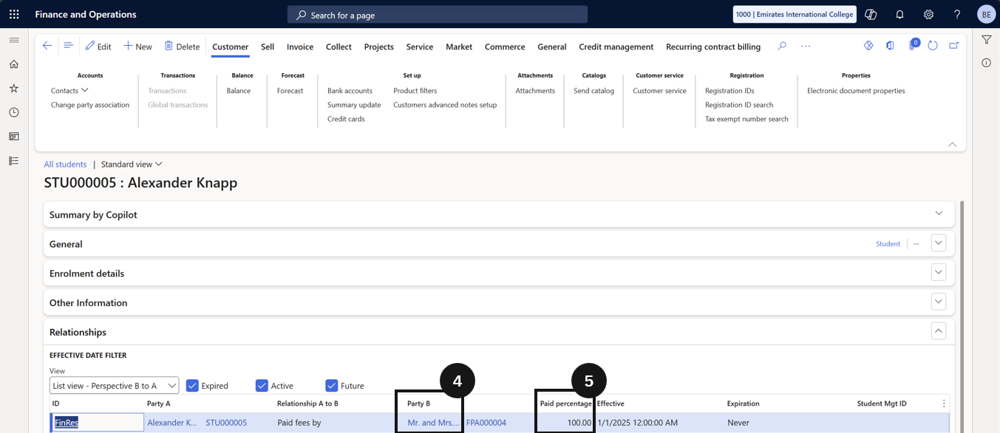

# Student Setup — Financial Responsibility

Financial responsibility defines which fee payers are liable for a student's invoices and in what proportion. Where the fee payer is managed as a customer (not a student), these percentages are set in the Student Management System and synchronised to D365 F&O — the steps below show how to view that setup.

1. Open the student record

   From the **FNO dashboard**, open **Modules ▸ Academic Management**, expand **Students**, and click **All students**. Select the student profile (③).

   

2. Confirm fee payers and split percentages

   In the **Relationships** section, confirm at least two fee payers are assigned (e.g., Mum and Dad) (④). Verify that default **split percentages** are set for each payer (e.g., 50% each) and that the total equals 100% (⑤). This is the baseline split for all fees unless overridden at item level.

   
