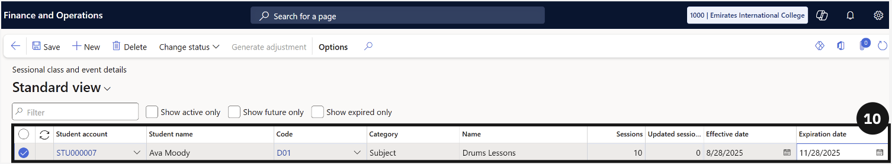
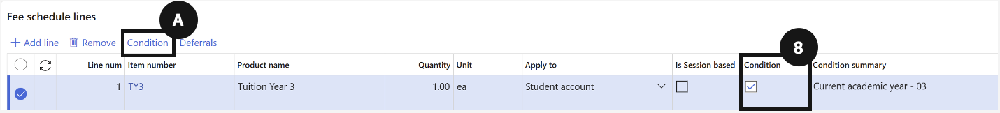
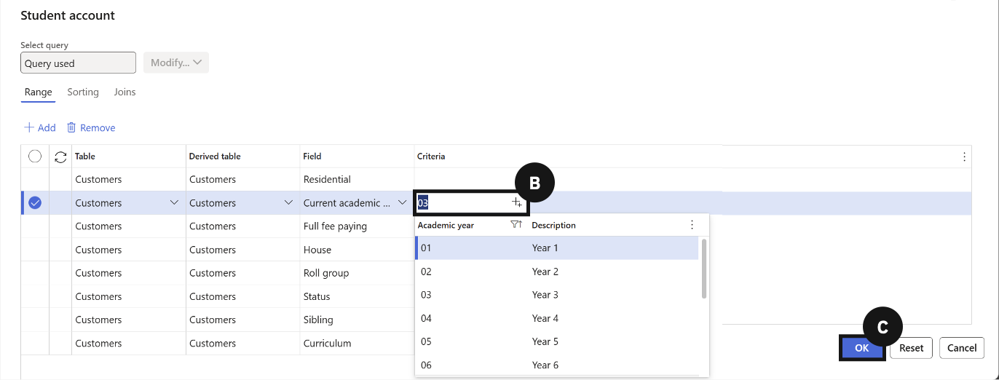
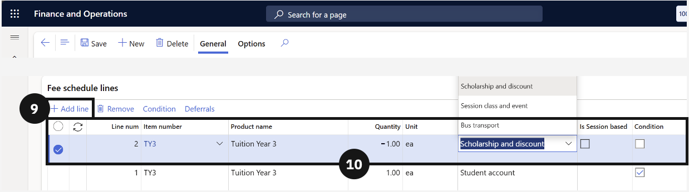
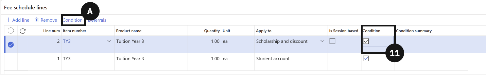
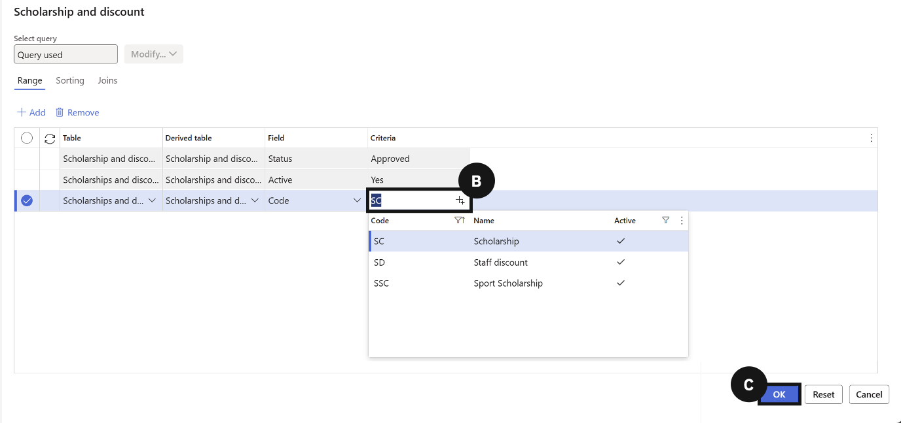
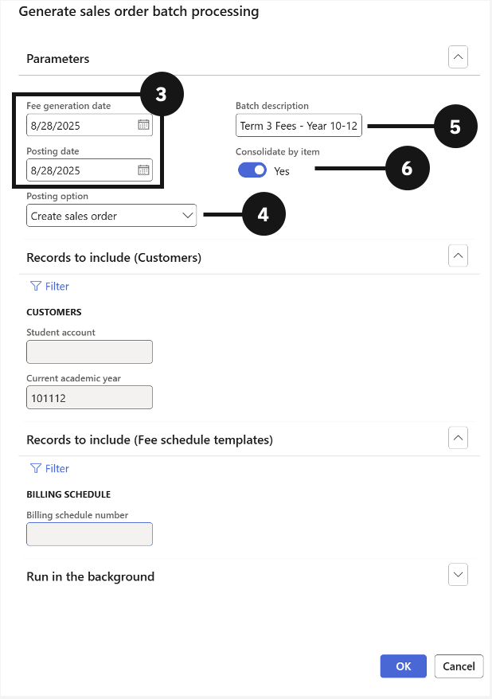
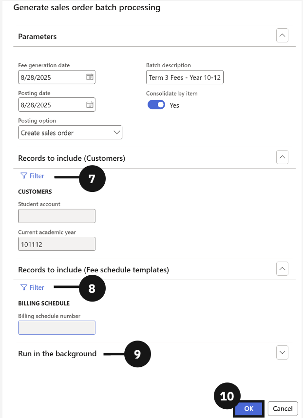
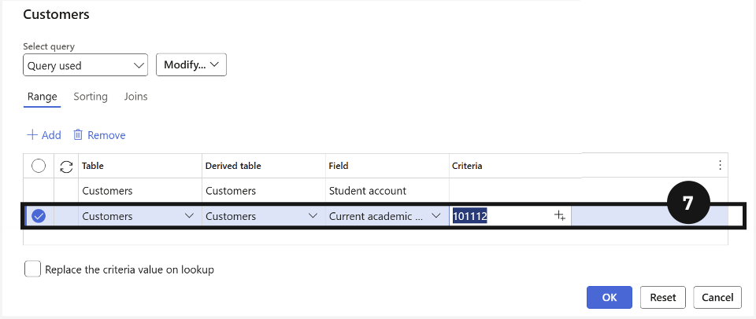
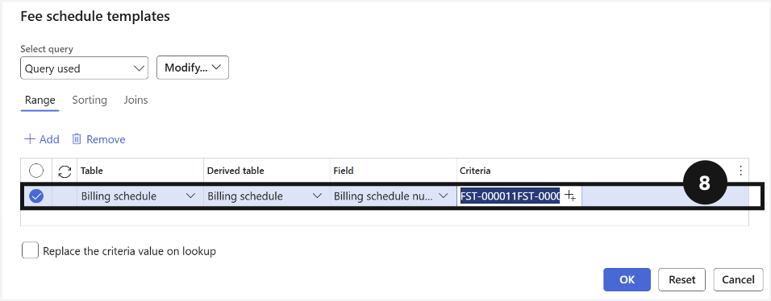

# Generate Fees

This section walks through everything required to generate accurate fee invoices for students. It covers verifying student master data, setting up scholarships and discounts, configuring subject and event names, building fee schedule templates, and running the batch process to generate and post invoices. It also includes reconciling generated sales orders to confirm accuracy before posting.

---

#### Check Student Master Data
Accurate fee generation depends entirely on the quality of the data held against each student's record. Before running any fee batch, it is essential to verify that each student has the correct academic year assigned, that their enrolment effective and expiration dates are current, that sibling order numbers are set for students eligible for family discounts, and that the financial responsibility percentages across all fee payers add up to 100. Any gaps or errors in this data at this stage will flow through to the invoices generated, making it significantly harder to correct after the fact.

---

## Check Student Details

1. From the **FNO dashboard**, open **Modules** ▸ **Academic Management**.
2. Expand **Students** and click **All students**.
3. Click on a **student**'s name to retrieve their details.
4. Confirm the Current academic year under Enrolment details and update if needed.
5. Open the **Academic** tab in the top toolbar.
6. Click on **Academic enrolments** under Related information.
7. Confirm the **Effective date** and **Expiration date** and update if needed.
8. Click **Back** in the top toolbar.
9. If the student has siblings, confirm the Sibling field under General has a number (e.g., eldest sibling = 1).
10. In the Relationships section, ensure the total **Paid percentage equals 100.00**.
11. Click **Save** if any changes were made.

---

## Scholarship and Discount Setup

1. From the **FNO dashboard**, open **Modules** ▸ **Academic Management**.
2. Expand **Setup** and click **Scholarships and discounts**.
3. Click **New** in the top toolbar.
4. Complete the following fields:
   - Enter or create a code in the **Code column**.
   - Enter the scholarship or discount name in the **Name column**.
   - Check the **Active** and **Approval boxes**.
   - Assign or create the approval group in the **User group** column.
     *Note: To assign an existing group, select it from the dropdown.*
5. To create a new group, if necessary, right-click the dropdown arrow, select **View details**, then click **New**.
6. Enter a **Name** for the group and then select the **User group**.
7. Click **Add / remove users**.
8. Search for and select the **approvers**.
9. Click **Add to group** and go **back**.

10. Select the new **User group** and click **Save**.
11. Select the **scholarship or discount** you created.
12. Go to the **General tab** and click **Items** under Fees.
13. Click **New** and select the relevant fees; repeat as needed.
14. Click **Save** and go back.
15. Go to the **General tab** and click **Students**.
16. Click **New** and add the student.
17. Enter the discount amount under **Discount %**.
18. Enter the **Effective date** and **Expiration date**.
19. From the **Approval dropdown**, select **Report as ready**.
20. Repeat to fully approve by selecting **Approve**.
21. Click **Save**.

---

## Subject and Event Name Setup

1. From the **FNO dashboard**, open **Modules** ▸ **Academic Management**.
2. Expand **Setup** and click **Subject and event names**.
3. Click **New** in the toolbar.
4. Fill out the following fields to create a subject or event:
   - Enter or create a code in the **Code column**.
   - Enter the **subject or event name**.
   - Select the correct **Category** from the dropdown.
   - Check **Active**.
5. Click **Save**.
6. From the **FNO dashboard**, open **Modules** ▸ **Academic Management**.
7. Expand **Inquiries and reports** ▸ **Fee schedules**.
8. Click **Sessional class and event details**.
9. Click **New** in the toolbar.
10. Fill out the following fields to assign a student to the subject or event:
    - Add the student under **Student account**.
    - Add the **code** for the sessional class or event.
    - Enter **Session numbers** if required (leave 0 for single sessions).
    - Enter the **Effective date and Expiration date**.
11. Click **Save**.

---

## Create Fee Schedule Templates

1. From the **FNO dashboard**, open **Modules** ▸ **Academic Management**.
2. Expand **Fee schedules** and click on **All fee schedules**.
3. Click **New** in the toolbar to create the fee invoice.
4. Enter details in **Description** (e.g., Fee invoice).
5. **Choose an option** from the Billing interval dropdown.
6. Click **+ Add line** to create the fee schedule.
7. Select the required fee item in **Item number**.
8. If a condition is required for the fee invoice, check the box in the **Condition** column.
    - Open **Condition** from the toolbar.
    - Choose the line that is required for the fee being paid and enter a value in the **Criteria** column by clicking on the '+' button.
    - Click **Ok** in the bottom right.
9. Click the **+ Add line** button.
10. Create the fee discount and fill out the following fields:
    - Click the dropdown in the **Item number** column and choose the required discount item.
    - Change the value in the **Quantity** column to **-1**.
    - Change the value in the **Apply to** column to **Scholarship and discount**.
11. **If a condition is required** for the fee discount, check the box in the **Condition** column.
    - Open **Condition** from the toolbar.
    - In the line which has **Code** in the **Field** column enter a value in the **Criteria** column by clicking on the '+' button.
    - Click **Ok** in the bottom right.

---

## Event Template Setup

1. From the **FNO dashboard**, open **Modules** ▸ **Academic Management**.
2. Expand **Fee schedules** and click on **All fee schedules**.
3. Click **New** in the toolbar to create the fee invoice.
4. Enter details in **Description** (e.g., Event template).
5. Choose the **Billing interval**.
6. Click **+ Add line**.
7. Complete the required fields for each line.
8. Add **conditions** if required.
9. Click **Save**.

---

#### Create Fee Invoices
With student data confirmed and fee schedule templates in place, the system is ready to generate fee invoices through a batch process. Staff navigate to the Generate Sales Order Batch Processing task and configure the run by setting the fee generation and posting dates, selecting the posting option, choosing whether to consolidate invoices by item, and filtering for the relevant student cohort and fee schedule templates. For large groups, the batch can be run in the background to avoid performance issues. Once complete, the system generates sales orders for all selected students, which can then be reviewed before posting.

---

## Run the task (Generate fee invoices)

> **Note:** *Invoices won't post until manually run under Accounts receivable > Sales orders > All sales orders.*

1. From the **FNO dashboard**, open **Modules** ▸ **Academic Management**.
2. Expand **Periodic tasks** and select **Generate sales order batch processing**.
3. In the dialog, set **Fee generation date** and **Posting date**.
4. Choose the **Posting option**:
   - Create sale orders — creates sales orders for manual review and posting.
   - Post invoice automatically — creates and posts invoices in one step.
5. Enter a **Description** (e.g., Term 3 Fees — Year 10–12).
6. Decide whether to **Consolidate by item**:
   - Yes — separates invoices by item.
   - No — generates one invoice per student for the entire template.

7. Use Customer **Filter** to select specific students or groups (e.g., by academic year).
8. In **Records to include**, select one or more fee schedule templates.
9. Under **Run in the background**, turn on Batch processing for large student numbers to avoid performance issues.
10. Click **OK** to start the process.
11. The system will notify you when the task is processing and when it's complete.

---

## Reconcile the Generated Sales Orders

1. From the **FNO dashboard**, open **Modules** ▸ **Academic Management**.
2. Expand **Fee schedule batches** and select **All fee schedule batches**.
3. Click the relevant **Fee schedule batch number** to view details.
4. Open **Fee generation reconciliation report** to check:
   - How many fee payer accounts were included.
   - How many students were included.
5. To export data, right-click the **Fee payer name** column header and select **Export all rows**.
6. In the dialog, click **Download** to export to Excel or SSRS for further validation if needed.

---

#### Post Fee Invoice and Settle Deposit
After fee invoices have been generated and reviewed, they need to be formally posted to create the financial transactions in the system. This is done by selecting the relevant fee schedule batch and initiating the post, either directly or as a background job for large volumes. Once posted, the batch status updates from Active to Invoice. At this point, the system also automatically matches any received enrolment deposits to the corresponding invoices, settling them against the posted amounts. Staff should confirm that deposit statuses update from Received to Settled to ensure the reconciliation has completed correctly.

---

## Post Fee Invoices

1. From the **FNO dashboard**, open **Modules** ▸ **Academic Management**.
2. Expand **Fee schedule batches** and click **All fee schedule batches**.
3. Click on the **Fee schedule batch number** you want to post (status must be Active).
4. Click **Post** in the toolbar.
5. Choose the **Posting date** (e.g., end of June).
6. Decide whether to:
   - Post directly, or
   - Run as a background job (recommended for large batches).
7. If running in the background, submit and wait for processing.
8. When complete, the batch status changes from Active to Invoice, and invoices are generated.

---

## Settle Enrolment Deposits

1. From **Modules** ▸ **Academic Management ▸ Inquiries and reports** ▸ **Pre-admission fees**.
2. Click **Pre-admission deposits**.
3. Click **OK** in the dialog.
4. Click on the enrolment deposit **Sales order** you want to review.
5. Review deposits with status **received** (indicating payment).
6. After posting, the system automatically matches these deposits to invoices.
7. Confirm the deposit status changes from received to **settled**.

---
