# Billing

Billing manages the end-to-end process of generating and posting fee invoices for students. It covers the creation of fee schedule templates that define what is charged and when, running batch jobs to generate sales orders across a student cohort, posting invoices by term, and handling adjustments for students who join or leave mid-term through pro rata calculations. Split billing configurations, proforma invoice generation and distribution, advance tax invoice requests, fee structure pricing through trade agreements, and student ledger reporting are also handled here.

## Fee Schedule Templates

1. From the **FNO dashboard**, open **Modules** ▸ **Academic Management**.
2. Expand **Fee schedules** and click **All fee schedules**.
3. Click **New** in the toolbar.
4. Set **Customer type** to **Student**.
5. Enter a **Description**.
6. Select the **Fee and charge interval**.
   > **Note:** *The fee and charge interval determines which students and terms the system targets when generating invoices. Start and end dates populate automatically based on this selection.*
7. Click **+ Add line** under **Fee schedule lines**.
8. Select the **Item number**.
9. Select the **Unit**.
   > **Note:** *The unit must match the unit used when setting up the item price in the trade agreement.*
10. Enable **Quantity** if the system should use the quantity from the fee and charge interval rather than the template.
    > **Note:** *Enable this for items charged monthly. Leave disabled for items charged once per year.*
11. Enable **Consolidate all periods** if all terms should be consolidated into one sales order line.
    > **Note:** *Enable this for recurring items such as tuition fees. Leave disabled for one-off items such as ID card fees.*
12. Set **Apply to** to **Student account**.
13. If the item should only apply to students who meet specific criteria, enable **Condition**.
14. Click **Condition** in the toolbar.
15. Select the **Field** and enter the required value in the **Criteria** column.
16. Click **OK**.
    > **Note:** *Use conditions when the school has different fee structures for different student types. Items without conditions apply to all students.*
17. Repeat steps 7–16 for each additional fee item.
18. To set up revenue recognition, click **Deferral** in the toolbar.
19. Enable the **Deferral** option for each term.
20. Select the **Deferral template** for the number of months to allocate revenue across.
    > **Note:** *If a revenue recognition date is set in the fee and charge interval, the system automatically populates the deferral start date.*
21. Click **Ok**.
22. Click **Save**.

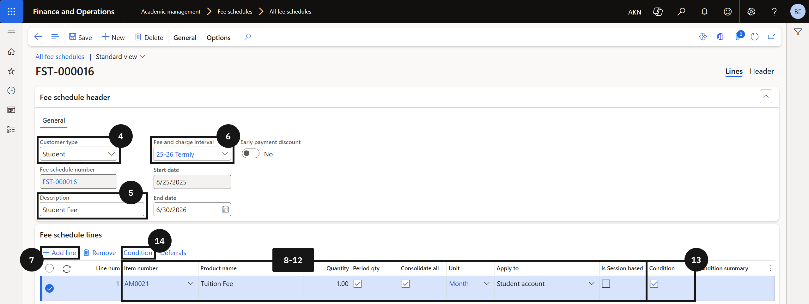

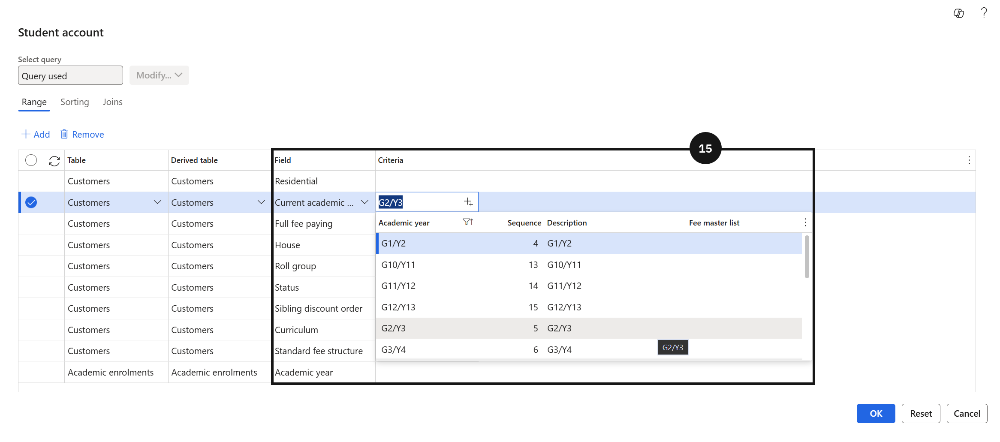

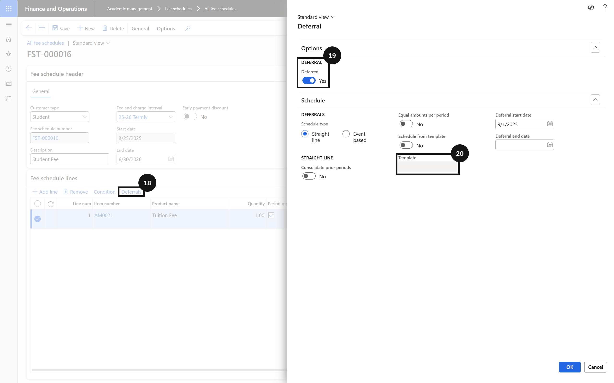

---

#### Create Fee Invoices
With student data confirmed and fee schedule templates in place, the system is ready to generate fee invoices through a batch process. Staff navigate to the Generate Sales Order Batch Processing task and configure the run by setting the fee generation and posting dates, selecting the posting option, choosing whether to consolidate invoices by item, and filtering for the relevant student cohort and fee schedule templates. For large groups, the batch can be run in the background to avoid performance issues. Once complete, the system generates sales orders for all selected students, which can then be reviewed before posting.

---

## Fee Schedule Batches

> **Note:** *Before running this batch, confirm that each student has an academic enrolment record with the correct fee and charge interval, and that at least one active fee schedule template exists for the target academic year. The fee and charge interval is the key field linking students, templates, and the batch job.*

1. From the **FNO dashboard**, open **Modules** ▸ **Academic Management**.
2. Expand **Periodic tasks** and click **Generate sale order batch processing**.
3. Set the **Fee generation date**.
   > **Note:** *Set this to the start date of the academic year or the start date of the fee charge interval.*
4. Set the **Posting date**.
   > **Note:** *The posting date is only required if using the Post invoice automatically option. Leave blank if creating open sale orders for manual review.*
5. Select the **Posting option**:
   - *Create sale orders* — generates open sales orders for review before posting.
   - *Post invoice automatically* — creates and posts invoices in a single step.
6. Select the **Fee and charge interval**.
   > **Note:** *This filters which students are included. Only students whose academic enrolment record contains this interval will be picked up by the batch.*
7. Enter a **Batch description**.
8. Select the **Fee schedule template number**, or leave blank to include all active templates.
9. In **Records to include**, **filter** certain criteria if running for a specific cohort, students, academic year, etc.
    > **Note:** *Leave this blank to run the batch across all eligible students for the selected interval.*
10. Click **OK** to submit the batch job.
11. Wait for the batch job to complete.
12. Open **Modules** ▸ **Academic Management** ▸ **Fee schedule batches** ▸ **All fee schedule batches**.
    > **Note:** *The system generates a new batch number for each run. All sales orders created in that batch are listed under the batch number.*
13. Click the **batch number** to review all generated sales orders.

> **Note:** *The system reuses an existing deposit sales order if the student has already paid an enrolment deposit, inserting the fee items into that order. If no deposit has been paid, a new sales order is created automatically. The sales order type is set to Fee Generation to distinguish it from other order types.*

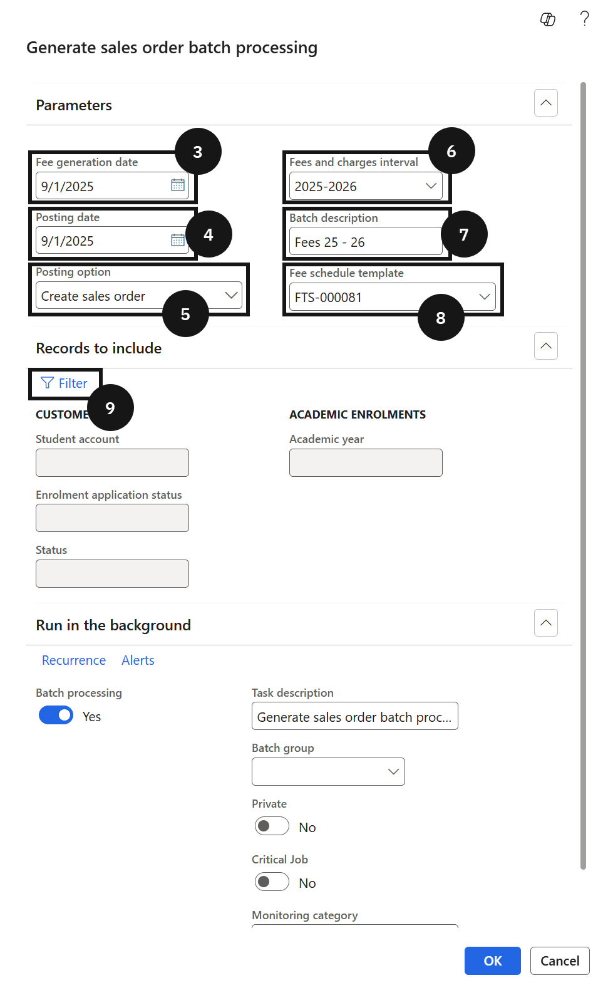

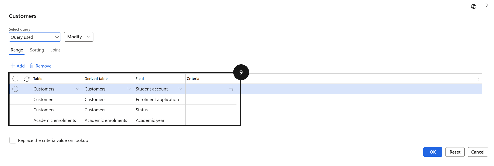

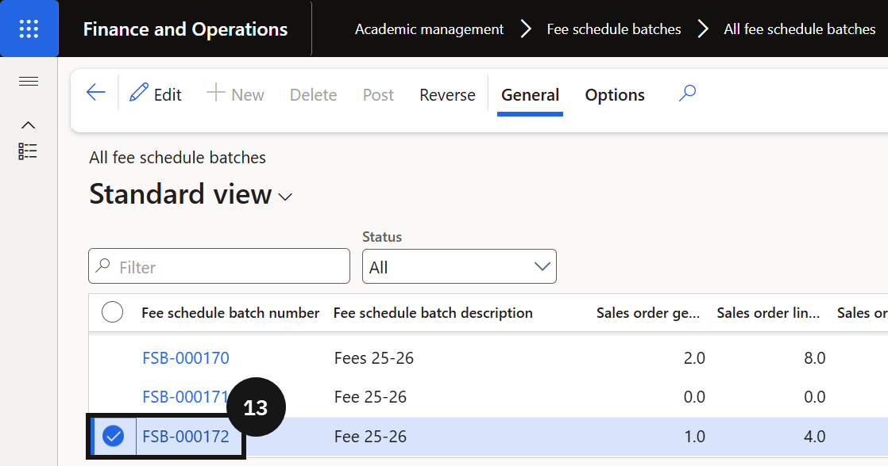

---

## Sibling Order Calculation

1. From the **FNO dashboard**, open **Modules** ▸ **Academic Management**.
2. Expand **Fee schedules** and click **All fee schedules**.
3. Open the relevant **template(s)** and ensure all tuition fee items are correctly listed.
4. Go back to **Modules** ▸ **Academic Management**.
5. Expand **Periodic tasks** and click **Generate sales order batch processing**.
6. In the dialog, enter a **batch description** (e.g., School Fee Invoice Term 1).
7. Expand **Records to Include (Customers)** and select the **customer group** (e.g., all students in Academic Year 1).
8. Expand **Records to Include (Fee schedule templates)** and choose the correct **fee schedule template**.
9. Click **OK** to run the task in the background and generate sales orders for all selected students.
10. When the task completes, go back to **Modules** ▸ **Academic Management**.
11. Expand **Fee schedule batches** and click **All fee schedule batches**.
12. Open the latest batch and review the sales orders.
    
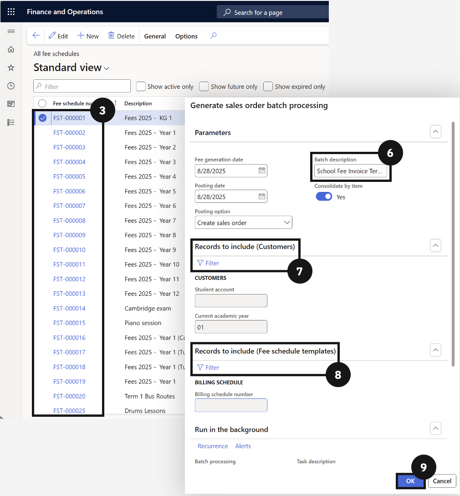

---

## Post Sale Order Invoices by Term

> **Note:** *Invoices are not posted in a single run. Each term is posted separately by scheduling a batch job filtered to the relevant period name. If the school has three terms, three separate batch jobs are required.*

1. From the **FNO dashboard**, open **Modules** ▸ **Academic Management**.
2. Expand **Periodic tasks** and click **Post sale order invoice**.
3. Set the **Posting date** for the term being posted.
4. Enable **Split invoice by item**.
   > **Note:** *With this option enabled, the system generates a separate invoice for each line item within the term. For example, if a student has two items in Term 1, two invoices are created.*
5. In **Records to include**, set the **Period name** filter to the term being posted (e.g., *Term 1*).
   > **Note:** *The system looks up all open sales order lines where the period name matches this filter and posts only those lines. This is how term-by-term invoice posting is controlled.*
6. Expand **Run in the background** and enable **Batch processing**.
7. Click **OK** to submit.
8. Wait for the batch job to complete.
9. Open **Modules** ▸ **Academic Management** ▸ **Fee schedule batches** ▸ **All fee schedule batches**.
10. Open the relevant batch and confirm that the status of each posted line has changed to **Invoice**.
11. Repeat steps 2–10 for each remaining term.

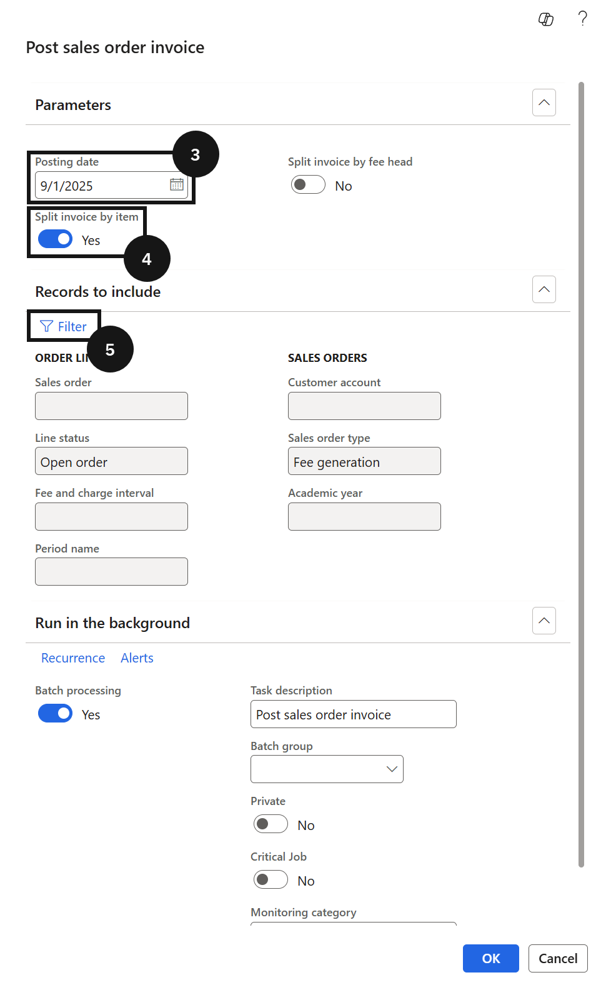

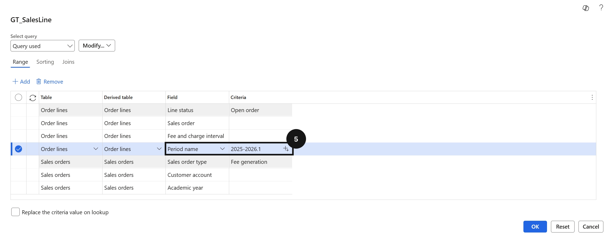

---

## Generate Proforma Sales Orders

---

#### Post Fee Invoice and Settle Deposit
After fee invoices have been generated and reviewed, they need to be formally posted to create the financial transactions in the system. This is done by selecting the relevant fee schedule batch and initiating the post, either directly or as a background job for large volumes. Once posted, the batch status updates from Active to Invoice. At this point, the system also automatically matches any received enrolment deposits to the corresponding invoices, settling them against the posted amounts. Staff should confirm that deposit statuses update from Received to Settled to ensure the reconciliation has completed correctly.

---

## Post Fee Invoices (GEMS)

1. From the **FNO dashboard**, open **Modules** ▸ **Academic Management**.
2. Expand **Fee schedule batches** and click **All fee schedule batches**.
3. Click on the **Fee schedule batch number** you want to post (status must be Active).
4. Click **Post** in the toolbar.
5. Choose the **Posting date** (e.g., end of June).
6. Decide whether to:
   - Post directly, or
   - Run as a background job (recommended for large batches).
7. If running in the background, submit and wait for processing.
8. When complete, the batch status changes from Active to Invoice, and invoices are generated.

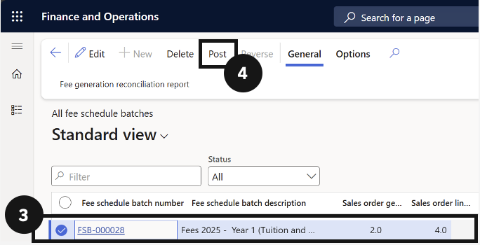

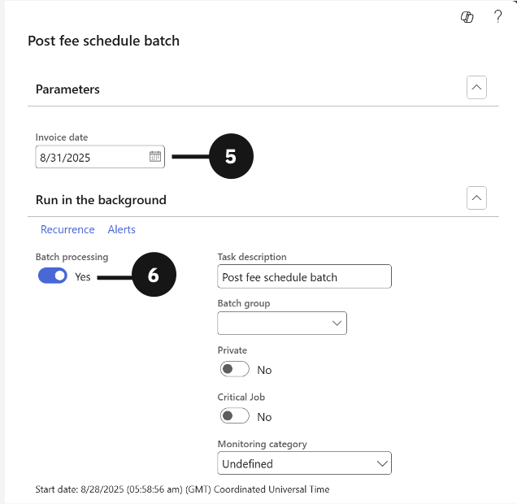

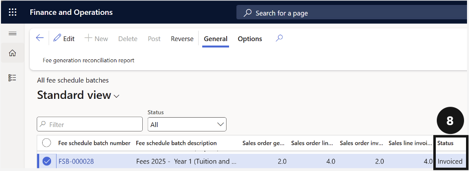

---

## Settle Enrolment Deposits

1. From **Modules** ▸ **Academic Management ▸ Inquiries and reports** ▸ **Pre-admission fees**.
2. Click **Pre-admission deposits**.
3. Click **OK** in the dialog.
4. Click on the enrolment deposit **Sales order** you want to review.
5. Review deposits with status **received** (indicating payment).
6. After posting, the system automatically matches these deposits to invoices.
7. Confirm the deposit status changes from received to **settled**.

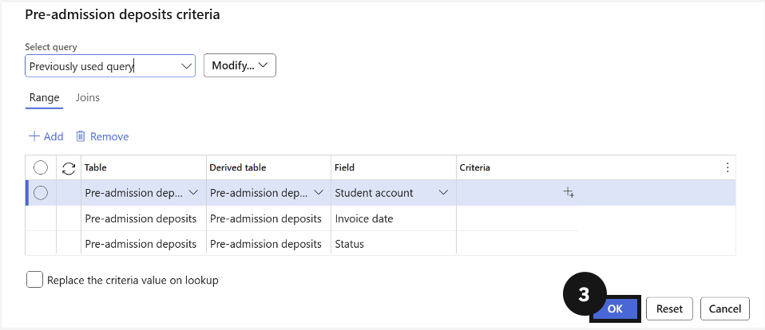

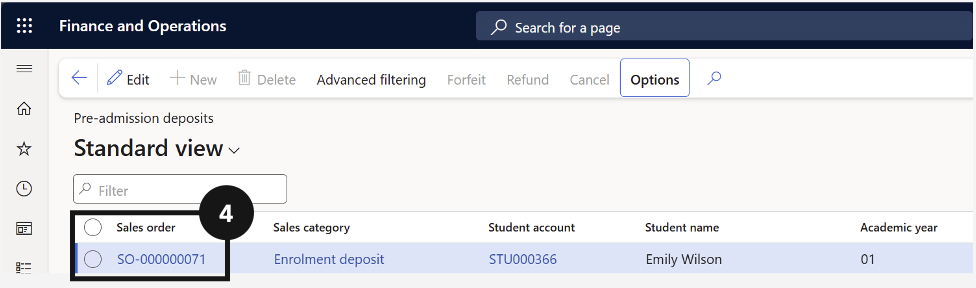

---

## Reconcile Sales Orders

1. From the **FNO dashboard**, open **Modules** ▸ **Academic Management**.
2. Expand **Fee schedule batches** and select **All fee schedule batches**.
3. Click the relevant **Fee schedule batch number** to view details.
4. Open **Fee generation reconciliation report** to check:
   - How many fee payer accounts were included.
   - How many students were included.
5. To export data, right-click the **Fee payer name** column header and select **Export all rows**.
6. In the dialog, click **Download** to export to Excel or SSRS for further validation if needed.

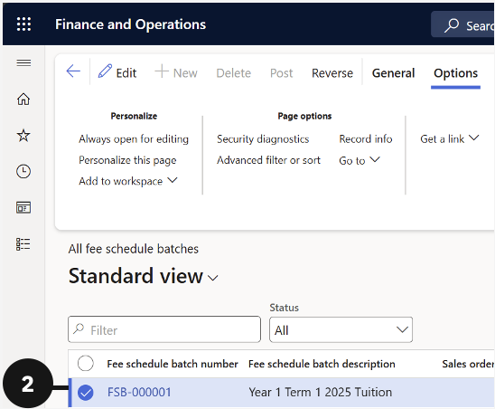

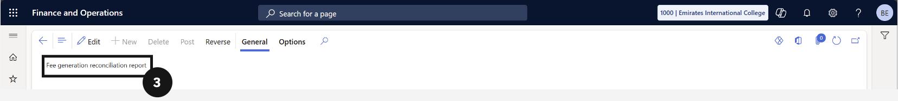

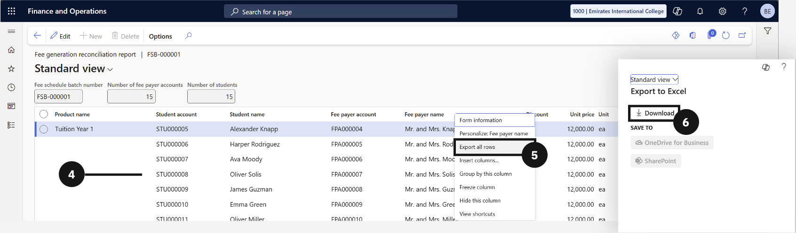

---

## Split Billing Fee Schedule Templates

1. From the **FNO dashboard**, open **Modules** ▸ **Academic Management**.
2. Expand **Fee schedules** and click **All fee schedules**.
3. Click **New** to create a new template.
4. Enter a name in **Fee schedule name** field (e.g., Split billing override template).
5. Set the **billing interval** (e.g., termly).
6. Enable the **early payment discount** option if required.
7. In the **Fee schedule lines** section, click **Add line**.
8. Choose the **Product name** (e.g., Tuition fee).
9. Enable **Conditions** and click Condition in the toolbar.
10. Set the **Criteria** for any necessary conditions (e.g., applies to current academic year students).
11. Add any other **fee items** required (e.g., Building Fund Fee item, which can be set to apply to all students without conditions).
12. Click **Save**.

---

## Split Billing Configuration Percent by Fee Items

> **Note:** *Split configuration applies only to sales orders generated after the setup is saved; Older invoices are not affected.*

1. From the **FNO dashboard**, open **Modules** ▸ **Academic Management**.
2. Expand **Setup** and click **Split percent by fee items**.
3. Click **New** to create a new record for a student.
4. Complete the following columns to configure split payment per payee:
   - Search and select a **student**.
   - Select the specific **fee item to override** (e.g., Building Fund Fee).
   - Assign the **custom split percentages** for each payer (e.g., Dad 60%, Mom 40%).
   - Specify the **effective and expiration dates** for this split configuration.
5. Repeat step 4 for the other payer.
6. Click **Save**.

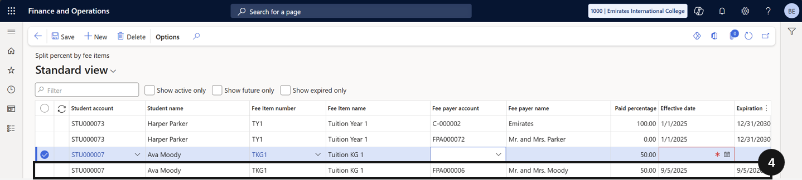

---

## Pro Rata Adjustments

This section covers fee adjustments for students who start after the official term date or leave before the term ends. For new students, it explains how to enable pro rata on fee items and update enrolment dates so the system calculates fees based on actual study days. For exiting students, it covers running the fee and charge adjustment task and reviewing the resulting sales order to confirm the correct refund amount.

---

#### Joining Students
When a student begins their enrolment after the official term start date, it would be inequitable to charge them the full term fee. The pro rata adjustment feature addresses this by calculating the fee based on the actual number of school days the student will attend within the term. To enable this, the Pro rata field on the relevant tuition fee item must be activated, and the student's enrolment effective date must be updated to reflect their actual start date. When the fee generation batch is run, the system uses these dates to automatically calculate and apply a reduced fee, ensuring the student is only charged for the days they are present.

---

## Enable Pro Rata Adjustments

> **Note:** *Ensure the **Pro rata joining** option on the fee item matches the policy configured in Fee schedule parameters. See [Fee Schedule Parameters (GEMS)](../02-Setup.md#fee-schedule-parameters-gems) — step 8.*
1. From the **FNO dashboard**, open **Modules** ▸ **Product information management**.
2. Expand **Products** and click **Released products**.
3. Locate and select the **tuition fee item** (e.g., FS1) that will be subject to pro rata adjustment.
4. Open the **Sell** section and locate the field called **Pro rata**.
5. Set this field to **any option except None** to activate pro rata adjustment for new students.
    > Note: *This ensures the system calculates fees based on the actual number of study days for students who start after the official term start date.*
6. Click **Save**.

---

## Update Student Enrolment Dates

1. From the **FNO dashboard**, open **Modules** ▸ **Academic Management**.
2. Expand **Students** and click **All Students**.
3. Select **students** who will begin **after the term start**.
4. Select the Academic tab (if it is not visible, click on the ellipsis), click **Academic enrolments**.
5. Edit each student's enrolment record to set their **Effective date to the actual start date**.
6. Click **Save**.

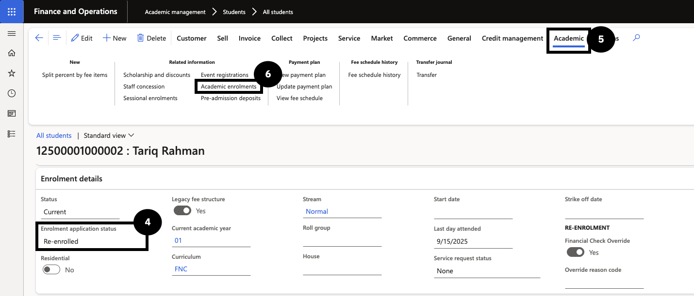

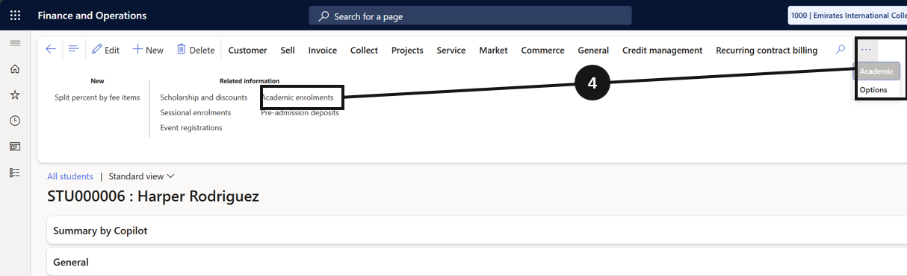

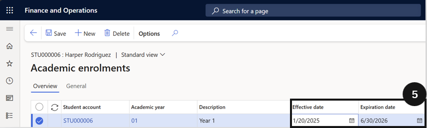

---

## Generate and Review Sales Orders

1. From the **FNO dashboard**, open **Modules** ▸ **Academic Management**.
2. Expand **Periodic tasks** and click **Generate sales order batch processing**.
3. In the dialog box, enter a **batch description** (e.g., Fee invoice for Term 1 2025).
4. Open the **Records to include (customers)** section and choose the appropriate **customer academic year**.
5. Open the **Records to include (fee schedule templates)** section and choose the appropriate **billing schedule**.
6. Click **OK** to run the task and generate sales orders for all students in the selected group.
7. Go back to **Modules** ▸ **Academic Management**.
8. Expand **Fee schedule batches** and click **All fee schedule batches**.
9. Open the **fee schedule batch form**.
10. Review the sales orders for each student. Confirm that students with late start dates have a reduced tuition fee amount, reflecting the pro rata calculation based on their actual study days.

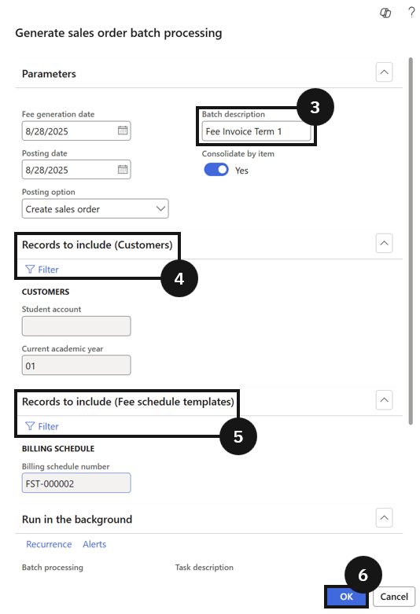

---

#### Leaving Students
When a student leaves the school before the end of a term, any fees already invoiced for the remaining days need to be adjusted and refunded. The system handles this through the Calculate fee and charge adjustment task, where staff enter the student's last day at school. The system then calculates the number of remaining school days and generates an adjustment sales order with a negative quantity representing the days to be refunded. Staff review the adjustment to confirm the quantity and net refund amount are correct before the refund is processed, ensuring the student's account is accurately reconciled upon departure.

---

## Enable Pro Rata Adjustments

> **Note:** *Ensure the **Pro rata leaving** option on the fee item matches the policy configured in Fee schedule parameters. See [Fee Schedule Parameters (GEMS)](../02-Setup.md#fee-schedule-parameters-gems) — step 9.*
1. From the **FNO dashboard**, open **Modules** ▸ **Product information management**.
2. Expand **Products** and click **Released products**.
3. Locate and select the **tuition fee item** (e.g., FS1) that will be subject to pro rata adjustment.
4. Open the **Sell** section and locate the field called **Pro rata**.
5. Set this field to **any option except None** to activate pro rata adjustment for new students.
   > Note: *This ensures the system will calculate fees based on the actual number of study days for students who start after the official term start date.*
6. Click **Save**.

---

## Fee and Charge Adjustment

1. From the **FNO dashboard**, open **Modules** ▸ **Academic Management**.
2. Expand **Periodic tasks** and click **Calculate fee and charge adjustment**.
   Note: *This function is used to process adjustments for students leaving mid‑term.*
3. In the dialog box, enter the **student's last day at school**.
4. Click **OK** to allow the system to process the adjustment.
5. The system calculates the refund based on the remaining school days after the leaving date.

---

## Review the Sales Order Adjustment

1. From the **FNO dashboard**, open **Modules** ▸ **Academic Management**.
2. Expand **Fee schedule batches** and click **All fee schedule batches**.
3. Locate and **open the newly generated sales order** for the student.
4. Review the sales order adjustment.
5. The Quantity column shows a negative value representing the number of remaining school days to be refunded.
6. The Net amount column displays the total refund due to the student.

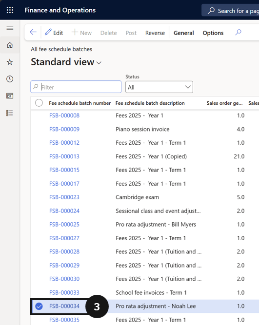

---

#### Proforma Invoice Generation

Proforma invoices are generated from confirmed sales orders and sent to fee payers before a formal tax invoice is issued. Once fee schedules have been run and sales orders created, staff can confirm individual orders manually for a single student, or process all open proforma invoices in bulk for a billing cycle. Both methods trigger the print management destination configured in the system, which automatically distributes the proforma document to the fee payer. If a proforma invoice needs to be resent or reprinted, staff can regenerate it from the confirmed sales order without creating a new order.

---

## Generate Proforma Invoice Document

1. From the **FNO dashboard**, open **Modules** ▸ **Academic Management**.
2. Expand **Students** and click **All students**.
3. Open the **Account** column filter.
4. Enter the student's account number in the **Account** field using the *contains* filter.
5. Click **Sell**.
6. Click **Orders**.
7. Click **All sales orders**.

> **Note:** *This displays all sales orders for the student, including open proforma invoices awaiting confirmation.*

8. Select the sales order to confirm.
9. On the Action Pane, click **Sell**.
10. Click **Confirm sales order**.
11. Set the **Print confirmation** field to *Yes*.
12. Set the **Use print management destination** field to *Yes*.
13. Click **OK**.

> **Note:** *The system sends the proforma invoice to the fee payer using the print management destination configured for the school. No manual distribution is required.*

14. Click **Back**.

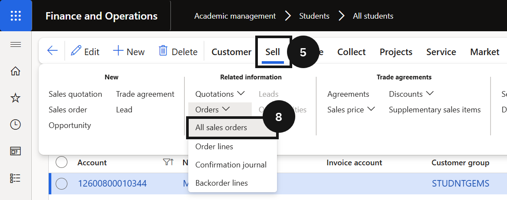

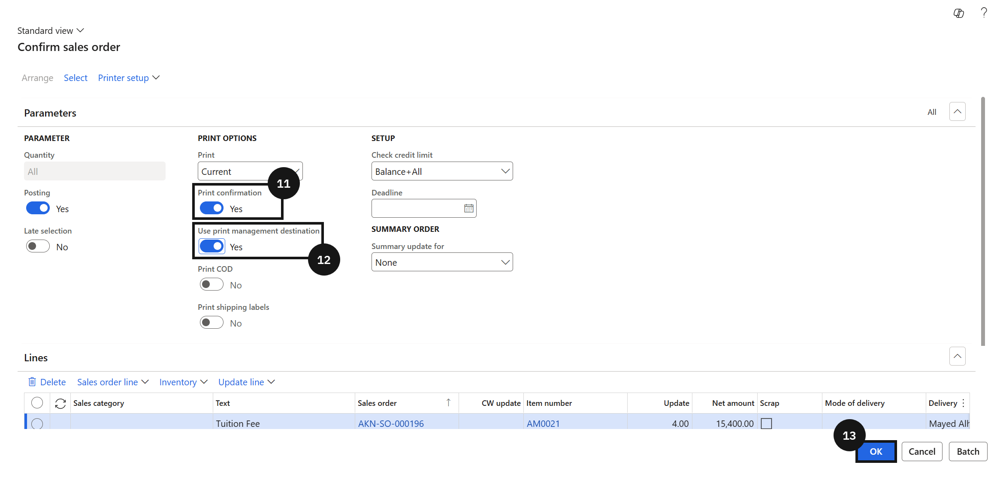

---

## Regenerate Proforma Invoice Document

1. From the **FNO dashboard**, open **Modules** ▸ **Academic Management**.
2. Expand **Students** and click **All students**.
3. Filter for the student and click **Sell**.
4. Open **Orders**, click **All sales orders** and open the relevant sales order.
5. On the Action Pane, click **Sell**.
6. Under **Journals**, click **Sales order confirmation**.
7. Select the latest version of the confirmation.
8. Click **Preview/Print**.
9. Click **Use print management**.
10. Click **Close**.

> **Note:** *This regenerates and resends the proforma invoice without creating a new sales order or confirmation record.*

---

## Generate Proforma Invoices in Bulk

1. From the **FNO dashboard**, open **Modules** ▸ **Sales and Marketing**.
2. Expand **Sales orders** ▸ **Order confirmation** and click **Confirm sales order**.
3. Click **Select**.
4. **Add** a filter for **Fee and charge interval**.
5. Click **Ok**.
6. Enter the **billing cycle year** to filter for the proforma invoices to be generated.

> **Note:** *The system lists all open proforma invoices (sales orders) matching the selected billing cycle.*

6. Enable **Print confirmation**.
7. Enable **Use print management destination**.
8. Click **OK** to generate and send the documents immediately.

> **Note:** *If there are a large number of sales orders, processing may take several minutes. Use the Batch option in step 9 to run in the background instead.*

9. To run as a scheduled batch job instead, click **Batch**.
10. Enable **Batch processing**.
11. Click **OK**.

> **Note:** *The system automatically emails each proforma invoice to the fee payer as an attachment once the batch completes.*

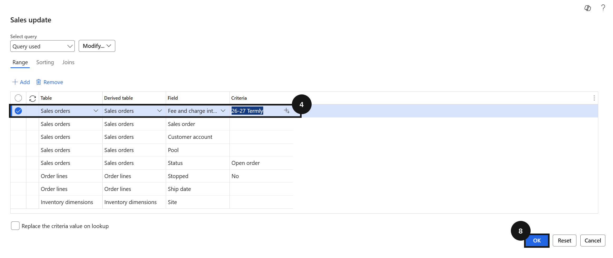

---

#### Fee Structure Setup

Fee structure setup defines the price applied to tuition fee items and other school fee items using trade agreements. Schools may have one or two tuition fee items depending on whether they apply different fee structures for new and existing students. Each tuition fee item requires two prices per academic attribute combination — a monthly price used when generating fee invoices, and an annual price used when calculating enrolment deposits. Once prices are configured, tuition fee items must be linked to the relevant academic year so the system knows which item and price to use during deposit calculations. Non-tuition items such as ID cards use a standard trade agreement without academic attributes.

---

## Fee Structure Setup

> **Note:** *Each academic attribute combination (academic year + curriculum + stream) requires two trade agreement lines: one with a monthly unit and one with an annual unit. The monthly price drives fee invoice generation; the annual price drives deposit calculations.*

1. From the **FNO dashboard**, open **Modules** ▸ **Product information management**.
2. Expand **Products** and click **Released Products**.
3. Search for and open the **tuition fee item** to review before setting up the price.
4. Open **Modules** ▸ **Sales and marketing**.
5. Expand **Prices and discounts** and click **Trade agreement journals**.
6. Click **New** to create a new trade agreement journal.
7. In the **Name** field, select the **academic journal name**.

> **Note:** *Selecting the academic journal name enables the Academic attributes flag. This differentiates academic pricing from standard pricing and allows prices to be set by academic year, curriculum, and stream.*

8. Click **Lines** to open the journal lines.
9. Complete the columns to create a new trade monthly agreement.
10. **Copy** the line for the same academic attribute combination.
11. In the **Unit** field, select *Annual*.
12. Enter the **annual price** in the currency field.
13. Repeat steps 8–12 for each additional academic attribute combination (academic year, curriculum, and stream).

> **Note:** *All attribute combinations used in fee generation must have a trade agreement line. If any combination is missing a price, the system will not generate a price for that combination.*

14. Click **Post** to complete the trade agreement setup.

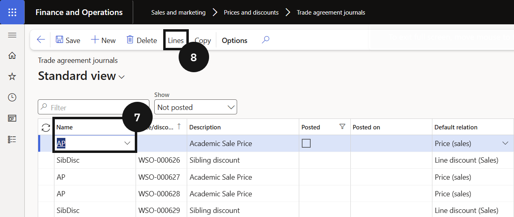

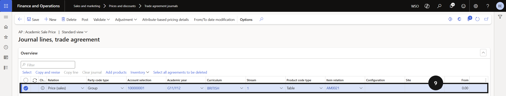

---

#### Tax Invoices
 
The advance tax invoice feature allows staff to generate a tax invoice against a fee payer's open proforma invoice before full payment is received. This is typically used when a family requests a formal tax invoice ahead of settlement, for example for employer reimbursement or government funding purposes. Staff locate the student account, access the relevant sales order, apply the prepayment invoice against the open term invoice, assign the advance tax invoice request category, and post the record. The system then generates the invoice, which can be printed and provided to the fee payer.
 
---
 
## Advance Tax Invoice upon Request
 
1. Navigate to **Modules** ▸ **Academic Management** ▸ **Students** ▸ **All students**.
2. Open the **Account** column filter.
3. Enter the student's account number in the **Account** field using the *contains* filter operator.
4. Open **Sell** and click **Orders** in the Action Pane.
5. Click **All sales orders** to locate the open proforma invoice.
6. Click **Invoice** in the Action Pane.
7. Click **Add prepayment invoice**.
8. Select the **Mark** checkbox to confirm the selection.

> **Note:** *If you are invoicing for a partial amount only, enter the amount in the Amount to invoice field before proceeding.*
 
9. In the **Sales category** field, enter or select *Advance tax invoice request category*.
10. Click **Post**.
11. Click **Prepayment invoice**.
12. Click **Show or hide controls** if necessary.
13. Click **Print**.

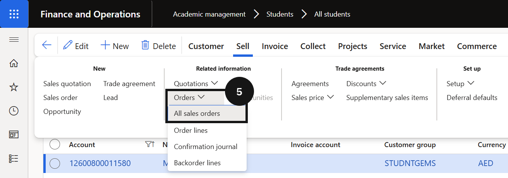

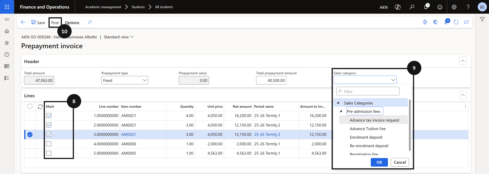

---

## Book Sales

---

#### Student Ledger

The student ledger provides a consolidated view of a student's financial activity over a specified date range. School finance staff use it to review invoices, payments, advance invoices, and prepayments associated with an individual student. The report can be filtered to suppress advance and prepayment invoice detail where a simplified view is required.

---

## Student Ledger

1. From the **FNO dashboard**, open **Modules**.
2. Expand **Students** and click **All Students**.
3. Select the **student** for whom the ledger is required.
4. Click **Collect** on the Action Pane.
5. Click **Statements**.
6. Enter the **From date**.
7. Enter the **To date**.
8. Select the **Suppress Advance Invoice** toggle if advance invoice or prepayment invoice detail should be excluded from the report.
   > **Note:** *Enabling this toggle hides both advance invoice and prepayment invoice lines from the generated report, producing a simplified statement view.*
9. Click **OK** to generate the report.

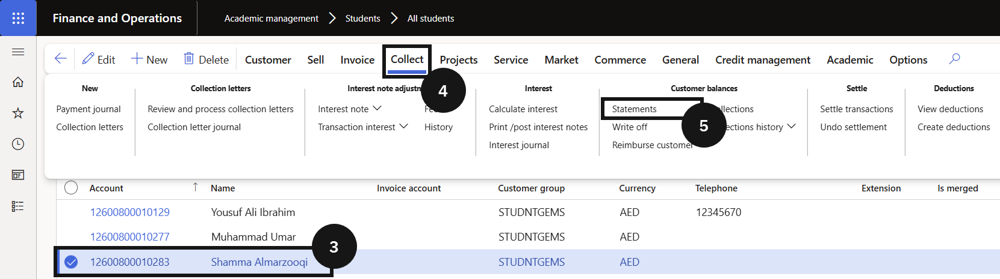

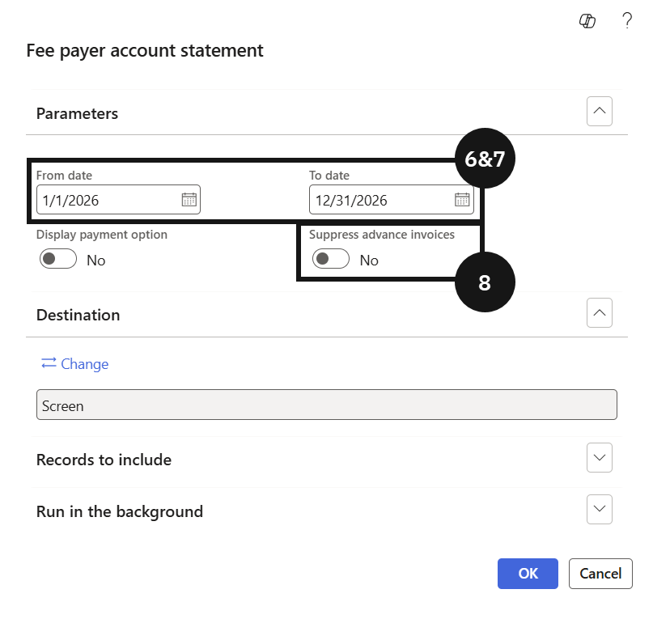

---

## Fee Structure - Price Changes

1. From the **FNO dashboard**, open **Modules** ▸ **Product information management**.
2. Expand **Products** and click **Released Products**.
3. Filter by **Product name** and select the student's tuition fee item.
4. Open **Sell** from the toolbar.
5. Click on **Sales price**.
6. Filter by **Company**, **Academic year**, **Curiculum**, and **Stream** to find the relevant fee line.
7. Select the fee line.
8. Click **Edit selected lines**.
9. Enter **Name** (e.g., Academic scale price).
10. Enter a **Description** for the price update (e.g., Fee increase).
11. Click **OK**.
12. Enter the new **Sales price**.

>**Note**: *If annual pricing is used for deposit calculations, update the yearly price field instead.*

13. Enter the **From date** for when the new price should take effect.
14. Click **Post**.
15. Return to the fee item and verify the updated price for the intended academic year and curriculum.

>**Note**: The steps below shows how to update the pro forma invoice:

16. Go to **Modules** ▸ **Academic Management**.
17. Expand **Periodic Tasks** and click **Recalculate Open Sales Order**.
18. Filter for the relevnat student or sales order number.
19. In **Parameters**, toggle **Yes** in **Recalculate sales price**.
20. In **Records to include**, filter **Student account** or enter a particular **Sales order**.

>**Note**: *You can filter for group of students or whole cycle for fee and charge interval.*

21. Click **OK**.
22. Return to the sales order and **refresh** the page to confirm that future terms show the updated price.

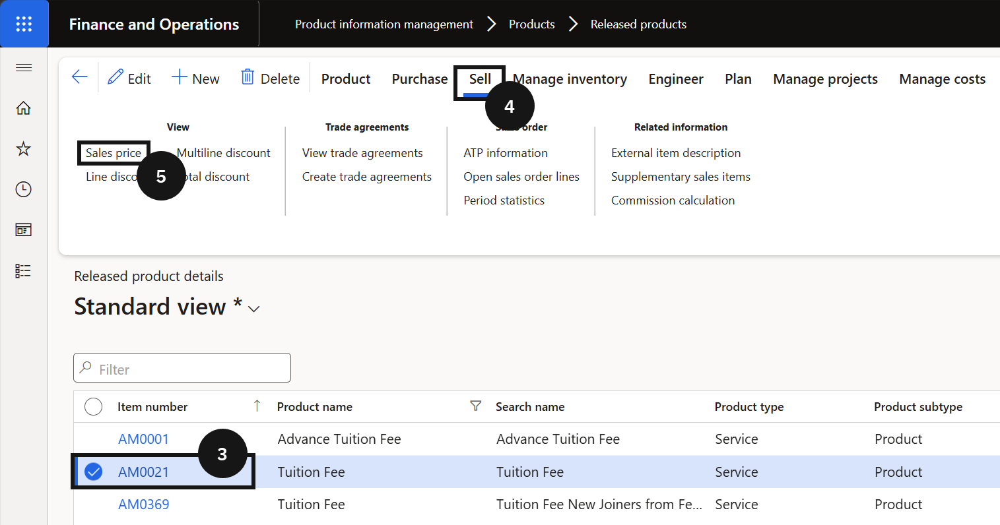

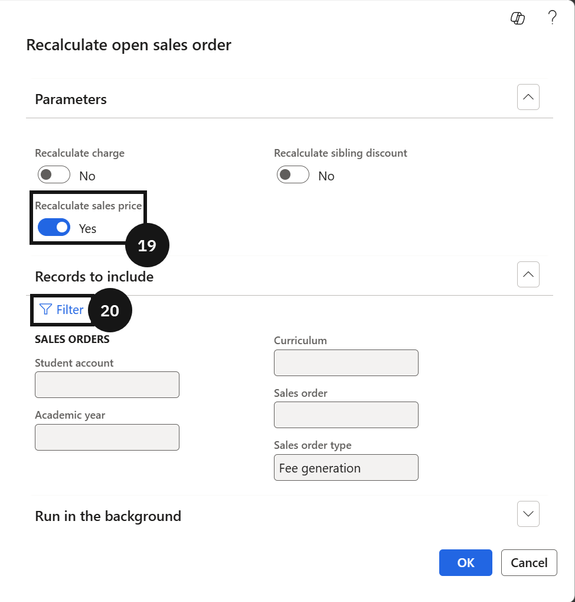

---
