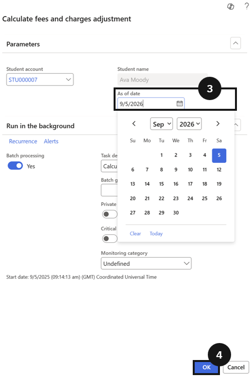

# Calculate Fee and Charge Adjustment

Use this task to process fee adjustments for students leaving mid-term. The system calculates the refund based on the number of remaining school days after the leaving date.

1. Run the adjustment task

   From the **FNO dashboard**, open **Modules ▸ Academic Management**, expand **Periodic tasks**, and click **Calculate fee and charge adjustment**. In the dialogue, enter the **student's last day at school** (③), then click **OK** (④). The system calculates the refund based on the remaining school days after the leaving date.

   
