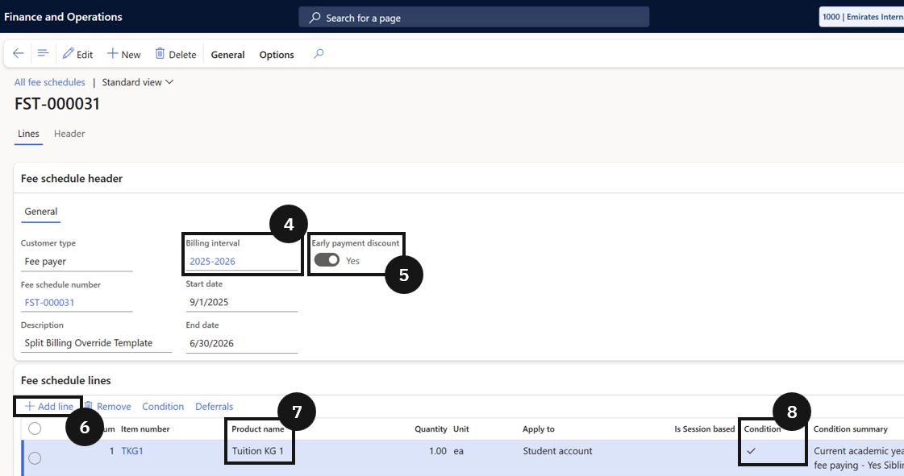

# Create a Split Billing Fee Schedule Template

1. Create a new template

   From the **FNO dashboard**, open **Modules ▸ Academic Management**, expand **Fee schedules**, and click **All fee schedules**. Click **New** and complete the header:

   - **Fee schedule name** — enter a name (e.g., *Split billing override template*).
   - **Billing interval** — select the billing cycle (e.g., termly).
   - **Early payment discount** — enable if required.

2. Add fee lines and configure conditions

   In the **Fee schedule lines** section, click **Add line** and select the **Product name** (e.g., *Tuition fee*). Enable **Conditions** and click **Condition** in the toolbar. Set the **Criteria** for any required conditions (e.g., applies to current academic year students). Add any other required fee items (e.g., a Building Fund Fee item that applies to all students without conditions).

3. Save

   Click **Save**.

