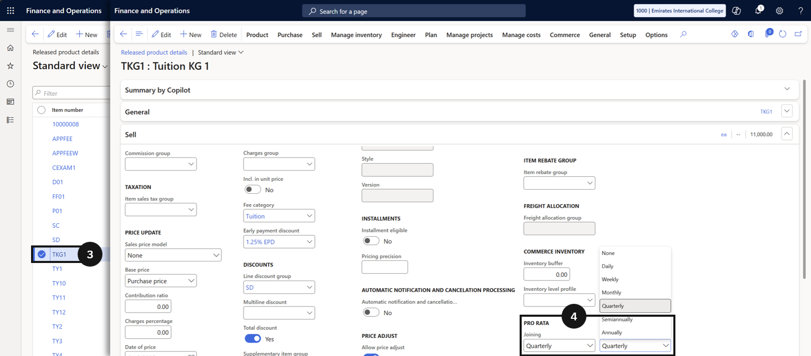

# Enable Pro Rata Adjustments — Joining Students

When a student begins their enrolment after the official term start date, the pro rata adjustment feature calculates the fee based on the actual number of school days the student will attend. The Pro rata field on the relevant tuition fee item must be activated, and the student's enrolment effective date must reflect their actual start date. Ensure the **Pro rata joining** option on the fee item matches the policy configured in Fee schedule parameters.

1. Open the tuition fee item

   From the **FNO dashboard**, open **Modules ▸ Product information management**, expand **Products**, and click **Released products**. Locate and select the tuition fee item (e.g., *FS1*) (③).

      

2. Enable Pro rata

   Open the **Sell** section and locate the **Pro rata** field (④). Set this field to any option except *None* to activate pro rata adjustment for joining students.

3. Save

   Click **Save**.
