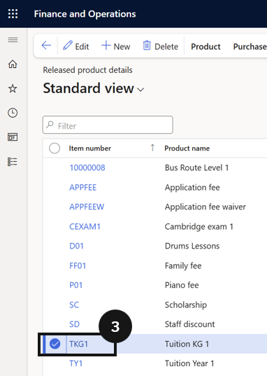

# Enable Pro Rata Adjustments — Leaving Students

When a student leaves the school before the end of a term, any fees already invoiced for the remaining days need to be adjusted and refunded. Enabling pro rata on the fee item allows the system to calculate the correct refund when the Calculate fee and charge adjustment task is run. Ensure the **Pro rata leaving** option on the fee item matches the policy configured in Fee schedule parameters.

1. Open the tuition fee item

   From the **FNO dashboard**, open **Modules ▸ Product information management**, expand **Products**, and click **Released products**. Locate and select the tuition fee item (e.g., *FS1*).

2. Enable Pro rata and save

   Open the **Sell** section and locate the **Pro rata** field. Set this field to any option except *None* to activate pro rata adjustment for leaving students.

   Click **Save**.

