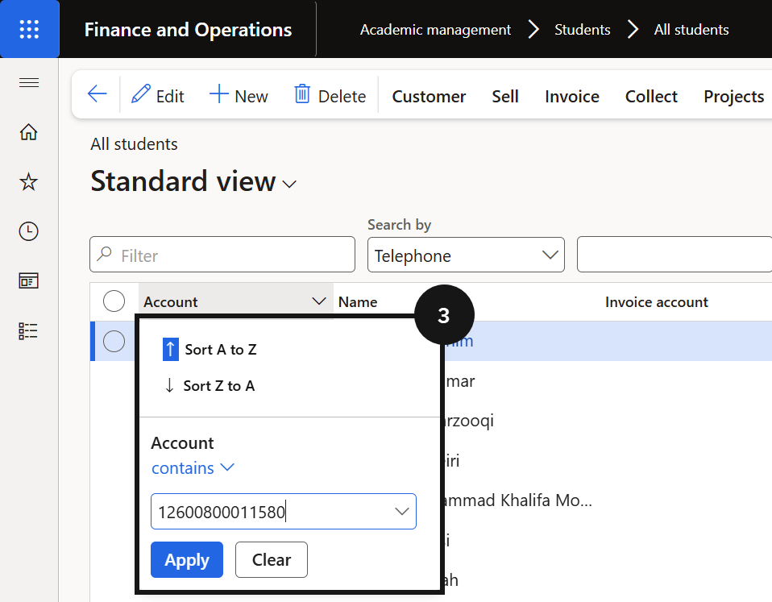
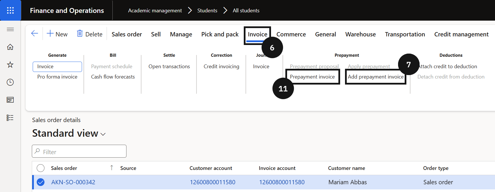
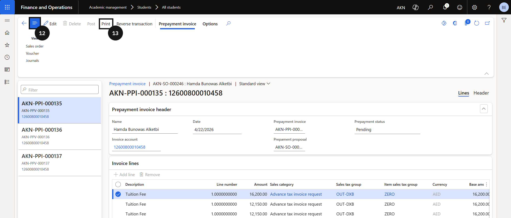

# Generate an Advance Tax Invoice upon Request

The advance tax invoice feature generates a tax invoice against a fee payer's open proforma invoice before full payment is received. Typically used when a family requests a formal tax invoice ahead of settlement — for employer reimbursement or government funding.

1. Find the student's sales order

   From the **FNO dashboard**, navigate to **Modules ▸ Academic Management ▸ Students ▸ All students**. Filter for the student using the **Account** column with the *contains* operator. Click **Sell** on the Action Pane, then click **Orders ▸ All sales orders** to locate the open proforma invoice.

2. Add the prepayment invoice

   Click **Invoice** on the Action Pane, then click **Add prepayment invoice**. Select the **Mark** checkbox to confirm the selection. If invoicing for a partial amount only, enter the amount in the **Amount to invoice** field before proceeding. In the **Sales category** field, enter or select *Advance tax invoice request category*. Click **Post**.

3. Print the invoice

   Click **Prepayment invoice**, click **Show or hide controls** if necessary, then click **Print**.

