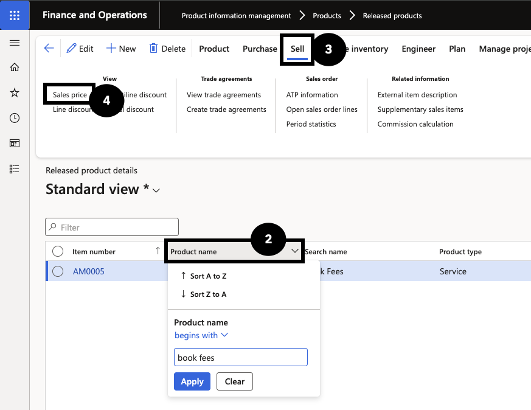
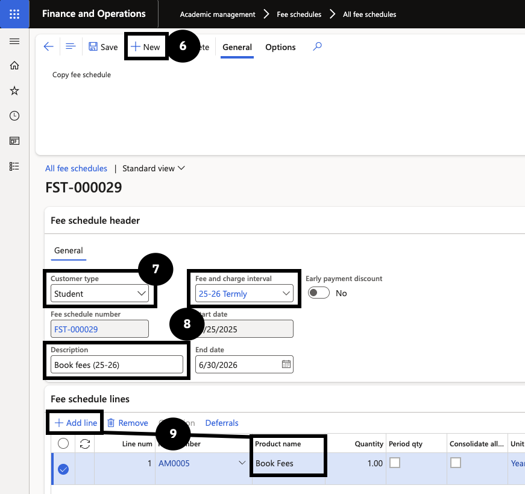
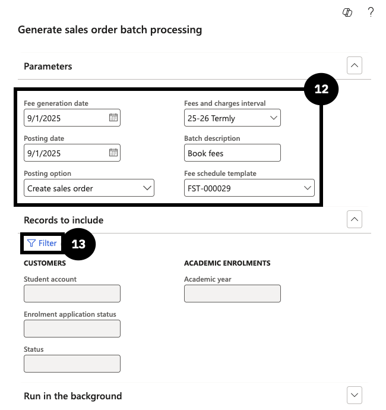
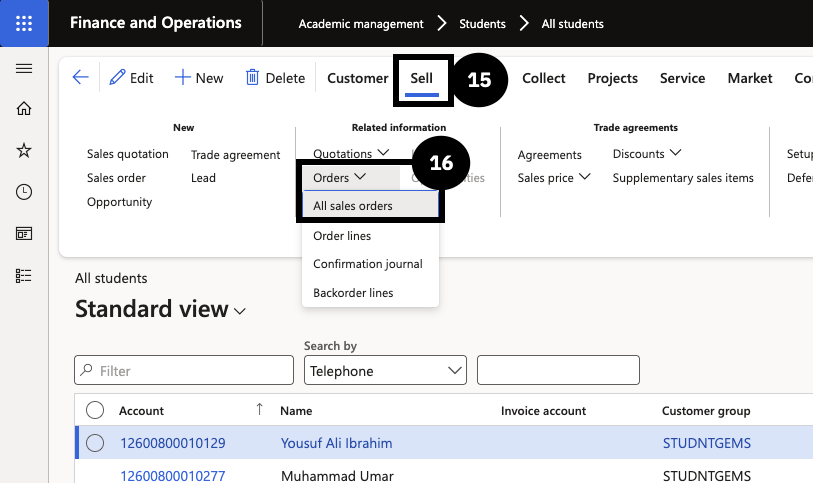

# Generate Flat Fee for Book Sales

Before starting, ensure a book fee item has already been created.

1. Verify book fee prices

   From the **FNO dashboard**, navigate to **Modules ▸ Product information management ▸ Products ▸ Released products**. Filter the **Product name** column for *Book fees* (②). Click **Sell** on the Action Pane (③) and under **View** select **Sales price** (④). Confirm prices are set up for all required grades, curricula, and streams.

   

2. Create a fee schedule template for book sales

   Navigate to **Modules ▸ Academic management ▸ Fee schedules ▸ All fee schedules** and click **New** (⑥). Set **Customer type** to *Student* (⑦), enter a **Description**, and select a **Fee and charge interval** (⑧). In **Fee schedule lines**, click **+ Add line** and choose the book fee item (⑨). Click **Save and close**.

   

3. Generate the sales order

   Navigate to **Modules ▸ Academic management ▸ Periodic tasks ▸ Generate sales order batch processing**. Set a **Fee generation date** within the fee and charge interval, select the **Fee and charge interval**, set **Posting option** to *Create sales order*, enter a **Batch description**, and select the **book sales fee schedule template** (⑫). In **Records to include**, filter by the **Student account number** (⑬). Click **OK**.

   

4. Send the proforma invoice
   
   Return to **Modules ▸ Academic management ▸ Students ▸ All students**, open the student record, click **Sell (⑮) ▸ Orders ▸ All sales orders** (⑯), and select the generated sales order. Click **Confirm sales order**, enable **Print confirmation** and **Use print management destination**, then click **OK** to send the proforma invoice.

   
