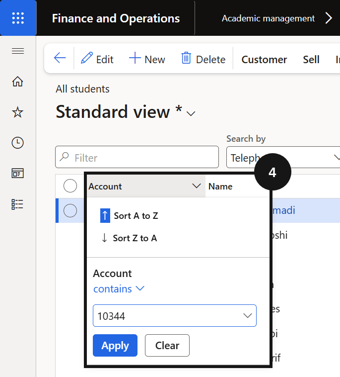
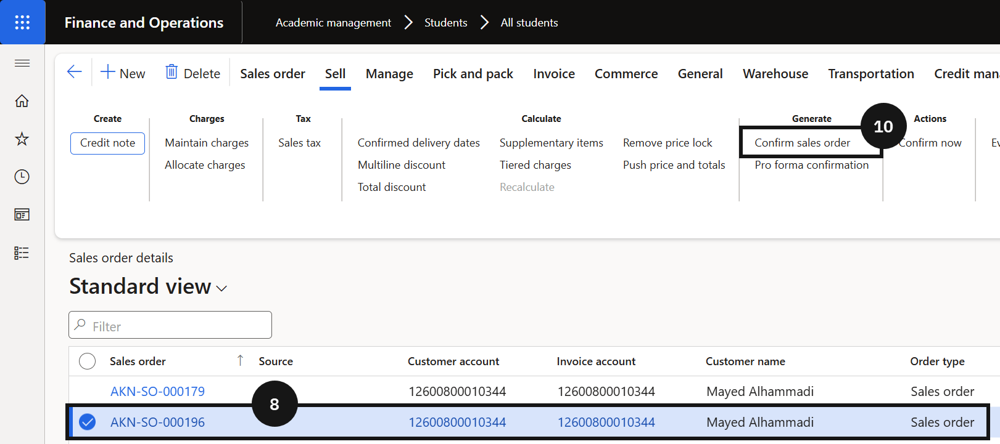

# Generate a Proforma Invoice Document

Proforma invoices are generated from confirmed sales orders and sent to fee payers before a formal tax invoice is issued. Use this process to confirm and send a proforma for an individual student.

1. Find the student's sales order

   From the **FNO dashboard**, open **Modules ▸ Academic Management**, expand **Students**, and click **All students**. Filter for the student using the **Account** column filter (use the *contains* operator) (④). Click **Sell** on the Action Pane (⑤), then click **Orders ▸ All sales orders** to view all sales orders for the student (⑧). Select the sales order to confirm.

   

   

2. Confirm and send the proforma invoice

   On the Action Pane, click **Sell**, then click **Confirm sales order** (⑩). Set the following:

   - **Print confirmation** — set to *Yes* (⑪).
   - **Use print management destination** — set to *Yes* (⑫).

   Click **OK** (⑬). The system sends the proforma invoice to the fee payer using the print management destination configured for the school. No manual distribution is required.

   

   
