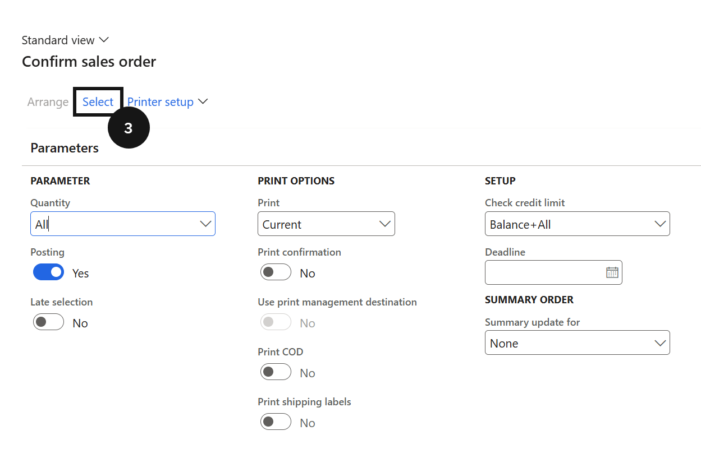
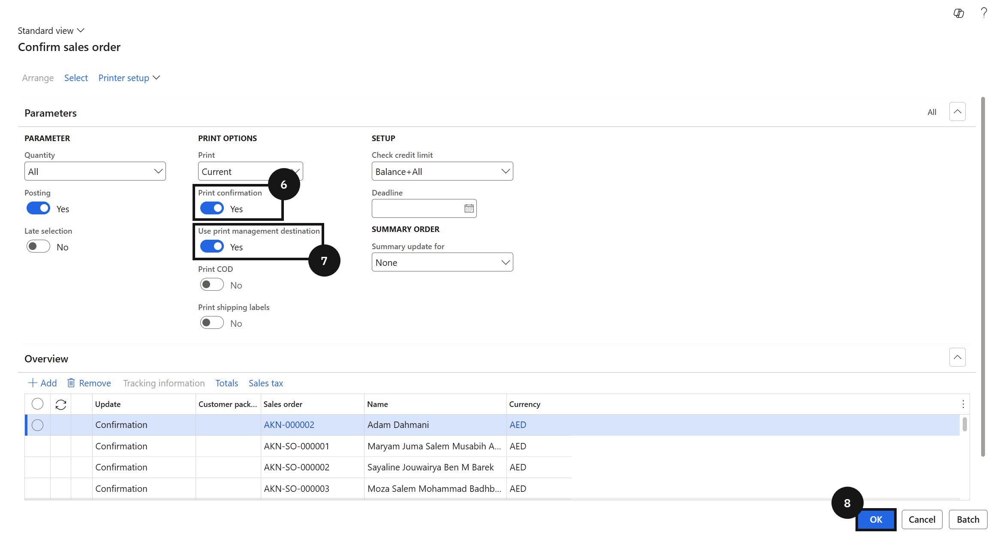

# Generate Proforma Invoice Documents in Bulk

Use this process to confirm and send proforma invoices for an entire billing cycle at once. The system automatically emails each document to the fee payer on completion.

1. Open Confirm sales order

   From the **FNO dashboard**, open **Modules ▸ Sales and Marketing**, expand **Sales orders ▸ Order confirmation**, and click **Confirm sales order**.

2. Filter by billing cycle

   Click **Select** (③) and add a filter for **Fee and charge interval** (④). Click **OK** (⑧), then enter the **billing cycle year** to filter for the proforma invoices to generate. The system lists all open sales orders matching the selected billing cycle.

   

   

3. Enable print options and submit

   Enable **Print confirmation** (⑥) and **Use print management destination** (⑦). For a manageable number of orders, click **OK** (⑧) to generate and send documents immediately. For large volumes, click **Batch**, enable **Batch processing**, and click **OK** to run in the background. The system automatically emails each proforma invoice to the fee payer as an attachment once processing completes.

   
