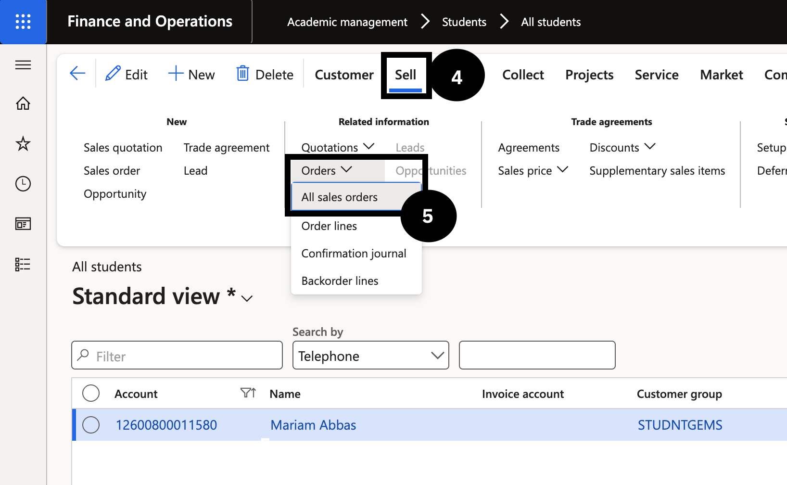
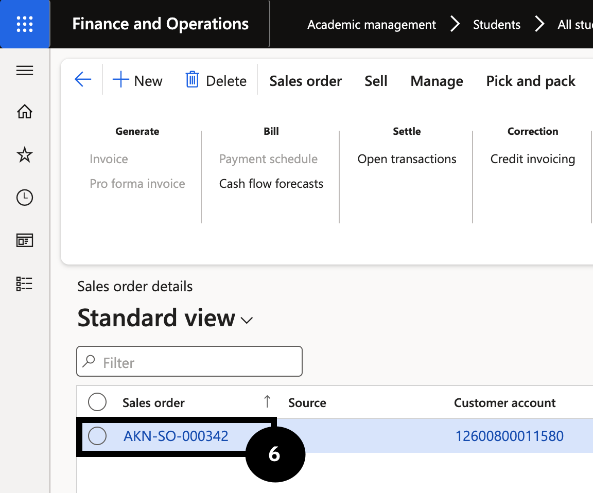

# Post Fee Invoices for a Whole Fee Schedule Batch

Once fee invoices have been generated and reviewed, post the batch to create the financial transactions in the system. The batch can be posted directly or as a background job for large volumes.

1. Open the batch and post

   From the **FNO dashboard**, open **Modules ▸ Academic Management**, expand **Fee schedule batches**, and click **All fee schedule batches**. Click the **Fee schedule batch number** to open the batch (status must be Active). Click **Post** in the toolbar.

2. Set the posting date and submit

   Choose the **Posting date** (e.g., end of June). For large batches, expand **Run in the background** and enable **Batch processing** before clicking **OK** to avoid timeouts.

   When complete, the batch status changes from Active to Invoice and all invoices are generated.

