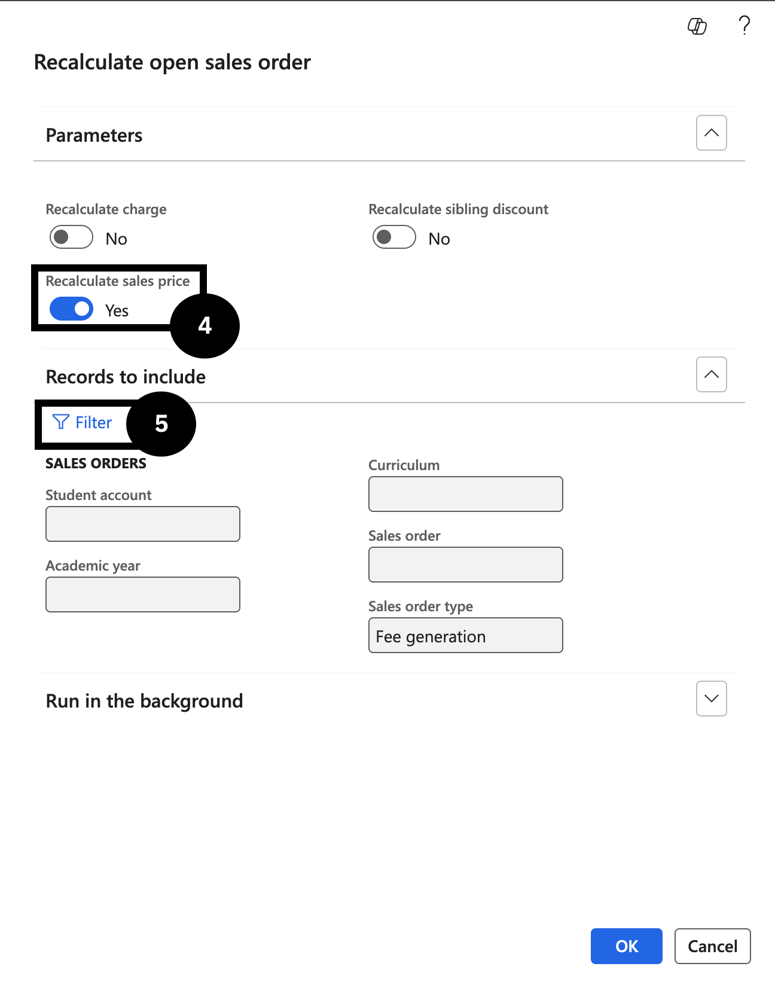

# Recalculate Open Sales Order Prices

After a fee price change is posted, open proforma sales orders generated under the old price do not automatically update. This task re-prices those open orders using the current trade agreement price.

1. Run the recalculation task

   From the **FNO dashboard**, open **Modules ▸ Academic Management**, expand **Periodic Tasks**, and click **Recalculate Open Sales Order**. Set the following:

   - **Recalculate sales price** — toggle to *Yes* (④).

   In **Records to include**, filter by **Student account** or a specific **Sales order** number (⑤). You can also filter for an entire fee and charge interval to reprice all students in a billing cycle.

   Click **OK**.

   

2. Verify the updated price

   Return to the sales order and refresh the page to confirm that future terms show the updated price.
