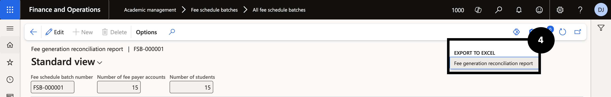

# Reconcile Sales Orders

After the fee generation batch has run, reconcile the output to confirm the expected number of students and fee payer accounts were captured. This ensures no students were unexpectedly excluded before invoices are posted.

1. Open the reconciliation report

   From the **FNO dashboard**, open **Modules ▸ Academic Management**, expand **Fee schedule batches**, and click **All fee schedule batches**. Click the relevant **Fee schedule batch number** (②), then open **Fee generation reconciliation report** (③) to review how many fee payer accounts and students were included.

   

   

2. Export for further validation (optional)

   Right-click the **Fee payer name** column header and select **Export all rows**. In the dialog, click **Download** to export the data to Excel or SSRS for further validation (④).

   
