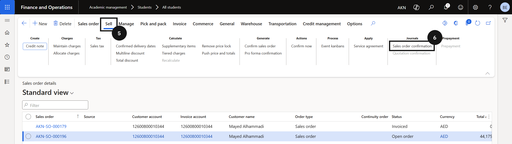
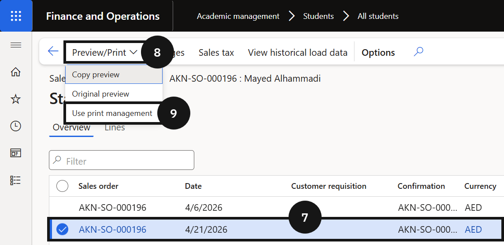

# Regenerate a Proforma Invoice Document

Use this process to resend a proforma invoice that has already been confirmed. This regenerates and resends the document without creating a new sales order or confirmation record.

1. Open the sales order confirmation

   From the **FNO dashboard**, open **Modules ▸ Academic Management**, expand **Students**, and click **All students**. Filter for the student, click **Sell**, then click **Orders ▸ All sales orders**. Open the relevant sales order. On the Action Pane, click **Sell** (⑤), then under **Journals** click **Sales order confirmation** (⑥). Select the latest version of the confirmation (⑦).

   

2. Reprint and resend

   Click **Preview/Print** (⑧), then click **Use print management** (⑨). Click **Close**.

   
