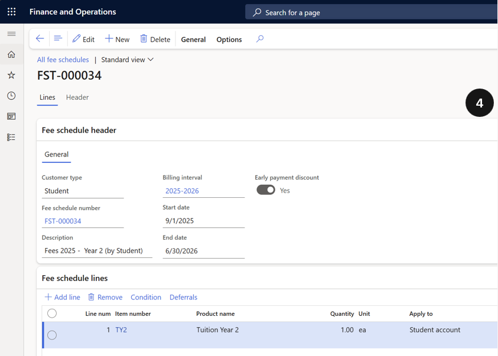

# Review the Sales Order Adjustment

After running the Calculate fee and charge adjustment task, review the resulting adjustment sales order to confirm the correct refund amount before processing.

1. Open the adjustment sales order

   From the **FNO dashboard**, open **Modules ▸ Academic Management**, expand **Fee schedule batches**, and click **All fee schedule batches**. Locate and open the newly generated sales order for the student.

2. Verify the adjustment amounts

   Review the adjustment:

   - **Quantity** — shows a negative value representing the number of remaining school days to be refunded.
   - **Net amount** — displays the total refund due to the student.

