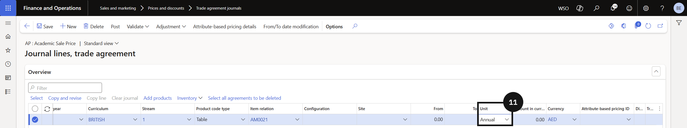

# Set Up Fee Structure — Trade Agreement

Fee structure setup defines the price applied to tuition fee items using trade agreements. Each tuition fee item requires two prices per academic attribute combination — a monthly price used when generating fee invoices, and an annual price used when calculating enrolment deposits.

> **Note:** Each academic attribute combination (academic year + curriculum + stream) requires two trade agreement lines: one with a monthly unit and one with an annual unit. If any combination is missing a price, the system will not generate a price for that combination.

1. Review the fee item

   From the **FNO dashboard**, open **Modules ▸ Product information management**, expand **Products**, and click **Released Products**. Search for and open the tuition fee item to review before setting up the price.

2. Create the trade agreement journal and add price lines

   Navigate to **Modules ▸ Sales and marketing**, expand **Prices and discounts**, and click **Trade agreement journals**. Click **New** and in the **Name** field select the **academic journal name**. Selecting the academic journal name enables the Academic attributes flag, allowing prices to be set by academic year, curriculum, and stream.

   Click **Lines** and complete the columns to create the monthly price line. Copy the line for the same academic attribute combination, change the **Unit** to *Annual*, and enter the **annual price**. Repeat for each additional academic attribute combination.

3. Post

   Click **Post** to activate the trade agreement.

