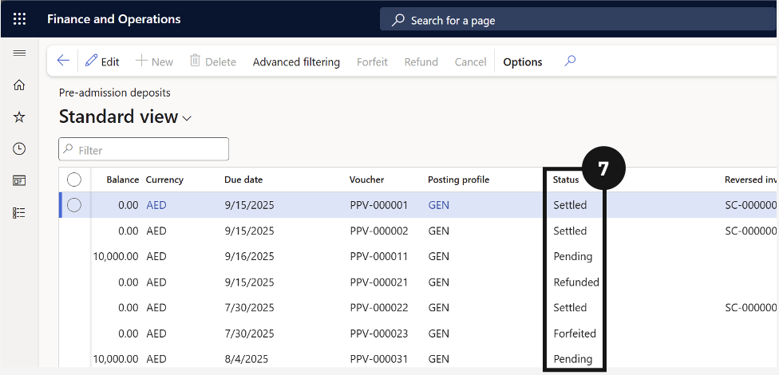

# Settle Enrolment Deposits

After fee invoices have been posted, the system automatically matches received enrolment deposits to the corresponding invoices. Confirm that deposit statuses update from Received to Settled to ensure reconciliation has completed correctly.

1. Open Pre-admission deposits

   From the **FNO dashboard**, open **Modules ▸ Academic Management**, expand **Inquiries and reports ▸ Pre-admission fees**, and click **Pre-admission deposits**. Click **OK** (③) in the dialog to view all deposits.

   

2. Confirm settlement status

   Click on the enrolment deposit **Sales order** to review (④). Deposits with status **Received** indicate payment was collected. After posting, the system automatically matches these to invoices — confirm the status has changed from Received to **Settled** (⑦).

   

   
