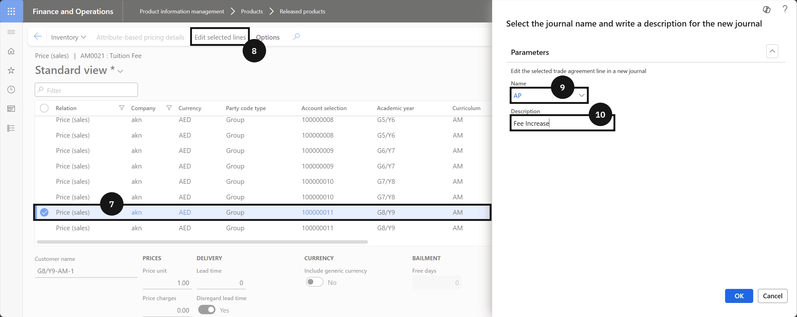
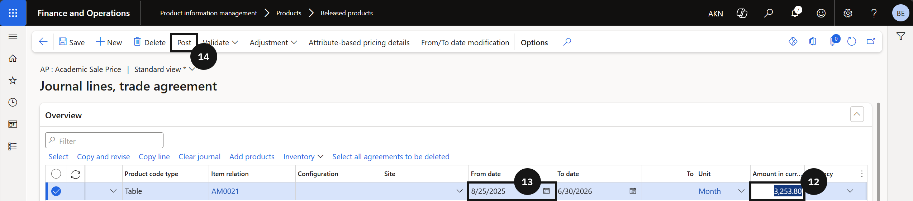

# Update Fee Structure Prices

When tuition fees or other fee item prices need to be updated — for example, at the start of a new academic year — make the change by editing the existing trade agreement line and submitting it through a new journal. The effective date controls when the new price takes effect.

1. Locate the price line

   From the **FNO dashboard**, open **Modules ▸ Product information management**, expand **Products**, and click **Released products**. Filter by **Product name** and select the tuition fee item (③). Click **Sell** (④) from the Action Pane, then click **Sales price** (⑤). Filter by **Company**, **Academic year**, **Curriculum**, and **Stream** to find the relevant fee line. Select the line (⑦).

   

2. Edit the price and post

   Click **Edit selected lines** (⑧) and complete the following:

   - **Name** (⑨) — enter a name (e.g., *Academic scale price*).
   - **Description** (⑩) — enter a description (e.g., *Fee increase*).

   Click **OK**. Enter the new **Sales price** (or the yearly price if annual pricing is used for deposit calculations) (⑫). Enter the **From date** (⑬) for when the new price should take effect. Click **Post** (⑭).

   

   

3. Verify the update

   Return to the fee item and confirm the updated price for the intended academic year and curriculum combination.
