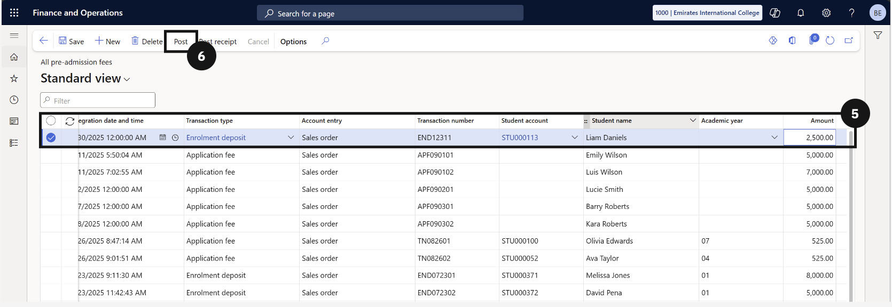
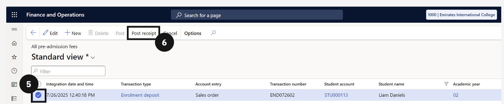
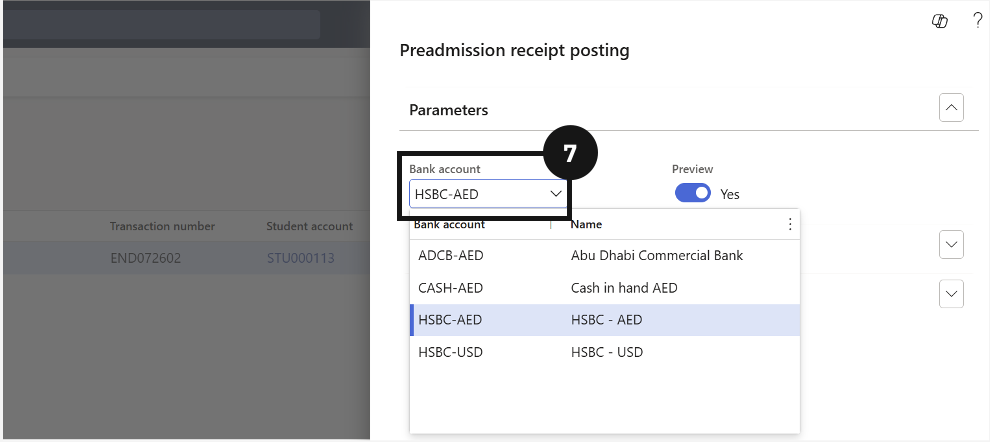
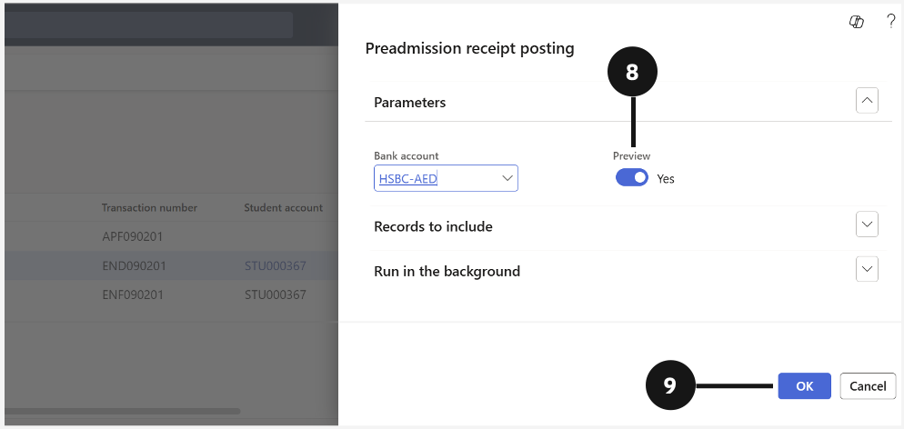

# Pre‑Admission Fees

Pre-Admission Fees manages the financial side of the enrolment journey before a student is formally admitted. It covers the configuration of transaction types and posting logic for application fees, enrolment fees, and deposits, as well as manual fee entry for schools where the CE integration is not yet active. Counter payment processing, deposit refunds and forfeits, fee reversals, and the approval workflow for concession types are all handled here. Bulk scholarship and discount data can also be imported using the Excel add-in when large volumes of records need to be set up at once.

---

#### Setup
Before any pre-admission fees can be processed, the system needs to be configured with the correct transaction types and posting logic. This involves defining the categories of fees that will be charged prior to enrolment, such as application fees, enrolment fees, and enrolment deposits, and mapping each of these to the appropriate general ledger accounts. Without this setup in place, the system will not know how to record or post these transactions correctly. Fee schedule parameters also need to be updated to enable pre-admission processing across the platform.

---

## Pre-Admission Type Setup

1. From the FNO dashboard, open **Modules** ▸ **Academic Management**.
2. Expand **Setup**, then expand **Pre‑admission fees**.
3. Click **Pre‑admission types**. *Tip: Review the existing types to avoid creating duplicates*.
4. Click **New** in the toolbar.
5. In **Pre-admission type**, enter a value (e.g, *Application fee*, *Enrolment fee*).
6. In **Description**, enter a value (e.g, *Application fee*, *Enrolment fee*).
7. To create an Enrolment deposit:

      a. Enter Enrolment deposit in both **Pre-admission type** and **Description**.

      b. Select the **Deposit** check box.

> **Note:** The deposit check box is only selected when the pre-admission type represents a deposit.
8. Click **Save**.

---

## Setup Posting Logic For Each Transaction Type

1. From the FNO dashboard, open **Modules** ▸ **Academic Management**.
2. Expand **Setup**, then expand **Pre‑admission fees**.
3. Click **Pre‑admission posting**.
4. Click **New** in the toolbar to create the Application Fee entry.
5. Enter the required information for each column in the table.
6. Click **New** in the toolbar to create the Enrolment Fee entry.
7. Set values for each of the columns in the table.
8. Click **New** in the toolbar to create the Enrolment Deposit entry.
9. Set values for each of the columns in the table.
10. Click **Save**.

---

## All Pre-Admission Fee Tables

---

## Pre-Admission Deposits Table

---

## Pre-Admission Deposits Held

---

## Application Fee Waiver

---

## Application / Registration Fee Process via Cashier

---

## Enrolment Deposit Process - Online

---

## Enrolment Deposit Process - Over-the-Counter

---

## Adhoc Forfeiting Deposits

---

#### Refunding Deposits
Enrolment deposits are designed to be refundable under certain circumstances, but they can also be forfeited if a student does not proceed with enrolment. This section covers both scenarios. When a refund is required, staff select the deposit, choose the refund bank account, and process the transaction through the journal. When a deposit is to be forfeited, the same selection process applies, but the forfeit action is used instead. In both cases, only deposits with a status of Received or Partial are eligible for processing, ensuring that incomplete or unsettled deposits are not actioned prematurely.

---

## Forfeiting Deposits

> **Note:** *Only deposits with Status = Received or Partial is eligible to be forfeited.*

1. From the **FNO dashboard**, open **Modules** ▸ **Academic Management**.
2. Expand **Inquiries and reports**, then expand **Pre-admission fees**.
3. Click **Pre-admission deposits**.
4. When the deposit criteria window opens, click **OK** to view all deposits.
5. **Check** the deposit to be forfeited from the far-left column.
6. Click **Forfeit** in the toolbar.
7. In the dialog box on the right, choose whether to **Preview** or **disable** the toggle to post automatically.
8. Click **OK**.
9. To preview, click the **Forfeit journal number**.
10. Open the journal by clicking **Lines** in the toolbar.
11. Review the transaction, select the credit line using the **checkbox**, and click **Post**.
12. Click **Save** in the toolbar.                                                           
13. Review the transaction.
14. Select the credit line using the **checkbox** and click **Post**.
15. Click **Save** in the toolbar.

---

## Refunding Deposits

1. From the **FNO dashboard**, open **Modules** ▸ **Academic Management**.
2. Expand **Inquiries and reports**, then expand **Pre-admission fees**.
3. Click **Pre-admission deposits**.
4. When the deposit criteria window opens, click **OK** to view all deposits.
5. **Check** the deposit to be refunded from the far-left column.
6. Click **Refund** in the toolbar.
7. In the dialog box on the right, choose the **Bank account** for the refund.
8. Choose whether to **Preview** or disable the toggle to post automatically. Click **OK**.
9. To preview, click the **Refund journal number**.
10. Open the journal by selecting the refund journal and clicking **Lines** in the toolbar. 
11. Review the refund, select the credit line using the **checkbox**, and click **Post**.
12. Review the transaction.
13. Select the credit line using the **checkbox**, and click **Post**.
14. Click **Save** in the toolbar.

---

## Cancel Enrolment Deposit or Fee

#### Reversing Unpaid Fees
There are situations where a posted enrolment fee or deposit needs to be reversed, such as when a fee was created in error or circumstances have changed before payment was received. This process allows staff to cancel a posted record by selecting it from the pre-admission fees list and applying a reverse posting date. The reversal creates an offsetting entry in the system, effectively cancelling the original transaction and restoring the record to a neutral state without permanently deleting any audit history.

---

## Reverse Enrolment Deposit or Fee

1. From the **FNO dashboard**, open **Modules** ▸ **Academic Management**.
2. Expand **Inquiries and reports**, then expand **Pre-admission fees**.
3. Click **All pre-admission fees**.
4. To filter the view by Posted entries, click the **Status column**.
5. Select **Posted**.
6. Select the **enrolment deposit or fee** using the checkbox on the far-left column.
7. Click **Cancel** in the toolbar.
8. In the dialog box on the right, choose the **Reverse posting date.**
9. Click OK. 

---

#### Enrolment Transactions
When the integration between the F&O and CE systems is not yet active, pre-admission fee records need to be created manually. This involves navigating to the pre-admission fees area and entering the relevant details for each transaction type, including application fees, enrolment fees, and enrolment deposits. Each record must then be posted to update its status and ensure it is correctly reflected in the system. This process is a temporary measure until the CE integration is fully operational and transactions can flow through automatically.

---

## Manually Adding Application Fee Records

1. From the **FNO dashboard**, open **Modules** ▸ **Academic Management**.
2. Expand **Inquiries and reports**, then expand **Pre-admission fees**.
3. Click **All pre-admission fees**.
4. Click **New** in the toolbar.
5. Enter the required information for each column in the table.
6. Click **Post** in the toolbar.
   *Note: The status updates from Created to Paid once the payment is successful.*
7. Click **Save**.

> **Tip:** *Under any date and time value, user can type letter "t" then hit Enter to input today date value.*

---

## Manually Adding Enrolment Fee Records

1. From the **FNO dashboard**, open **Modules** ▸ **Academic Management**.
2. Expand **Inquiries and reports**, then expand **Pre-admission fees**.
3. Click **All pre-admission fees**.
4. Click **New** in the toolbar.
5. Enter the required information for each column in the table.
6. Click **Post** in the toolbar.
   *Note: The status updates from Created to Posted.*
7. Click **Save**.

---

## Manually Adding Enrolment Deposit Records

1. From the **FNO dashboard**, open **Modules** ▸ **Academic Management**.
2. Expand **Inquiries and reports**, then expand **Pre-admission fees**.
3. Click **All pre-admission fees**.
4. Click **New** in the toolbar.
5. Enter the required information for each column in the table.
6. Click **Post** in the toolbar.
   *Note: The status updates from Created to Posted.*
7. Click **Save**.

---

#### Payments
Once enrolment fees and deposits have been created and posted, payments can be processed directly from the Pre-Admission Fees table. This process is used when a fee payer makes a payment in person at the school's counter, rather than through the Parent Portal (PXP). Staff select the relevant fee or deposit, choose the appropriate bank account, and confirm the payment. The system then updates the record status to reflect that payment has been received, providing an accurate and up-to-date view of each student's financial position prior to enrolment.

---

## Pre-Admission Enrolment Fee Payment Process

1. From the **FNO dashboard**, open **Modules** ▸ **Academic Management**.
2. Expand **Inquiries and reports**, then expand **Pre-admission fees**.
3. Click **All pre-admission fees**.
4. Identify the student by clicking the **Student name** column and using the **filter** to search (e.g., Stuart Little).
5. **Check** either the Enrolment fee and/or Enrolment deposit from the far-left column.
6. Click **Post receipt** in the toolbar.
7. Choose the appropriate **Bank account** from the dropdown.
8. Decide whether to enable the **preview** option:
   - If **Enabled**, review payment channels manually before processing.
   - If **Disabled**, the system posts the payment automatically.
9. Click **OK** to finalise the payment.

---
