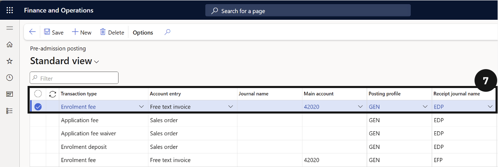
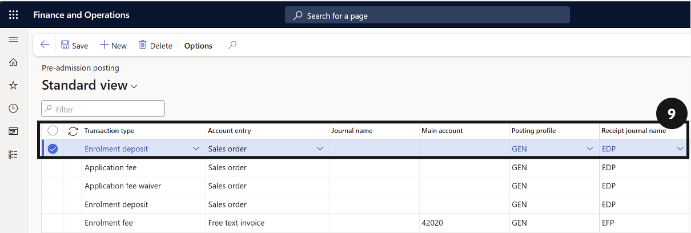

# Configure Posting Logic for Each Transaction Type

This page walks through configuring the three standard posting entries — Application Fee, Enrolment Fee, and Enrolment Deposit — in **Pre-admission posting**. Complete this setup after creating the types in [Set Up Pre-Admission Types](./set-up-pre-admission-types.md).

1. Open Pre-admission posting

   From the **FNO dashboard**, open **Modules ▸ Academic Management**, expand **Setup**, then expand **Pre-admission fees**, and click **Pre-admission posting**.

2. Add the Application Fee entry

   Click **New** in the toolbar. Select *Application fee* in **Pre-admission type** and complete all required columns in the row.

3. Add the Enrolment Fee entry

   Click **New** in the toolbar. Select *Enrolment fee* in **Pre-admission type** and complete all required columns in the row.

4. Add the Enrolment Deposit entry

   Click **New** in the toolbar. Select *Enrolment deposit* in **Pre-admission type** and complete all required columns. Do not select an **Item number** for deposit types.

5. Save

   Click **Save**.

