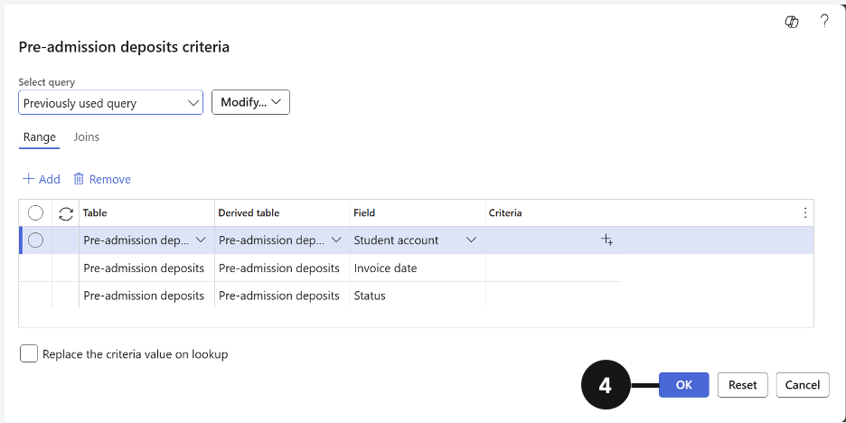
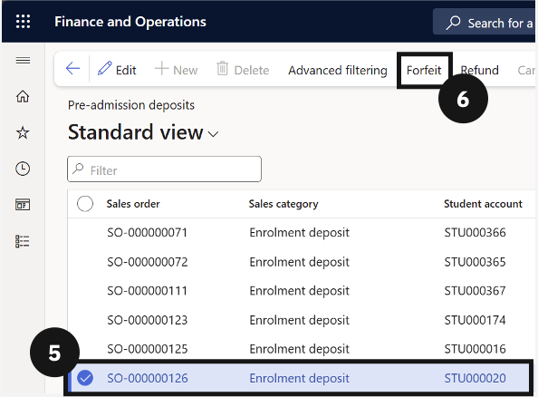
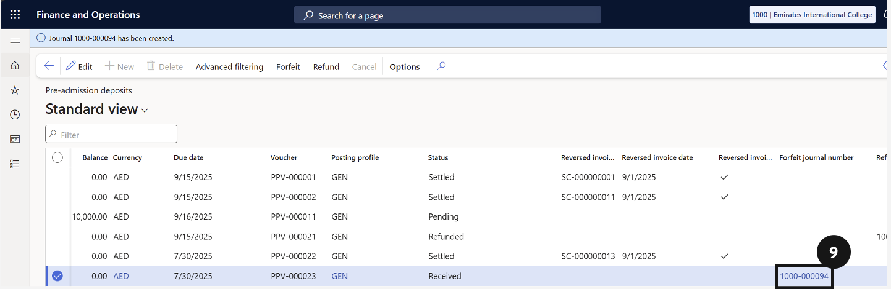
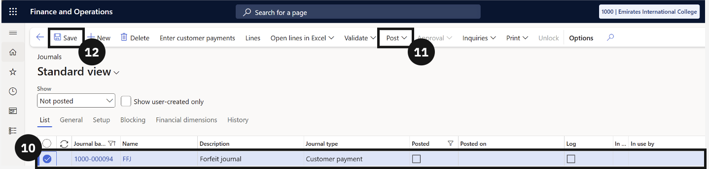
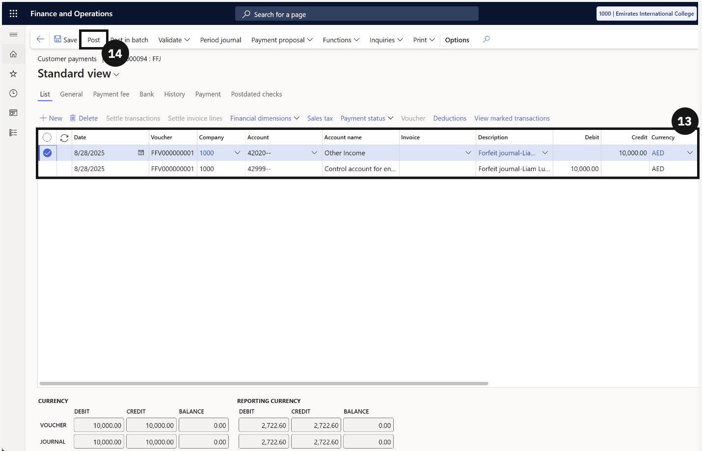

# Forfeiting Deposits

Deposits are forfeited when a student does not proceed with enrolment and the school elects to retain the funds.

> **Note:** Only deposits with Status = Received or Partial are eligible to be forfeited.

1. Open Pre-admission deposits and select the deposit

   From the **FNO dashboard**, open **Modules ▸ Academic Management**, expand **Inquiries and reports**, then expand **Pre-admission fees**, and click **Pre-admission deposits**. When the deposit criteria window opens, click **OK** (④) to view all deposits. Check the deposit to be forfeited using the checkbox in the far-left column (⑤).

   

   

2. Initiate the forfeit

   Click **Forfeit** in the Action Pane (⑥). In the dialog on the right, choose whether to enable **Preview** (to review before posting) or disable it to post automatically (⑦). Click **OK** (⑧).

   

3. Review and post the forfeit journal

   If you selected Preview, click the **Forfeit journal number** link (⑨). Open the journal by clicking **Lines** in the toolbar. Select the credit line using the checkbox (⑩), review or edit the VAT as required, and click **Post** (⑪). Click **Save** in the toolbar (⑫).

   

   

   > **Note:** The system will transfer the balance from the forfeited payment to another income amount.

   
