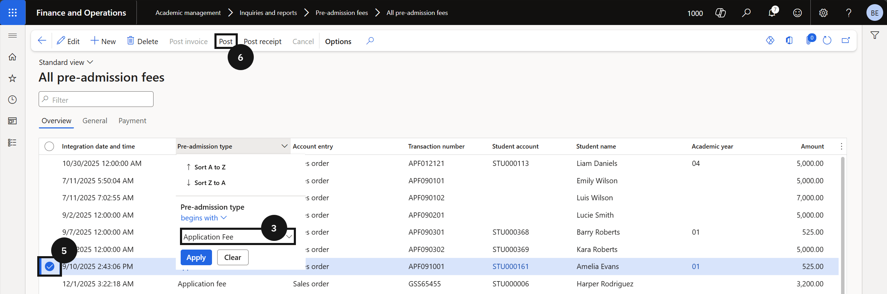
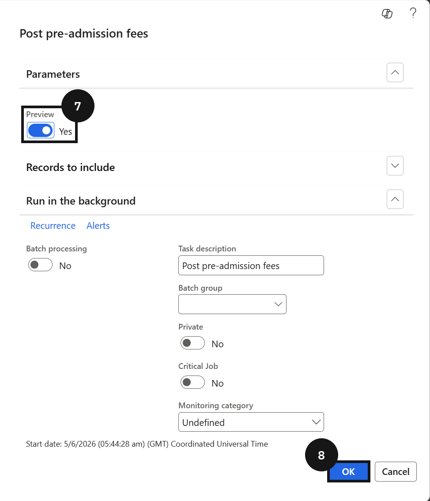
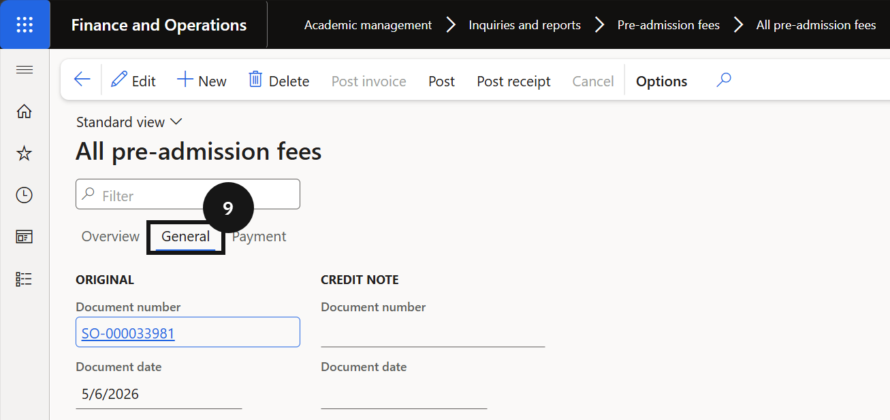

# Manually Post a Pre-Admission Fee to Create a Sales Order for Cashier Receipt

> **Note:** This step is only required when a parent wishes to pay the registration fee over the counter. For online payments, the sales order invoice is generated and posted automatically. For counter payments, the student management system must first be manually progressed to Registered before following the steps below.

1. Filter and select the fee record

   From the **FNO dashboard**, open **Modules ▸ Academic Management**, expand **Inquiries and reports**, then expand **Pre-admission fees**, and click **All pre-admission fees**. Filter the **Pre-admission type** column by *Application Fee* and locate the correct student record. Select the record using the checkbox.

2. Post the fee

   Click **Post** in the toolbar. Ensure the **Preview** toggle is set to *Yes* to review the posting before it is finalised, then click **OK**.

3. View the sales order

   Click the **General** tab to view the created sales order number. Once posted, the sales order is available in Cashier receipt for payment processing.

