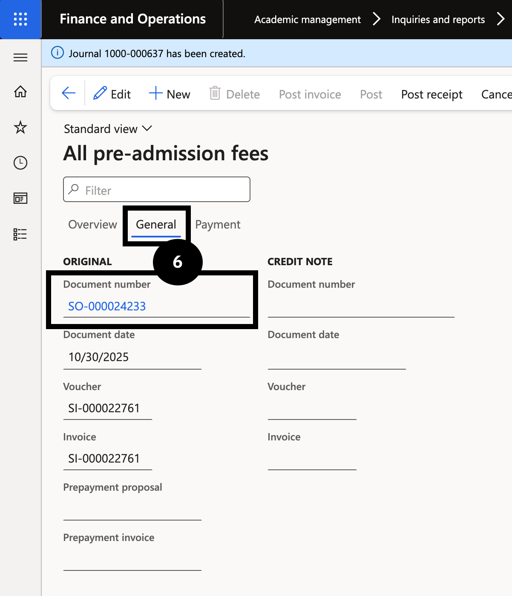
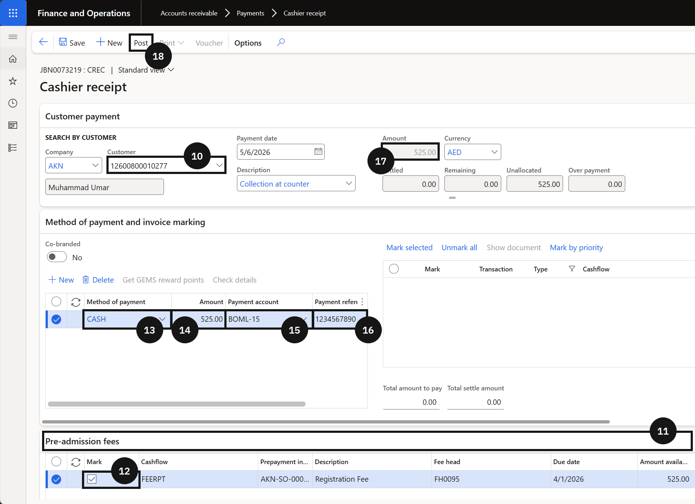

# Application / Registration Fee Process via Cashier

Registration fees can be receipted over the counter when a fee payer makes payment in person at the school. The pre-admission fee record must already be posted (see [Manually Post a Pre-Admission Fee](./manually-post-pre-admission-fee.md)) before proceeding with cashier receipting.

> **Note:** The enrolment officer must manually push the student record to Registered status in the student management system before receipting over the counter. This step is automated when payment is made online.

1. Filter and post the fee record

   From the **FNO dashboard**, open **Modules ▸ Academic Management**, expand **Inquiries and reports ▸ Pre-admission fees**, and click **All admission fees**. Filter **Pre-admission type** by *Application fee* (②), locate and select the correct student record. Click **Post** (④) with **Preview** toggled on. Click the **General** (⑥) tab to view the created sales order — it will now be available in Cashier receipt for payment.

   

   

2. Create a cashier receipt

   From the **FNO dashboard**, open **Modules ▸ Accounts receivable**, expand **Payments**, and click **Cashier receipt**. Click **+ Cashier receipt** in the Action Pane (⑨).

   Select the **student name** from the fee payer list. Open the **Pre-admission fees** tab (⑪) and tick the **Mark** checkbox (⑫) next to the registration fee. Complete the payment details in the **Method of payment and invoice marking** tab:

   - **Method of payment** (⑬) — select the payment method from the dropdown.
   - **Amount** (⑭) — enter the fee amount.
   - **Payment account** (⑮) — select the deposit account.
   - **Payment reference** (⑯) — enter a payment reference.

   Verify the fee is fully allocated in the allocations summary.

   

   

3. Post and deliver the receipt

   Click **Post** in the Action Pane (⑱). Select the receipt delivery option — **Print receipt** to print a physical copy or **Email receipt** to send to the fee payer. Click **OK**.

   Once posted, the receipt journal flows back to the student management system, allowing the enrolment record to proceed to the next stage.
