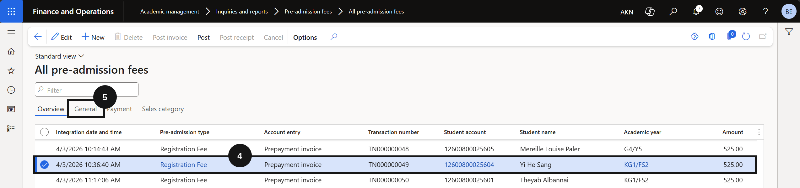
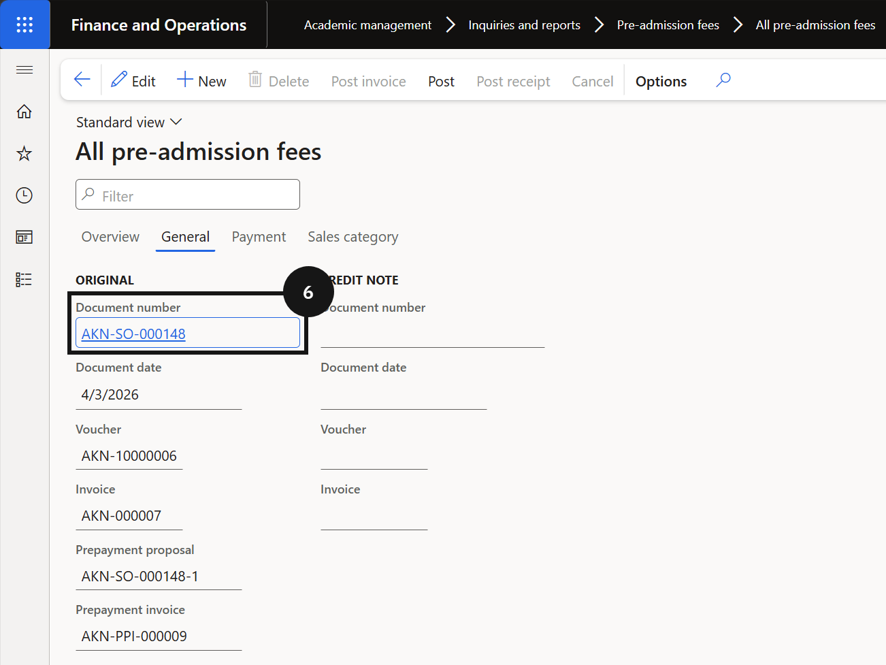
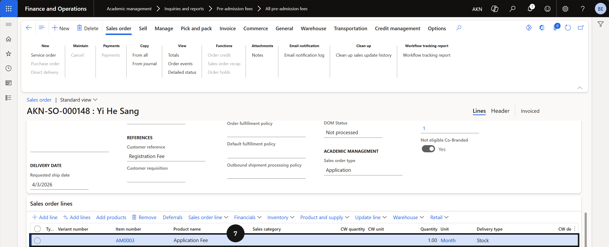

# Application / Registration Fee Process via Online

The registration fee is automatically created when the student record syncs from the student management system with an enrolment status of Prospective and an application status of Registered. No manual intervention is required — the receipt is created automatically once the fee payer completes payment via the payment link sent by the student management system.

1. Open All pre-admission fees

   From the **FNO dashboard**, open **Modules ▸ Academic Management**, expand **Inquiries and reports**, then expand **Pre-admission fees**, and click **All pre-admission fees**. Search for the student by name or account number.

2. View the sales order

   Click the **General** tab and click the link in the **Document number** field to open the sales order for the registration fee. Click **Back** to return.

3. Verify the payment receipt

   Click the **Payment** tab and click the link in the **Receipt journal** field. Locate the student's receipt journal record and verify the status shows **Posted**. Click **Lines** in the toolbar to view the posting detail for the registration fee.

