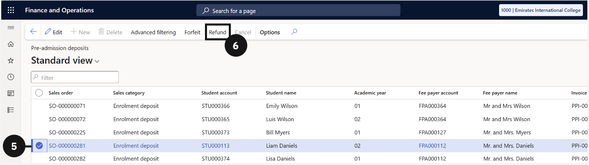
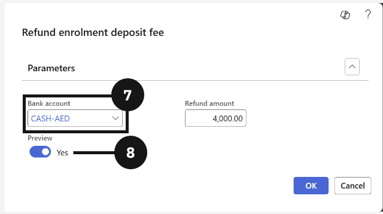
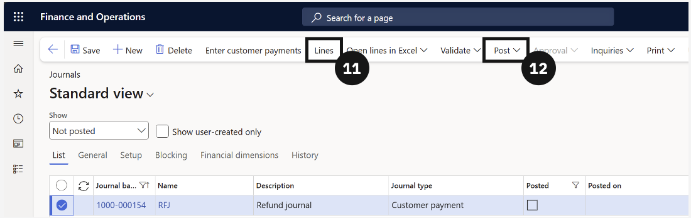
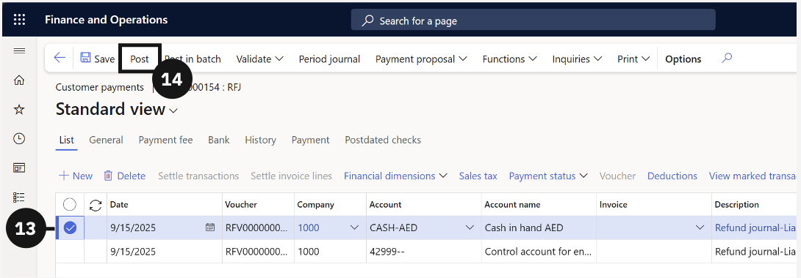

# Refunding Deposits

Deposits are refunded when a student does not proceed with enrolment and the school elects to return the funds. Only deposits with Status = Received or Partial are eligible.

1. Open Pre-admission deposits and select the deposit

   From the **FNO dashboard**, open **Modules ▸ Academic Management**, expand **Inquiries and reports**, then expand **Pre-admission fees**, and click **Pre-admission deposits**. When the deposit criteria window opens, click **OK** to view all deposits (④). Check the deposit to be refunded using the checkbox in the far-left column (⑤).

    

   

   
  
2. Initiate the refund

   Click **Refund** in the Action Pane (⑥). In the dialogue on the right, select the **Bank account** for the refund (⑦). Choose whether to enable **Preview** (to review before posting) or disable it to post automatically (⑧). Click **OK**.

   

3. Review and post the refund journal

   If you selected Preview, click the **Refund journal number** link (⑩). Select the refund journal and click **Lines** in the Action Pane (⑪). Review the refund, select the credit line using the checkbox, and click **Post** (⑫). Click **Save** in the toolbar.

   

   

4. Check the balance

   The system will show the amount deducted from the selected bank account (or mention if it is a cash refund) (⑬). The amount will be cleared from the refunded account. Check that the amounts are correct, then click **Post** (⑭). The deposit status will update to Refunded.

   
