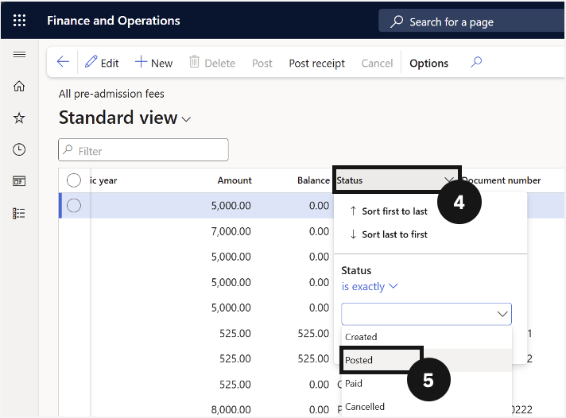

# Reverse an Enrolment Deposit or Fee

Use this process when a posted enrolment fee or deposit needs to be reversed — for example, when a fee was created in error or circumstances changed before payment was received. The reversal creates an offsetting entry in the system without deleting audit history.

1. Find the posted fee

   From the **FNO dashboard**, open **Modules ▸ Academic Management**, expand **Inquiries and reports**, then expand **Pre-admission fees**, and click **All pre-admission fees**. Filter the **Status** column to show only *Posted* entries (⑤) and select the enrolment deposit or fee using the checkbox on the far-left column (⑥).

   

2. Reverse the fee

   Click **Cancel** in the Action Pane (⑦). In the dialog on the right, set the **Reverse posting date** (⑧), then click **OK**.

   
