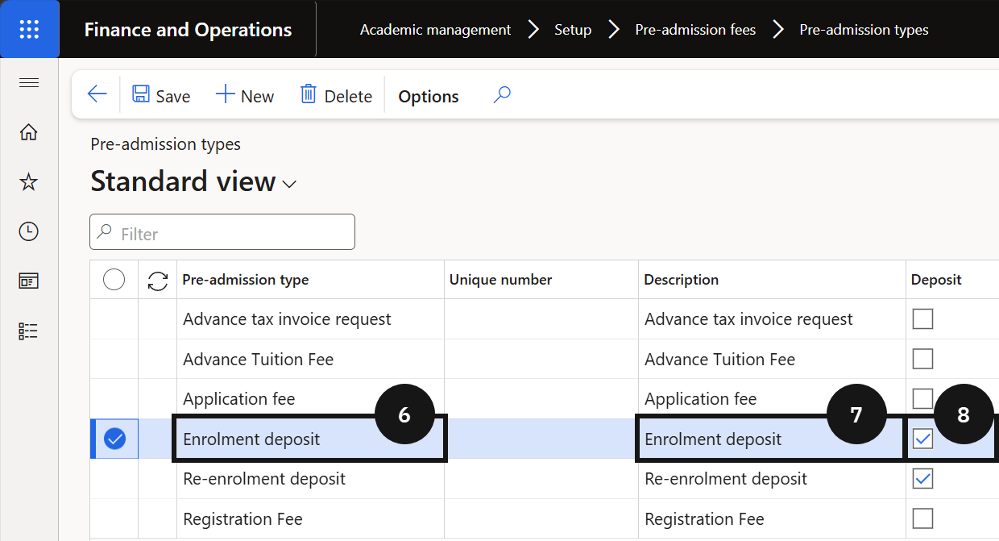

# Set Up Pre-Admission Types

Pre-admission types define the category of fee or deposit being collected before a student is formally enrolled. Each type must be created before the corresponding posting rules can be configured.

Transaction type reference:
- *General journal* — used when there is no student record yet; records the fee as other income directly to the general ledger. Typically used for application fees.
- *Free text invoice* — used when a student record exists and immediate posting to a liability account is required. Typically used for enrolment fees.
- *Sales order* — used when a student record exists and a sales order invoice is required.
- *Prepayment invoice* — used to record an enrolment or re-enrolment deposit, settled against the tuition fee invoice once finalised.

1. Open Pre-admission types

   From the **FNO dashboard**, open **Modules ▸ Academic Management**, expand **Setup**, then expand **Pre-admission fees**, and click **Pre-admission types**. Review the existing types before proceeding to avoid creating duplicates.

2. Create a new type

   Click **New** in the toolbar and complete the following:

   - **Pre-admission type** (⑥) — enter a value (e.g., *Application fee*, *Enrolment fee*).
   - **Description** (⑦) — enter a matching value. In most cases, match the description to the type name for easier identification.
   - **Deposit** (⑧) — tick this checkbox only when the type represents a deposit (e.g., *Enrolment deposit*).

   

3. Save

   Click **Save**.
