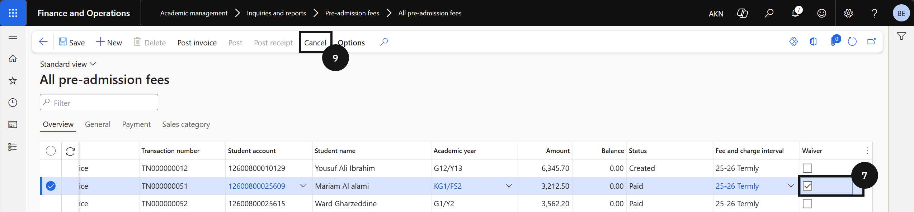

# Application Fee Waiver

The waiver process handles cancellation automatically based on the fee's current status:
- *Created (no sales order)* — status set to Cancelled.
- *Created (sales order and prepayment invoice created)* — sales order cancelled.
- *Paid (customer payment posted)* — prepayment invoice reversed and sales order cancelled.
- *Posted (sales order invoice posted)* — system creates and posts a sales order credit note.

1. Find the fee record

   From the **FNO dashboard**, open **Modules ▸ Academic Management**, expand **Inquiries and reports**, then expand **Pre-admission fees**, and click **All pre-admission fees**. Search for or filter by **student account**.

2. Enable the waiver

   Select the row of the application to waive. Click **Edit** in the toolbar, tick the checkbox in the **Waive** column, and click **Save**.

3. Cancel and set the reversing date

   Click **Cancel** in the toolbar. Select a **Reversing posting date**, then click **OK**. Refresh the page to see the updated status.

