# Concession Management

Concession Management handles the configuration and application of scholarships, discounts, and staff concessions across the fee management system. Scholarship and discount codes are created, linked to fee items and students, and moved through an approval workflow before taking effect. Staff concessions are managed through dedicated charge codes in the auto charges table, with separate discount codes configured for each concession type. Applied discounts can be reviewed directly against fee schedule batches once invoices are generated. For high-volume setup, bulk import of scholarship and discount records is supported through the Microsoft Excel add-in.

---

## Scholarship and Discount Setup

1. From the **FNO dashboard**, open **Modules** ▸ **Academic Management**.
2. Expand **Setup** and click **Scholarships and discounts**.
3. Click **New** in the top toolbar.
4. Complete the following fields:
   - Enter or create a code in the **Code column**.
   - Enter the scholarship or discount name in the **Name column**.
   - Check the **Active** and **Approval boxes**.
   - Assign or create the approval group in the **User group** column.

> **Note:** *To assign an existing group, select it from the dropdown.*

5. To create a new group, if necessary, right-click the dropdown arrow, select **View details**, then click **New**.
6. Enter a **Name** for the group and then select the **User group**.
7. Click **Add / remove users**.
8. Search for and select the **approvers**.
9. Click **Add to group** and go **back**.
10. Select the new **User group** and click **Save**.
11. Select the **scholarship or discount** you created.
12. Go to the **General tab** and click **Items** under Fees.
13. Click **New** and select the relevant fees; repeat as needed.
14. Click **Save** and go back.
15. Go to the **General tab** and click **Students**.
16. Click **New** and add the student.
17. Enter the discount amount under **Discount %**.
18. Enter the **Effective date** and **Expiration date**.
19. From the **Approval dropdown**, select **Report as ready**.
20. Repeat to fully approve by selecting **Approve**.
21. Click **Save**.

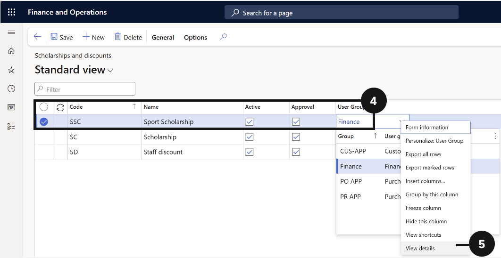

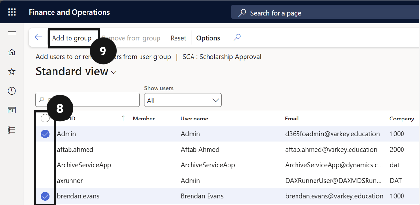

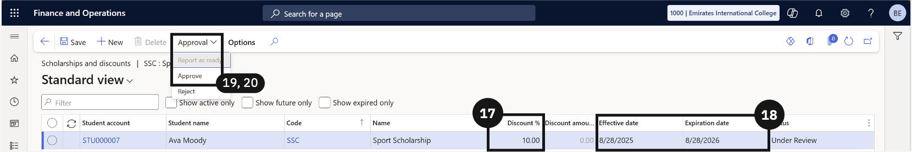

---

## Linking Scholarships and Discounts to Fee Items

1. From the **FNO dashboard**, open **Modules** ▸ **Academic Management**.
2. Expand **Setup** and click **Scholarships and discounts**.
3. Select a **scholarship or discount** by checking the circle to the left of the item.
4. Click **General** in the toolbar.
5. Choose **Items** under the Fees tab.
6. Click **New** to create a new item.
7. Enter the required details.
8. Click **Save**.

---

## Linking Scholarships and Discounts to Students

1. From the **FNO dashboard**, open **Modules** ▸ **Academic Management**.
2. Expand **Setup** and click **Scholarships and discounts**.
3. Select a **scholarship or discount** by checking the circle to the left of the item.
4. Click **General** in the toolbar.
5. Choose **Students** under the Students tab.
6. Click **New** to create a new record.
7. Complete the following columns to link a scholarship or discount to a student:
   - Choose a student from the **Student Account** dropdown.
   - Choose whether to apply a **percentage or total discount** amount.
   - Set the **start and expiration date**.

> **Note:** *The Student Name, Code, and Scholarship/ Discount Name will prepopulate.*

8. Click **Save**.

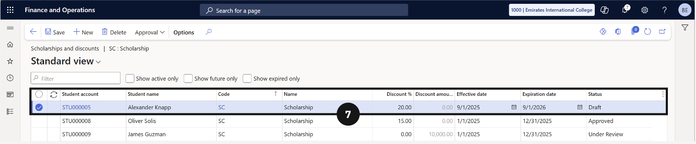

---

## Approving or Rejecting Scholarships and Discounts

1. From the **FNO dashboard**, open **Modules** ▸ **Academic Management**.
2. Expand **Setup** and click **Scholarships and discounts**.
3. Select a **scholarship or discount** by checking the circle to the left of the item.
4. Click **General** in the toolbar.
5. Choose **Students** under the Students tab.
6. Select the student whose **scholarship/discount requires approval**.
7. Click the Approval dropdown and choose **Approve or Reject**.
8. Click **Save**.

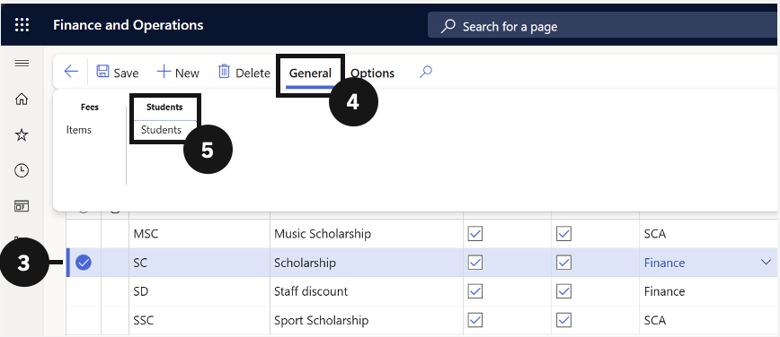

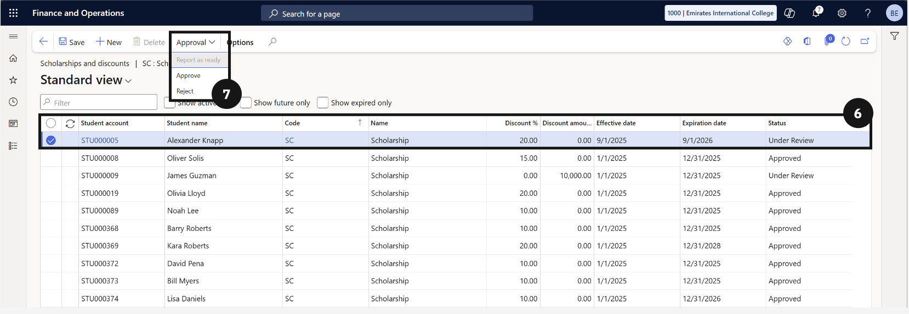

---

## View Scholarship & Discounts for Students via the Scholarship & Discounts details table

1. From the **FNO dashboard**, open **Modules** ▸ **Academic Management**.
2. Expand **Students** and click **All Students**.
3. Search for and select the **student**.
4. Click the **Academic tab** in the toolbar.
5. Under Related information, click **Scholarship and discounts**.
6. Use the **checkbox to filter by activity**.

---

## View Approved Scholarship and Discount Fees

1. From the **FNO dashboard**, open **Modules** ▸ **Academic Management**.
2. Expand **Fee schedule batches** and click **All fee schedule batches**.
3. Search for the **fee record** you want to view.
4. Open the **fee record**.
5. Under Sales order lines, scroll to the right to view the **discount amount** applied.

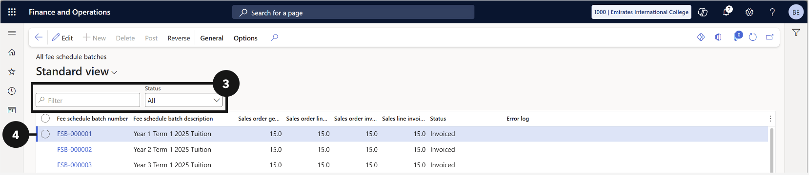

---

## View Approved Scholarship & Discount Fees

1. Navigate to **Modules ▸ Academic Management ▸ Inquiries and reports ▸ Fee schedules ▸ Scholarship and discount details**.
2. Select the student to apply the scholarship or discount.
3. In the Action Pane, open the **General** tab and click **Generate concession**.
4. Select the **Fee and Charge Interval** from the dropdown and click **OK**.
5. Open the **Concession** tab to view the estimated discount.
6. Navigate to **Academic Management ▸ Periodic Tasks ▸ Generate Sales Order Batch Processing**.
7. Enter the **Fee Generation Date**, **Posting Date**, **Fees and Charge Interval**, and **Batch Description**.
8. Select the required **Fee Schedule Template**.
9. In the **Records to include** section, select **Filter**.
10. In the **Student account** field, enter the **Student ID** and select **OK**.
11. Select **OK** to generate the Fee Schedule Batch.
12. Navigate to **Academic Management ▸ Fee Schedule Batches ▸ All Fee Schedule Batches**.
13. In the **Fee Schedule Batch Number** field, select the batch just created.
14. Select the **Sales Order** hyperlink to open the sales order.
15. At line level, expand **Financials** and select **Maintain Charges**.
16. Confirm that the discount is displayed on the charges page.
17. In the Sales Order Action Pane, select **Totals** to verify that the total charges reflect the applied discount.

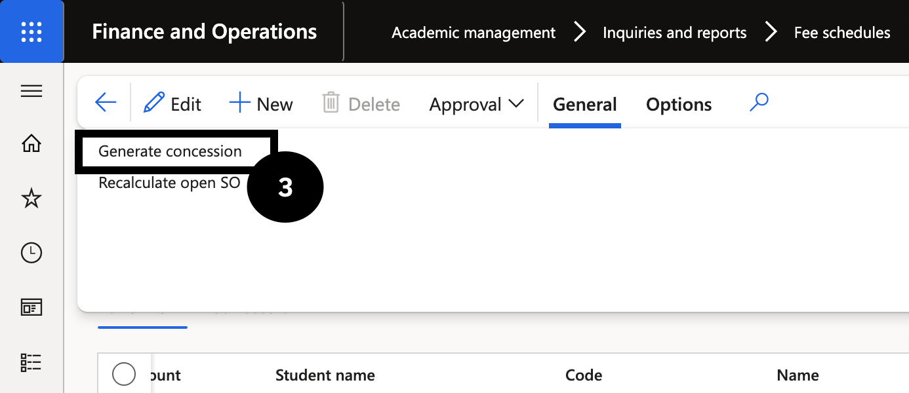

---

#### Sibling Discount Configuration

The sibling discount policy allows each school to define the discount rates applied to students based on their position within a family. Policies are school-specific and configured once unless the school's concession rules change. The system supports three student types — new students, existing students from existing families, and existing students from new families — and each can carry a different discount rate. Once configured, the policy works in conjunction with the sibling order assigned to each student and the fee items marked as eligible for a sibling discount to automatically apply the correct discount when fees are generated. No manual discount application is required after setup.

---

## Sibling Discount Policy (GEMS)

> **Note:** *This setup is school-specific and must be completed in each school. The sibling discount policy is typically a one-time configuration unless the school's discount rules change.*

1. From the **FNO dashboard**, open **Modules** ▸ **Academic Management**.
2. Expand **Setup** and click **Sibling setup**.
3. Click **Sibling discount policy**.
4. Click **Add** to create a new policy entry.
5. Enter the **sibling order number** for the child position (e.g., 3 for third child).

> **Note:** *Use the sibling order numbers configured in the Sibling Order setup. Only current students carry an active sibling order; future and past students default to 0.*

6. Enter a descriptive **name** for the policy entry.

> **Note:** *The description is read by the GEMS parent experience app (PXP) agent. Write it clearly so it is unambiguous — for example, "Third child — new student" or "Third child — existing family, existing student".*

7. Select the **student type** for this entry:
   - *New student* — applies to students with no prior enrolment history at the school.
   - *Existing family, existing student* — applies to students already enrolled and from a family already registered in the system.
   - *Existing family only* — applies to students from a known family but without an existing enrolment record.
8. Select the **line discount group** to link this policy entry to the correct trade agreement.

> **Note:** *Line discount groups are configured separately. Refer to the Sibling Order setup process for details on creating and mapping discount groups.*

9. Repeat steps 4–9 for each sibling position and student type combination required by the school's policy.
10. Click **Save**.

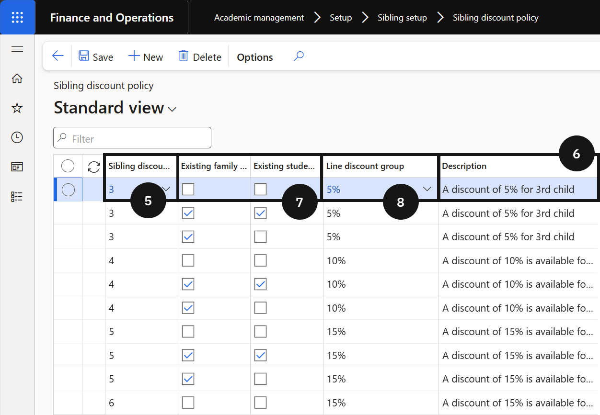

---

## Sibling Discount Policy

---

#### Staff Concession

Staff concessions allow the school to apply fee reductions to students who are dependants of staff members. The system manages staff concessions through two dedicated tables: the Staff Tuition Fee Concession table for staff-related reductions, and the Scholarship and Discount table for other concession types such as corporate or commercial concessions. Before a concession record can be added to either table, a discount code and a linked charge code must be configured. Once set up and approved, the system calculates an estimated concession amount and inserts a charge record into the auto charge table, which is then applied to new or existing sale orders when fees are generated.

---

## Setup Charge Code

1. From the **FNO dashboard**, open **Modules** ▸ **Accounts receivable**.
2. Expand **Charges setup** and click **Auto charges**.
3. Change the **Level** to **Line**.
4. Click **New** in the toolbar.
5. Enter the **Charge description**.

> **Note:** *Create one charge code per concession type — for example, a separate code for commercial concessions and for staff concessions.*

6. Configure the required charge settings for the concession type.
7. Click **Save**.

---

## Set Up Staff Concession Code

> **Note:** *A charge code must be created and linked before completing this setup. See [Setup Charge Code](#setup-charge-code).*

1. From the **FNO dashboard**, open **Modules** ▸ **Academic Management**.
2. Expand **Setup** and click **Scholarship and discount**.
3. Click **New** in the toolbar.
4. Enter the **name** of the concession.
5. Select the **Type**:
   - *Staff concession* — use for staff tuition fee reductions. The record is captured in the Staff Tuition Fee Concession table.
   - *Scholarship and discount* — use for other concession types such as corporate or commercial concessions. The record is captured in the Scholarship and Discount table.
6. Select the **Charge code** to link to this discount code.
7. Click **Activate** in the toolbar to make the code available for use.
8. In the **Approval** section, configure the approval workflow:
   - Enable **Approval** if concession records in the Scholarship and Discount table require an approver.
   - Identify the **user** authorised to approve concession records.

> **Note:** *The approval function is not available for records in the Staff Tuition Fee Concession table. Those records are automatically set to Approved status.*

9. Click **Save**.

---

## Bulk Upload of Concessions

---

#### Importing Scholarship and Discount Data
 
The scholarship and discount details import process allows bulk entry of scholarship and discount records into the system using the Microsoft Excel add-in. Rather than creating records one at a time in the interface, users download a pre-configured Excel template connected to the GEMS data entity, populate or update records directly in the spreadsheet, and publish back to the system. The system validates each row on publish and flags any errors in red for correction before re-publishing. This method is particularly useful when setting up large volumes of records at the start of an enrolment period or applying a bulk change across multiple students.
 
---
 
## Scholarship and Discount Details Import Through Excel Add-in
 
1. From the **FNO dashboard**, open **Modules** ▸ **Academic Management**.
2. Expand **Inquiries and reports** ▸ **Fee schedules** and click **Scholarship and discount details**.
3. Click **Open in Microsoft Office** in the toolbar.
4. Select **TMRW Student scholarship discount entity (AKN)**.
5. Click **Download**.

> **Note:** *An Excel file will download to your computer. The file contains the data entity template pre-configured for the scholarship and discount records.*
 
6. Open the downloaded Excel file.
7. Click **Enable Editing** and open in the desktop.

> **Note:** *Wait for the Excel add-in to complete sign-in before proceeding. The add-in connects to the GEMS environment to read and write data.*
 
8. Click **Design** in the add-in connection panel (bottom-right corner).
9. Click the **Edit** button (pencil icon) next to the entity.
10. Double-click each field in the **Available fields** list to move all fields across to the selected fields.
11. Click **Update**.
12. Click **Yes** in the confirmation prompt.
13. Click **Done**.
14. Click **Refresh** in the add-in panel.

> **Note:** *Refreshing pulls the latest data from the system into the spreadsheet, including any records already saved.*

15. Enter new records in the rows below the existing data, or copy existing rows and edit the details as required.

> **Note:** *Do not modify or delete existing records unless a change to those records is specifically required. Altering existing rows will overwrite the data in the system on publish.*
 
16. Click **Publish** in the add-in panel.

> **Note:** *The system validates each row before saving. Rows that fail validation are highlighted in red text. Correct the flagged data and click Publish again to resubmit.*
 
17. Confirm that all records have been accepted and are visible in the **Scholarships and discounts** master.

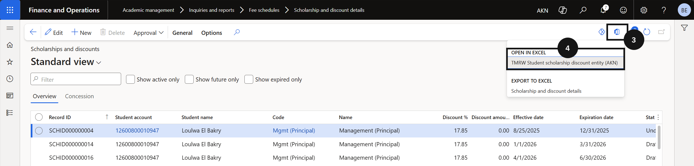

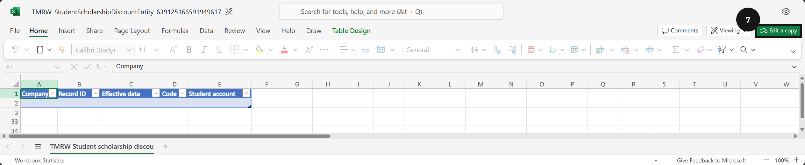

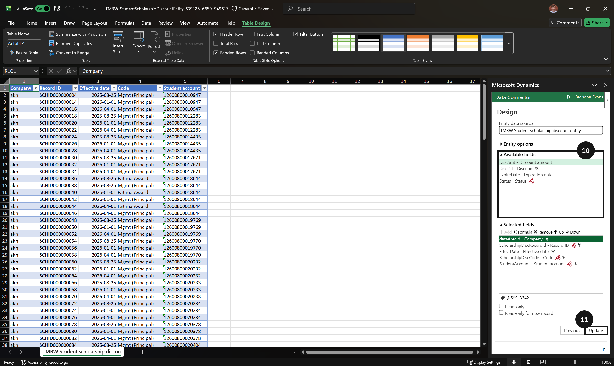

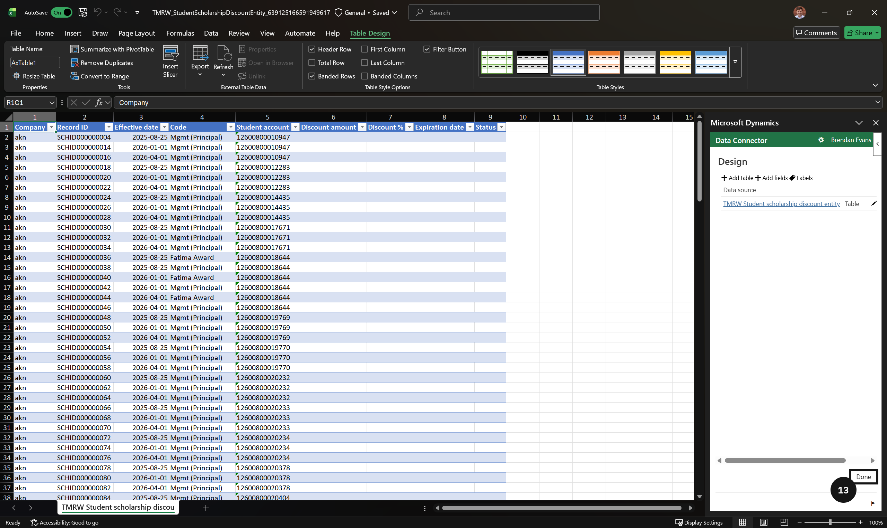

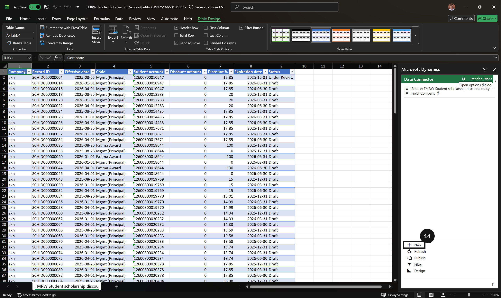

---
