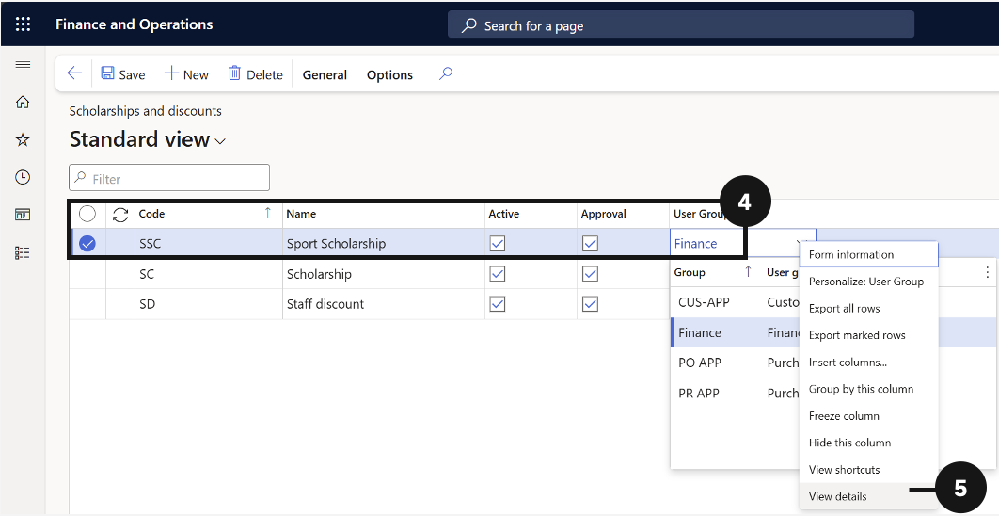
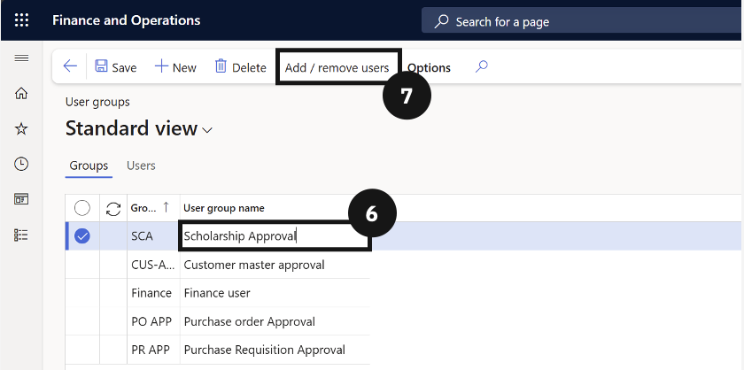
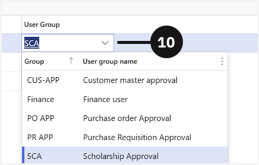
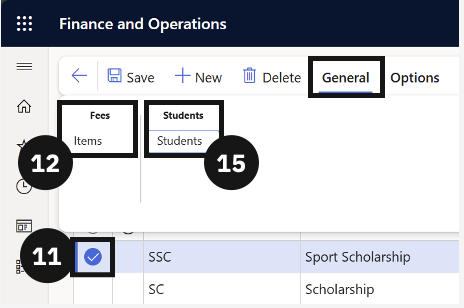

# Create a Scholarship or Discount

Before a scholarship or discount takes effect on a student's fees, it must be created as a named code, linked to the relevant fee items and students, and moved through the approval workflow.

1. Open Scholarships and Discounts

   From the **FNO dashboard**, open **Modules ▸ Academic Management**, expand **Setup**, and click **Scholarships and discounts**. Click **New** in the toolbar.

2. Complete the discount code details

   Fill in the following fields:

   - **Code column** — enter a unique code for the scholarship or discount.
   - **Name column** — enter the scholarship or discount name.
   - **Active** and **Approval** — check both boxes.
   - **User group column** — assign the approval group. To use an existing group, select it from the dropdown.

3. Create a new approval user group (if needed)

   If the required approval group does not yet exist, right-click the **User group** dropdown arrow and select **View details**, then click **New**. Enter a **Name** for the group and select the **User group**. Click **Add / remove users**, search for and select the approvers, then click **Add to group**. Click **Back**, select the new user group, and click **Save**.

4. Link fee items to the code

   Select the scholarship or discount record you just created. Click **General** in the toolbar, then choose **Items** under the Fees tab. Click **New** and select the relevant fee item — repeat for each additional item — then click **Save** and navigate back.

5. Add a student and configure the discount

   Click **General** in the toolbar and choose **Students** under the Students tab. Click **New**, select the student from the **Student Account** dropdown, and enter the discount amount under **Discount %**. Set the **Effective date** and **Expiration date**.

6. Submit and approve the discount

   From the **Approval** dropdown, select **Report as ready**. Then open the **Approval** dropdown again and select **Approve** to complete the workflow. Click **Save**.

