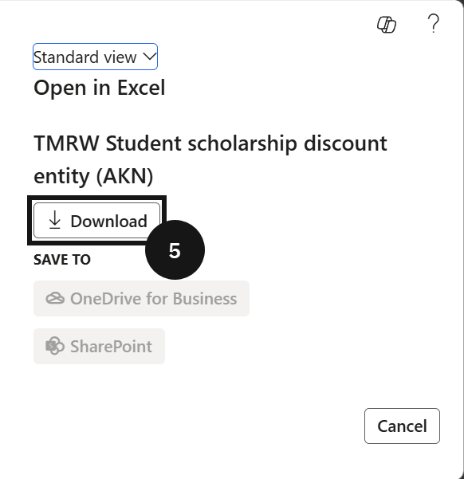
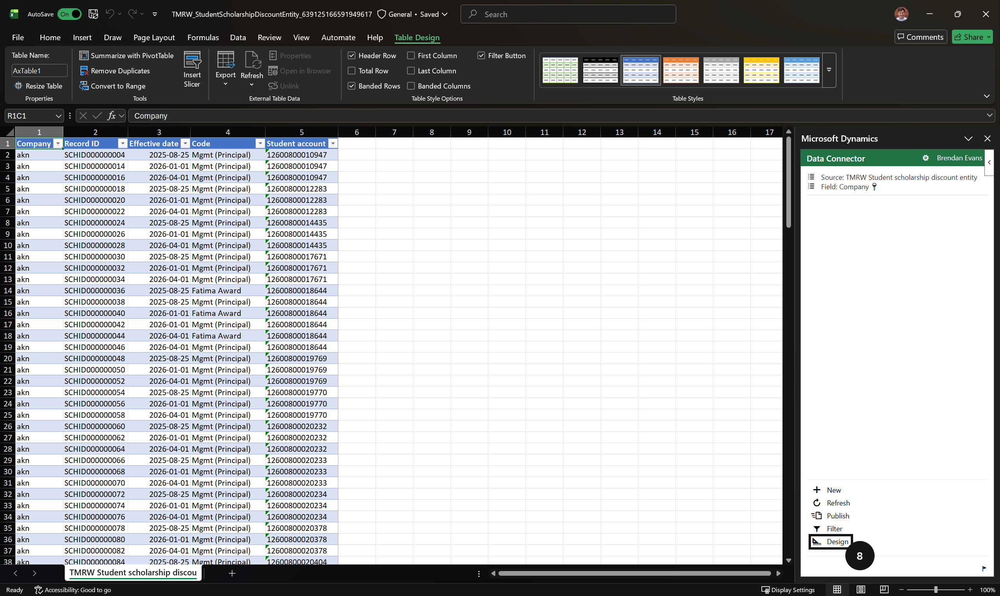
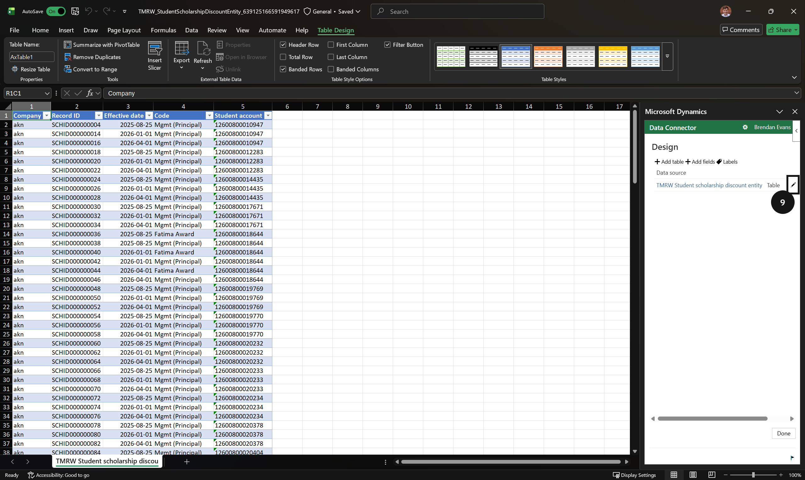
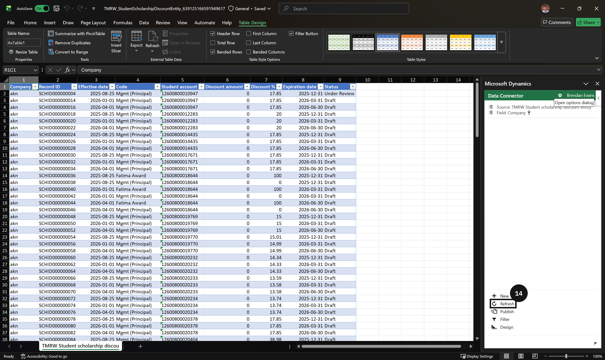

# Import Scholarship and Discount Data via Excel

Use this process to enter or update scholarship and discount records in bulk using the Microsoft Excel add-in, rather than creating records one at a time in the interface.

1. Download the Excel template

   From the **FNO dashboard**, open **Modules ▸ Academic Management**, expand **Inquiries and reports ▸ Fee schedules**, and click **Scholarship and discount details**. Click **Open in Microsoft Office** in the toolbar, select **TMRW Student scholarship discount entity (AKN)**, and click **Download**. An Excel file containing the pre-configured data entity template will download to your computer.

2. Open the file and wait for the add-in

   Open the downloaded Excel file, click **Enable Editing**, and open it in the desktop app. Wait for the Excel add-in to complete sign-in before proceeding — the add-in connects to the environment to read and write data.

3. Add all available fields

   Click **Design** in the add-in panel (bottom-right corner), then click the **Edit** button (pencil icon) next to the entity. Double-click each field in the **Available fields** list to move all fields across to the selected fields. Click **Update**, click **Yes** in the confirmation prompt, then click **Done**.

4. Refresh the data

   Click **Refresh** in the add-in panel. This pulls the latest records from the system into the spreadsheet, including any records already saved.

5. Enter or update records

   Enter new records in the rows below the existing data, or copy existing rows and edit the details as required.

   > **Note:** Do not modify or delete existing rows unless a change to those specific records is required. Editing an existing row overwrites the data in the system on publish.

6. Publish the records

   Click **Publish** in the add-in panel. The system validates each row before saving — rows that fail validation are highlighted in red. Correct any flagged data and click **Publish** again to resubmit.

7. Confirm the records

   Verify that all records have been accepted and are visible in the **Scholarships and discounts** master.

