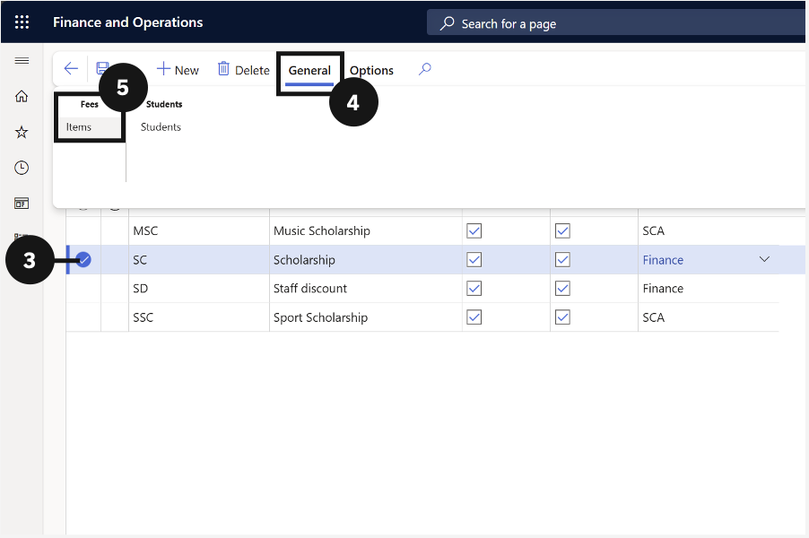
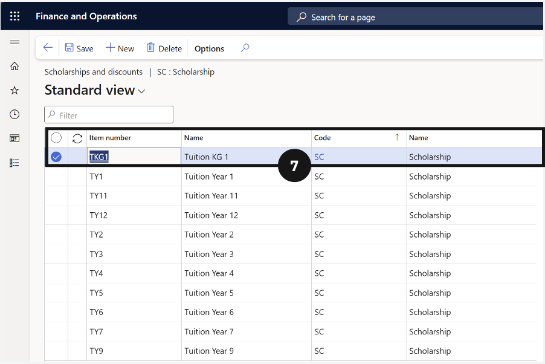

# Link a Discount to Fee Items

Fee items must be linked to a scholarship or discount code before the discount applies when invoices are generated.

1. Open Scholarships and Discounts

   From the **FNO dashboard**, open **Modules ▸ Academic Management**, expand **Setup**, and click **Scholarships and discounts**.

2. Select the discount code and open Fee Items

   Check the circle to the left of the scholarship or discount you want to configure. Click **General** in the toolbar, then choose **Items** under the Fees tab.

3. Add a fee item

   Click **New**, enter the required fee item details, and click **Save**. Repeat for each additional fee item.

