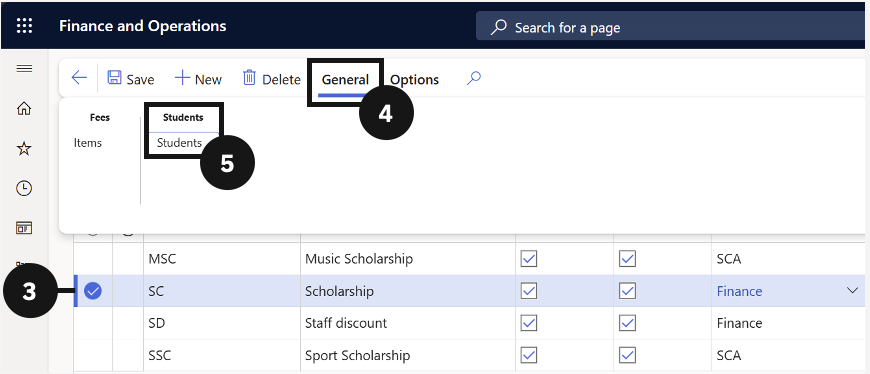

# Link a Discount to a Student

1. Open Scholarships and Discounts

   From the **FNO dashboard**, open **Modules ▸ Academic Management**, expand **Setup**, and click **Scholarships and discounts**.

2. Select the discount code and open Students

   Check the circle to the left of the scholarship or discount you want to configure (③). Click **General** in the Action Pane (④), then choose **Students** under the Students tab (⑤).

   

3. Add a student record

   Click **New** and complete the following columns (⑦)— the **Student Name**, **Code**, and **Scholarship / Discount Name** will prepopulate automatically:

   - **Student Account** — select the student from the dropdown.
   - **Discount %** — enter the percentage or total discount amount.
   - **Effective date** and **Expiration date** — set the dates the discount is active.

   

4. Save

   Click **Save**.
