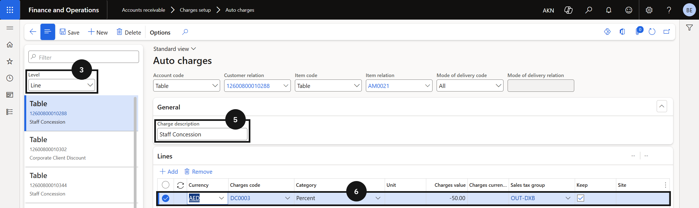

# Set Up a Charge Code

Staff concession discounts are applied to fee invoices through the auto charges table. A charge code defines how and where the concession amount posts in the ledger. Create one charge code per concession type — for example, separate codes for staff concessions and commercial concessions.

1. Open Auto Charges

   From the **FNO dashboard**, open **Modules ▸ Accounts Receivable**, expand **Charges setup**, and click **Auto charges**.

2. Set the level and create a new record

   Change the **Level** to **Line**. Click **New** in the toolbar.

3. Configure the charge code

   Enter the **Charge description**, then configure the required charge settings for the concession type.

4. Save

   Click **Save**.

