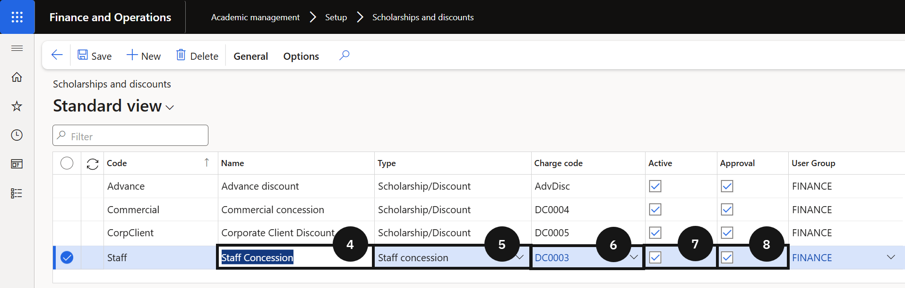

# Set Up a Staff Concession Code

Before using this page, ensure a charge code has been created and is ready to link. See [Set Up a Charge Code](./set-up-charge-code.md).

Staff concessions apply fee reductions to dependants of staff members. The system manages them through two tables depending on the type selected — the Staff Tuition Fee Concession table for staff-related reductions, and the Scholarship and Discount table for corporate or commercial concessions.

1. Open Scholarship and Discount

   From the **FNO dashboard**, open **Modules ▸ Academic Management**, expand **Setup**, and click **Scholarship and discount**. Click **New** in the toolbar.

2. Enter the concession name

   Enter the **name** of the concession.

3. Select the type

   Select the **Type**:

   - **Staff concession** — for staff tuition fee reductions. The record is captured in the Staff Tuition Fee Concession table and is automatically set to Approved status — the approval workflow does not apply.
   - **Scholarship and discount** — for corporate or commercial concessions. The record is captured in the Scholarship and Discount table and can require an approver.

4. Link the charge code and activate

   Select the **Charge code** to link to this discount code. Click **Activate** in the toolbar to make the code available for use.

5. Configure approval and save

   In the **Approval** section, enable **Approval** if concession records require an approver, then identify the authorised **user**. Click **Save**.

