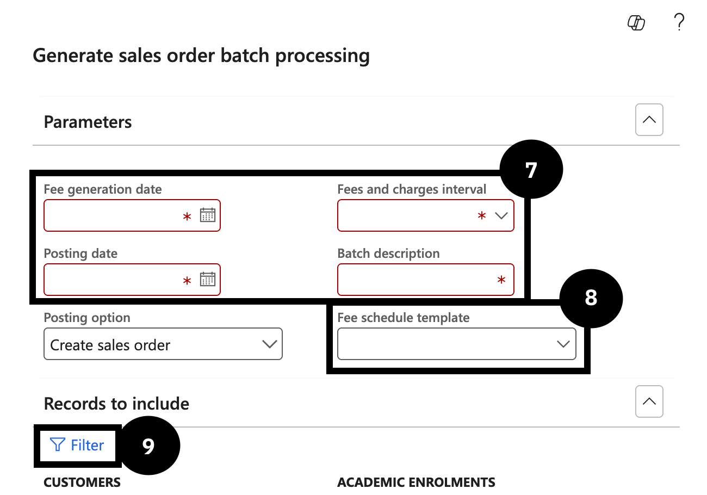
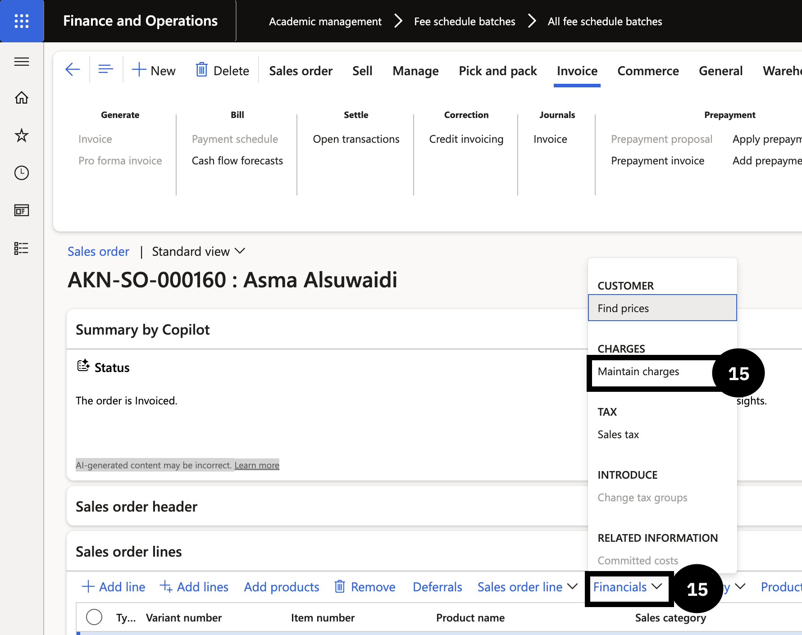

# Verify a Concession in a Sales Order

Use this process to generate a concession estimate for a student, run the fee batch for that student, and confirm the discount has applied correctly on the resulting sales order.

1. Generate the concession estimate

   From the **FNO dashboard**, open **Modules ▸ Academic Management ▸ Inquiries and reports ▸ Fee schedules ▸ Scholarship and discount details**. Select the student, then in the Action Pane open the **General** tab and click **Generate concession**. Select the **Fee and Charge Interval** from the dropdown and click **OK**. Open the **Concession** tab to review the estimated discount amount.

2. Run the fee generation batch for the student

   Navigate to **Academic Management ▸ Periodic Tasks ▸ Generate Sales Order Batch Processing**. Enter the **Fee Generation Date**, **Posting Date**, **Fee and Charge Interval**, and **Batch Description**. Select the required **Fee Schedule Template**. In the **Records to include** section, click **Filter**, enter the student's **Student ID** in the **Student account** field, and click **OK**. Click **OK** to run the batch.

3. Open the resulting sales order

   Navigate to **Academic Management ▸ Fee Schedule Batches ▸ All Fee Schedule Batches**, find the batch just created using the **Fee Schedule Batch Number**, and click the **Sales Order** hyperlink to open the sales order.

4. Verify the discount is applied

   At line level, expand **Financials** and select **Maintain Charges**. Confirm the discount is displayed on the charges page. In the Sales Order Action Pane, select **Totals** to verify the total charges reflect the applied discount.

