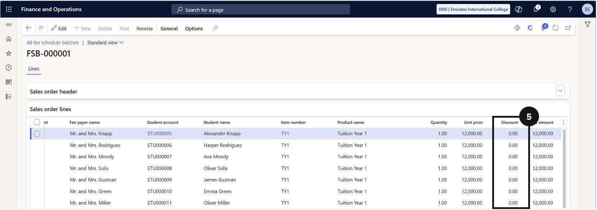

# View Approved Discount Fees on a Batch

1. Open All Fee Schedule Batches

   From the **FNO dashboard**, open **Modules ▸ Academic Management**, expand **Fee schedule batches**, and click **All fee schedule batches**.

2. Open the fee record

   Search for and open the fee record you want to review (③-④).

   

3. View the discount amount

   Under **Sales order lines**, scroll to the right to see the **Discount** amount (⑤) applied to each line.

   
