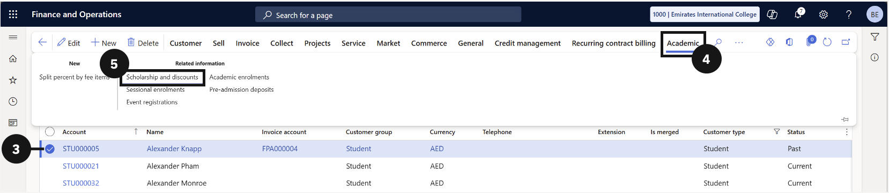
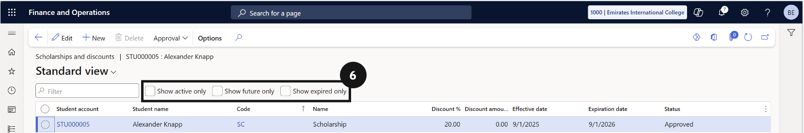

# View a Student's Scholarships and Discounts

1. Open the student record

   From the **FNO dashboard**, open **Modules ▸ Academic Management**, expand **Students**, and click **All Students**. Search for and select the student.

2. Open the Scholarships and Discounts panel

   Click the **Academic** tab in the toolbar. Under **Related information**, click **Scholarship and discounts**.

3. Filter the results

   Use the **checkbox** to filter the list by activity status.

