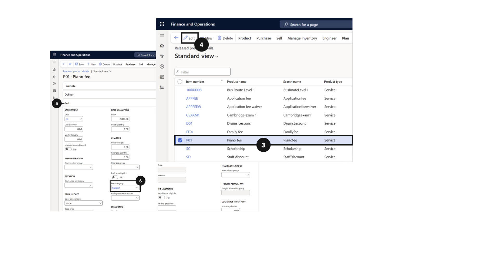
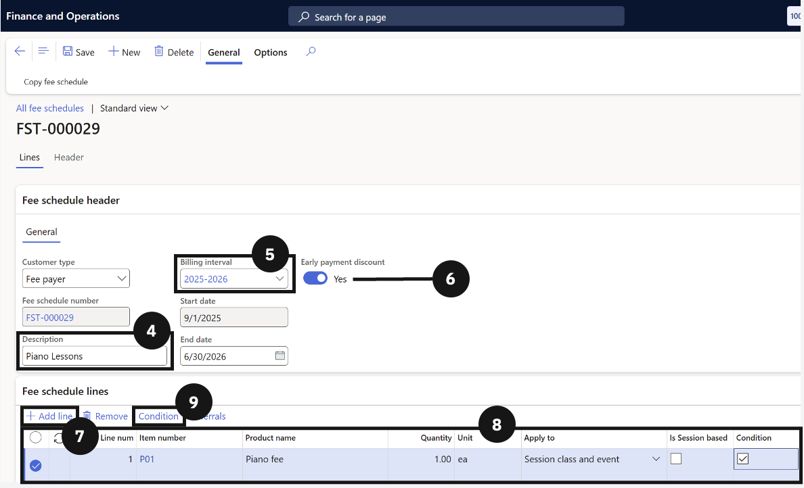
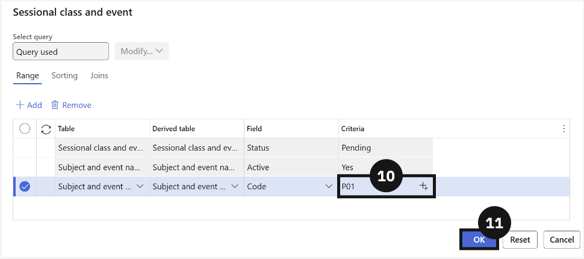
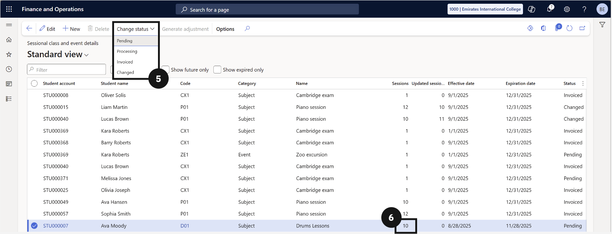
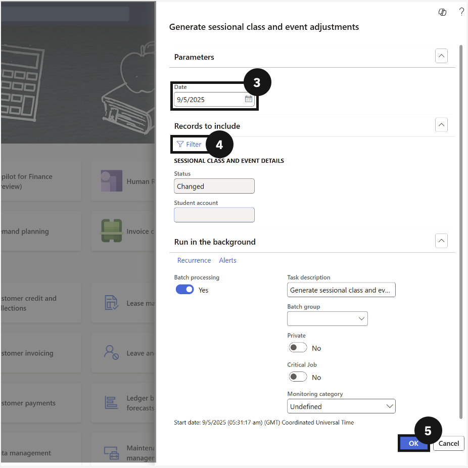

# Sessional Classes & Events

This section covers the setup and invoicing of fee-generating activities such as excursions, music lessons, and other events. It includes creating fee categories, subject and event codes, assigning fee categories to items, enrolling students into sessional classes and events, enabling session-based invoicing, and processing adjustments when session numbers change after invoices have been generated.

---

#### Subject and Event Name Creation
Before students can be enrolled in sessional classes or events and invoiced accordingly, the system needs to have the correct fee categories, subject codes, and event names configured. Fee categories classify the type of activity, while subject and event codes provide the unique identifiers the system uses to link students to specific classes or events. Each entry needs to be marked as active before it can be used in fee processing. Early payment discount options can also be set at this stage if applicable. This setup work is a prerequisite for all subsequent sessional class and event invoicing.

---

## Create Fee Categories

1. From the **FNO dashboard**, open **Modules** ▸ **Academic Management**.
2. Expand **Setup** and click **Fee categories**.
3. Click **New** in the top toolbar.
4. Complete the columns to create new fee categories.
5. Click **Save**.

---

## Create Subject and Event Codes

1. From the **FNO dashboard**, open **Modules** ▸ **Academic Management**.
2. Expand **Setup** and click **Subject and event names**.
3. Click **New** in the top toolbar.
4. Complete the columns to create codes for subjects and events.
5. Click **Save**.

---

#### Student Registration and Invoicing
Once the subject and event codes are in place, students can be registered into specific sessional classes and events, and the system can generate the corresponding invoices. This involves assigning the correct fee category to the relevant fee item, creating a fee schedule template with the appropriate conditions and event codes, and enrolling students by adding them to the sessional class and event details. When the fee generation batch is run, the system uses these enrolment records to create invoices based on either a flat fee or the number of sessions attended, depending on whether session-based invoicing has been enabled.

---

## Assign Fee Category to an Item

1. From the **FNO dashboard**, open **Modules** ▸ **Product information management**.
2. Expand **Products** and click **Released products**.
3. Find and select the **item** (e.g., Piano Fee).
4. Click **Edit** in the top toolbar.
5. Expand the **Sell** section.
6. Set the **fee category**.
7. Click **Save**.

---

## Sessional Class and Event Enrolment

1. From the **FNO dashboard**, open **Modules** ▸ **Academic Management**.
2. Expand **Fee schedules** and click **All fee schedules**.
3. Click **New** in the top toolbar.
4. Enter a **name** for the template (e.g., Zoo Excursion Fee).
5. Choose the **Billing interval** from the dropdown.
6. Match **Early payment discounts** with the fee categories.
7. Click **+ Add line.**
8. Completing these columns to create the fee schedule template:
   - In the **Item number** column, select the item you just updated.
   - Change the **Apply to** column to Sessional class and event.
   - Enable **Conditions**.
9. Open **Condition** from the toolbar.
10. In the line with Code in the Field column, enter the event code in the **Criteria column** by clicking +.
11. Click **OK**.
12. Click **Save**.

---

## Adjust for Session-Based Invoicing

> **Note:** *Delete any previously generated sales order for this event/student. Rerun the Generate Sale Order Batch Processes. If Session Based is not enabled, the system will charge a flat fee (quantity = 1).*

1. From the **FNO dashboard**, open **Modules** ▸ **Academic Management**.
2. Expand **Fee schedules** and click **All fee schedules**.
3. Find and open a **fee schedule template**.
4. Enable the **Session Based** option.
5. Click **Save**.
6. Run a fee schedule batch to generate the invoices.

---

#### Changing Sessional Classes & Events
After invoices have been generated for sessional classes or events, there may be situations where the original enrolment details change, such as a student attending more or fewer sessions than originally invoiced. In these cases, the system provides a process to generate an adjustment rather than requiring the original invoice to be reversed and reissued. Staff update the session record status to Change, enter the revised session numbers, and then run the adjustment batch. The system calculates the difference and creates an updated sales order to reflect the correct amount, ensuring the student's account remains accurate.

---

## Update the Session Information

1. From the **FNO dashboard**, open **Modules** ▸ **Academic Management**.
2. Expand **Inquiries and reports**, then expand **Fee schedules**.
3. Click **Sessional class and events details**.
4. Locate and select the record for the student/event that requires adjustment (e.g., if a student attended more sessions than invoiced).
5. Change the status from Invoice to Change by opening the **Change status** dropdown in the toolbar.
6. Enter the new number of sessions attended by the student in the **Updated sessions** column.
7. Click **Save**.

---

## Generate the Adjustment

1. From the **FNO dashboard**, open **Modules** ▸ **Academic Management**.
2. Expand **Periodic tasks** and click **Generate sessional class and event adjustments**.
3. In the dialog box, choose the **adjustment date**.
4. Expand the **Records** to include section and add the specific student, or leave blank to process all students with changes.
5. Click **OK** to run the task.

---
