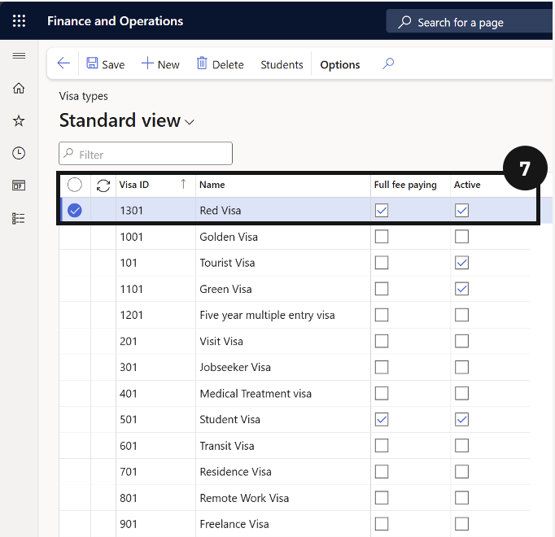
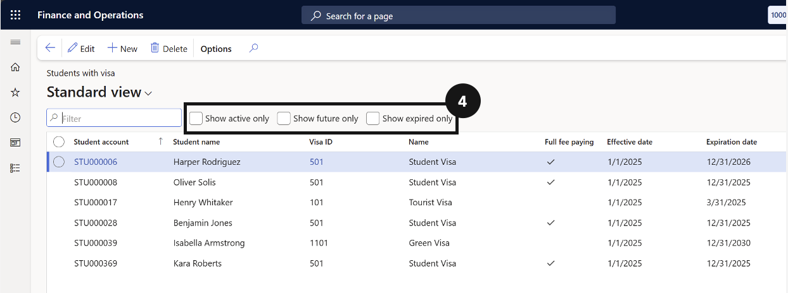

# Visa Management

Visa Management keeps student visa records accurate and accessible within the Academic Management system. While visa entries are typically created automatically through the CE integration, staff can also create and maintain visa types manually when required. Visa details are viewable directly on individual student records, and a dedicated report provides a full list of students with active visas across the school. Keeping this information current supports compliance obligations and gives the school a clear picture of its international student cohort.

---

#### Student Visa Management
Managing student visa information within F&O ensures the school maintains accurate records of each student's visa status and type. While visa entries are typically created automatically through the integration with the CE system, this section also covers how to manually create visa types when required. Staff can view visa details directly on a student's record and run a report to see all students with active visas across the school. Keeping this information current is important for compliance purposes and for ensuring the school has a clear picture of its international student cohort.

---

## Create new Visa Type

1. From the **FNO dashboard**, open **Modules** ▸ **Academic Management**.
2. Expand **Setup** and click **Visa types**.
3. Click **New** in the toolbar.
4. Complete the columns to create a new Visa type.
5. Click **Save**.

---

## Visa Details on Students

1. From the **FNO dashboard**, open **Modules** ▸ **Academic Management**.
2. Expand **Students** and click **All Students**.
3. Select or search for a **student account** and click the student whose details you want to view.
4. Scroll down to the **Other Information** tab to view Visa details.

---

## View all Students' Visa Types

1. From the **FNO dashboard**, open **Modules** ▸ **Academic Management**.
2. Expand **Enquiries and reports**, then expand **Visa Management**.
3. Click **Students with Visa**.
4. Use the **checkbox** to filter by status.

---
