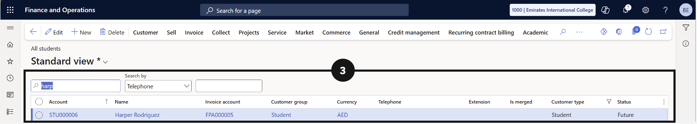
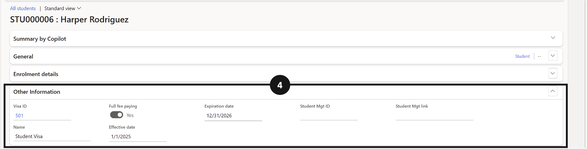

# View Visa Details on a Student

Visa details for an individual student are stored on their record under the **Other Information** tab. Use this to check a student's visa type, issue date, and expiry date directly from the student record.

1. Open the student record

   From the **FNO dashboard**, open **Modules ▸ Academic Management**, expand **Students**, and click **All Students**. Select or search for the student account and open their record (③).

   

2. View visa details

   Scroll down to the **Other Information** tab (④). The student's visa details are displayed here, including visa ID, issue date, and expiry date.

   
