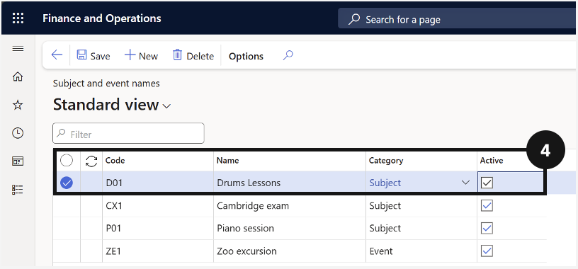
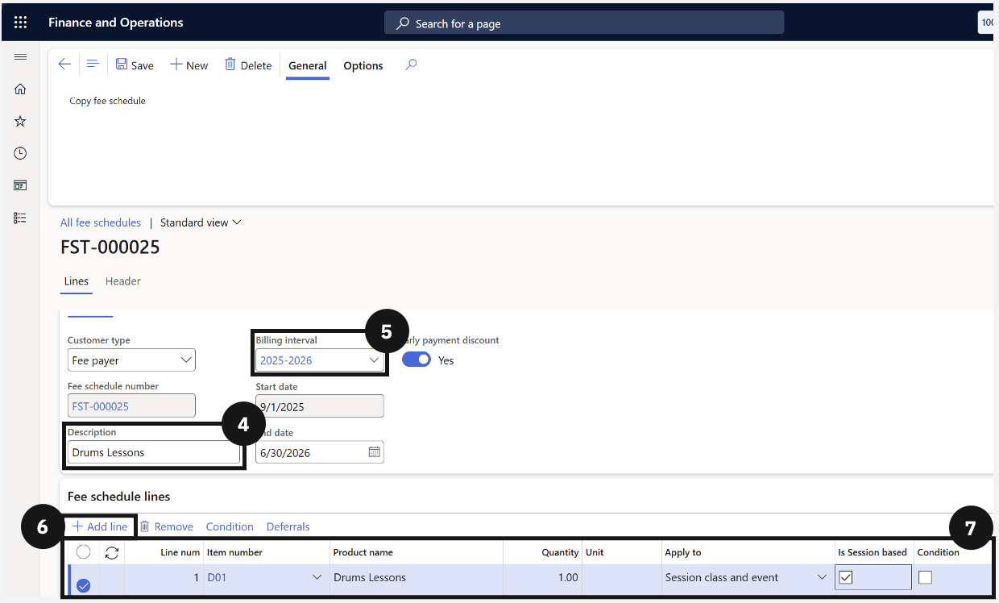
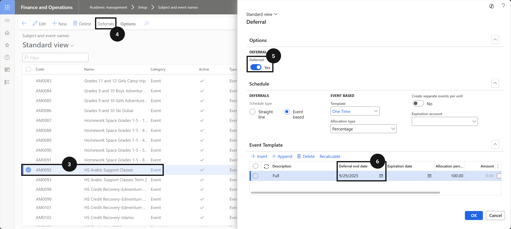
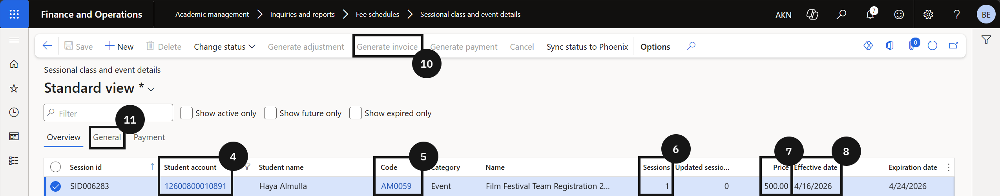
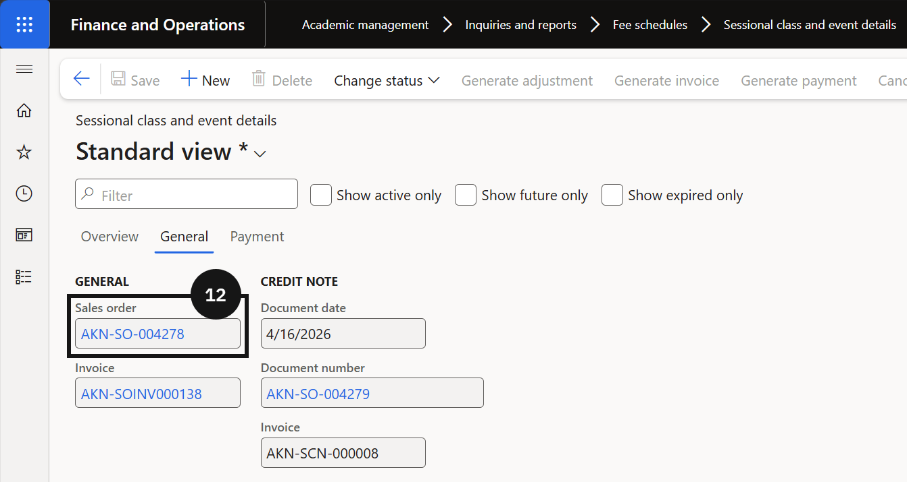
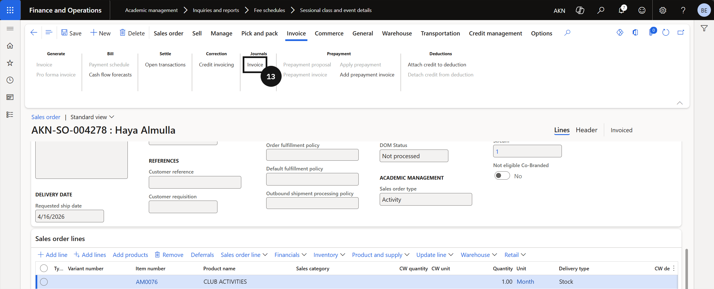
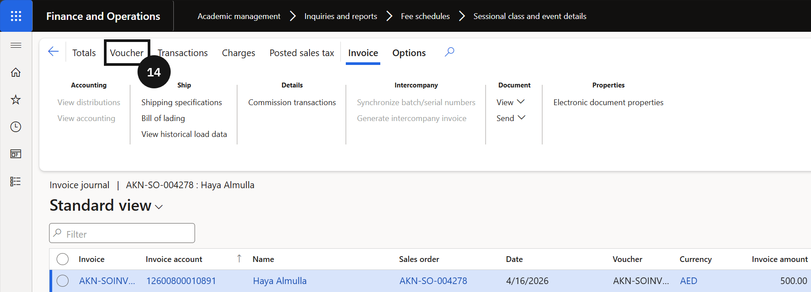
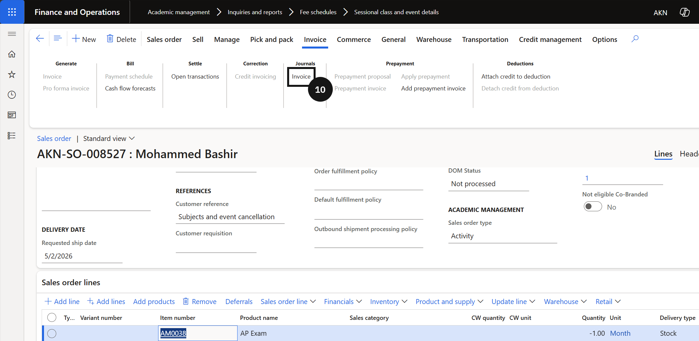

# Subject & Event Management

Subject & Event Management handles the setup and invoicing of fee-generating activities including excursions, music lessons, and other school events. Fee categories, subject and event codes, and event fee schedule templates are configured before students are enrolled into sessional classes or events. Invoicing can be set to charge a flat fee or calculated based on the number of sessions attended using session-based invoicing. Where session numbers change after invoices have been generated, adjustment processing is available to keep student accounts accurate. Enrolment cancellations are also managed here.

---

#### Subject and Event Name Creation
Before students can be enrolled in sessional classes or events and invoiced accordingly, the system needs to have the correct fee categories, subject codes, and event names configured. Fee categories classify the type of activity, while subject and event codes provide the unique identifiers the system uses to link students to specific classes or events. Each entry needs to be marked as active before it can be used in fee processing. Early payment discount options can also be set at this stage if applicable. This setup work is a prerequisite for all subsequent sessional class and event invoicing.

---

## Subject & Event Names

1. From the **FNO dashboard**, open **Modules** ▸ **Academic Management**.
2. Expand **Setup** and click **Subject and event names**.
3. Click **New** in the toolbar.
4. Fill out the following fields to create a subject or event:
   - Enter or create a code in the **Code column**.
   - Enter the **subject or event name**.
   - Select the correct **Category** from the dropdown. Verify the **Type** field is auto-filled.
   - Check **Active**.
   - Select the **Item number** from the dropdown. 
5. Click **Save**.

---

## Event Template Setup

1. From the **FNO dashboard**, open **Modules** ▸ **Academic Management**.
2. Expand **Fee schedules** and click on **All fee schedules**.
3. Click **New** in the toolbar to create the fee invoice.
4. Enter details in **Description** (e.g., Event template).
5. Choose the **Billing interval**.
6. Click **+ Add line**.
7. Complete the required fields for each line.
8. Add **conditions** if required.
9. Click **Save**.

---
#### Event Registration and Invoicing

Before students can be registered for sessional classes or events, each event record requires a deferral date to be set so the system knows when to recognise the associated revenue. Once the event is configured, staff can enrol students directly from the Sessional Class and Event Details form. In most cases, registration is handled automatically through Parent Connect or an equivalent app; however, where a parent or guardian registers in person at the school counter, staff complete the enrolment manually and generate the invoice from within the system. Once posted, the charge is held as deferred revenue until the event date, at which point the system automatically transfers it to the main revenue account.

---

## Sessional Class and Event Enrolment

1. From the **FNO dashboard**, open **Modules** ▸ **Academic Management**.
2. Expand **Fee schedules** and click **All fee schedules**.
3. Click **New** in the top toolbar.
4. Enter a **name** for the template (e.g., Zoo Excursion Fee).
5. Choose the **Billing interval** from the dropdown.
6. Match **Early payment discounts** with the fee categories.
7. Click **+ Add line.**
8. Completing these columns to create the fee schedule template:
   - In the **Item number** column, select the item you just updated.
   - Change the **Apply to** column to Sessional class and event.
   - Enable **Conditions**.
9. Open **Condition** from the toolbar.
10. In the line with Code in the Field column, enter the event code in the **Criteria column** by clicking +.
11. Click **OK**.
12. Click **Save**.

---

## Set the Deferral Date

1. From the **FNO dashboard**, open **Modules** ▸ **Academic Management**.
2. Expand **Setup** and click **Subject and event names**.
3. Locate and select the relevant **event record**.
4. Click **Deferrals**.
5. Enable **Deferred**.
6. Set the **Deferral date** to the event date.

> **Note:** *The deferral date determines when revenue is recognised. Once the event occurs, revenue moves automatically from the deferral account to the main revenue account.*

5. Click **Ok**.

---

## Over-the-Counter Registration and Invoice Generation

> **Note:** *Student event registration is typically completed by the student or parent via Parent Connect or an equivalent app, which automatically creates the enrolment record. Use this process only when a parent or guardian is registering in person at the school counter.*

1. From the **FNO dashboard**, open **Modules** ▸ **Academic Management**.
2. Expand **Inquiries and reports** ▸ **Fee schedules** and click **Sessional class and event details**.
3. Click **New** in the toolbar.
4. Select the **Student account** to register for the event.
5. Select the **Event code** from the dropdown.
6. Enter the **number of sessions**.
7. Enter the **price**.
8. Enter the **Effective date** and **Expiration date** for the registration period.
9. Click **Save**.
10. Click **Generate invoice** in the toolbar.

> **Note:** *Clicking Generate invoice creates a sales order in the system with a deferral schedule attached. The system records the charge as deferred revenue until the event date.*

11. Open the **General** tab.
12. Click the **Sales order** hyperlink in the toolbar or header to view the order details.
13. Click **Invoice** to view the posted invoice.
14. Click **Voucher** to view the posted accounting voucher.

---

#### Student Registration and Invoicing
Once the subject and event codes are in place, students can be registered into specific sessional classes and events, and the system can generate the corresponding invoices. This involves assigning the correct fee category to the relevant fee item, creating a fee schedule template with the appropriate conditions and event codes, and enrolling students by adding them to the sessional class and event details. When the fee generation batch is run, the system uses these enrolment records to create invoices based on either a flat fee or the number of sessions attended, depending on whether session-based invoicing has been enabled.

---

## Assign Fee Category to an Item

1. From the **FNO dashboard**, open **Modules** ▸ **Product information management**.
2. Expand **Products** and click **Released products**.
3. Find and select the **item** (e.g., Piano Fee).
4. Click **Edit** in the top toolbar.
5. Expand the **Sell** section.
6. Set the **fee category**.
7. Click **Save**.

---

## Adjust for Session-Based Invoicing

> **Note:** *Delete any previously generated sales order for this event/student. Rerun the Generate Sale Order Batch Processes. If Session Based is not enabled, the system will charge a flat fee (quantity = 1).*

1. From the **FNO dashboard**, open **Modules** ▸ **Academic Management**.
2. Expand **Fee schedules** and click **All fee schedules**.
3. Find and open a **fee schedule template**.
4. Enable the **Session Based** option.
5. Click **Save**.
6. Run a fee schedule batch to generate the invoices.

---

#### Cancelling a Sessional Class or Event Enrolment

When a student's enrolment in a sessional class or event needs to be cancelled after invoicing, the cancellation is performed directly in GEMS via the Sessional class and event details form. Accessing the form allows staff to review the full enrolment record — including the event code, student account, and invoice status — before initiating the cancellation. Once confirmed, the system automatically generates a credit note to reverse the original invoice, with the resulting sales order showing a negative quantity and amount. Full details of the cancellation are recorded in the journal section for audit purposes.

---

## Sessional Class and Event Enrolment Cancellation

1. From the **FNO dashboard**, open **Modules** ▸ **Academic Management**.
2. Expand **Inquiries and reports**, then expand **Fee schedules**.
3. Click **Sessional class and event details**.
4. Locate the enrolment record for the student and event you want to cancel.
5. Click **Cancel** in the toolbar.
6. A confirmation prompt will appear. Click **Yes** to proceed.
7. The system generates a **credit note** to reverse the original invoice.

> **Note:** *The credit note is recorded in the journal section with the same sales order details as the original invoice. The quantity and total price on the reversed sales order will appear as negative values.*

8. To view the credit note sales order, click the **General** tab.
9. Click the **Document number** link.
10. To view the posted voucher, click **Invoice**.
11. Then click **Voucher**.

---

#### Changing Sessional Classes & Events
After invoices have been generated for sessional classes or events, there may be situations where the original enrolment details change, such as a student attending more or fewer sessions than originally invoiced. In these cases, the system provides a process to generate an adjustment rather than requiring the original invoice to be reversed and reissued. Staff update the session record status to Change, enter the revised session numbers, and then run the adjustment batch. The system calculates the difference and creates an updated sales order to reflect the correct amount, ensuring the student's account remains accurate.

---

## Update the Session Information

1. From the **FNO dashboard**, open **Modules** ▸ **Academic Management**.
2. Expand **Inquiries and reports**, then expand **Fee schedules**.
3. Click **Sessional class and events details**.
4. Locate and select the record for the student/event that requires adjustment (e.g., if a student attended more sessions than invoiced).
5. Change the status from Invoice to Change by opening the **Change status** dropdown in the toolbar.
6. Enter the new number of sessions attended by the student in the **Updated sessions** column.
7. Click **Save**.

## Generate the Adjustment

1. From the **FNO dashboard**, open **Modules** ▸ **Academic Management**.
2. Expand **Periodic tasks** and click **Generate sessional class and event adjustments**.
3. In the dialog box, choose the **adjustment date**.
4. Expand the **Records** to include section and add the specific student, or leave blank to process all students with changes.
5. Click **OK** to run the task.

---
