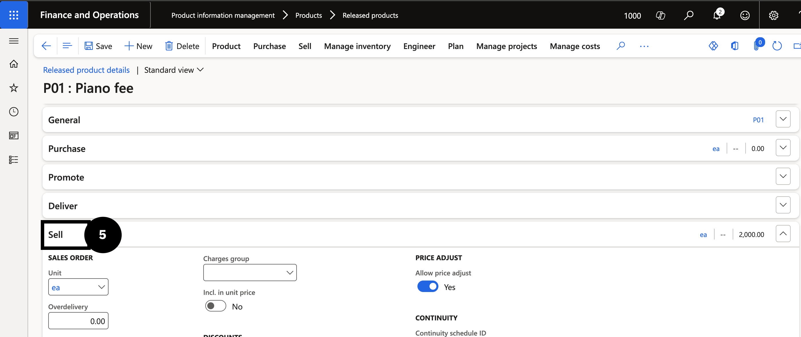
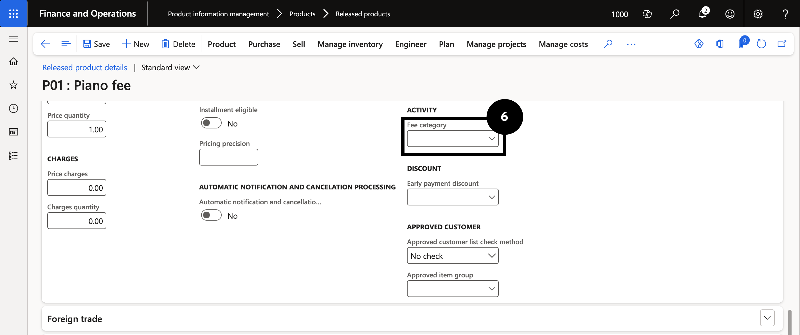

# Assign Fee Category to an Item

1. Open the item

   From the **FNO dashboard**, open **Modules ▸ Product information management**, expand **Products**, and click **Released products**. Find and select the item (e.g., *Piano fee*) (③). Click **Edit** in the Action Pane (④).

   

2. Set the fee category

   Expand the **Sell** section below (⑤) and set the **Fee category** (⑥).

   

   

3. Save

   Click **Save**.
