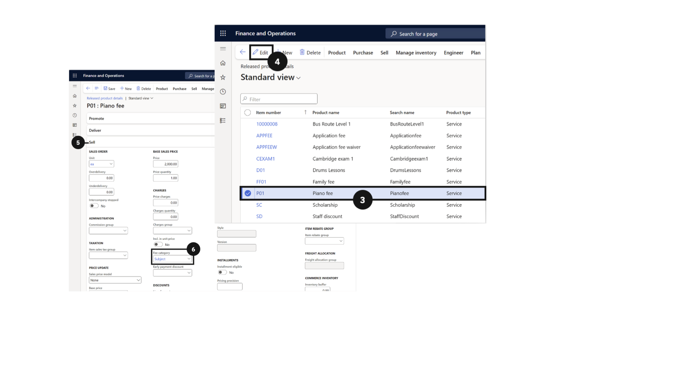

# Assign Fee Category to an Item

1. Open the item

   From the **FNO dashboard**, open **Modules ▸ Product information management**, expand **Products**, and click **Released products**. Find and select the item (e.g., *Piano Fee*). Click **Edit** in the toolbar.

2. Set the fee category

   Expand the **Sell** section and set the **fee category**.

3. Save

   Click **Save**.

