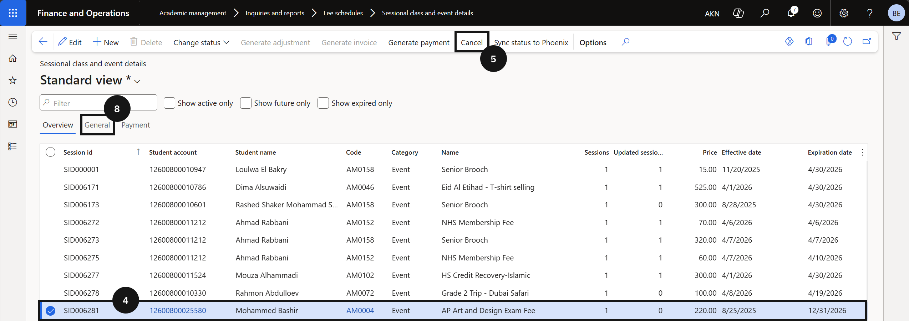
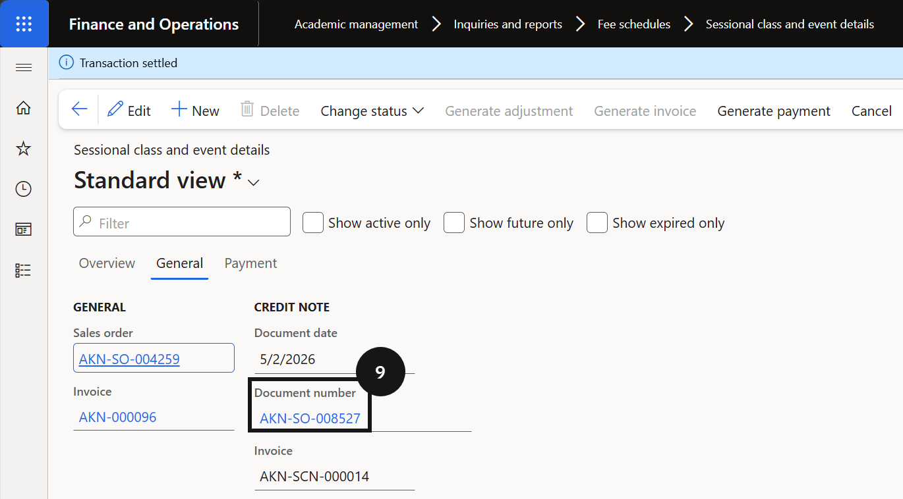
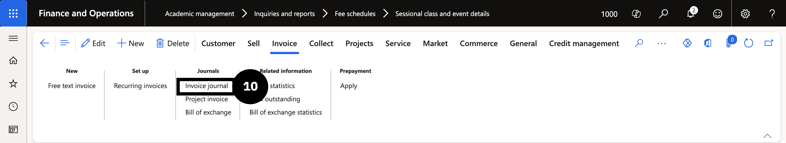
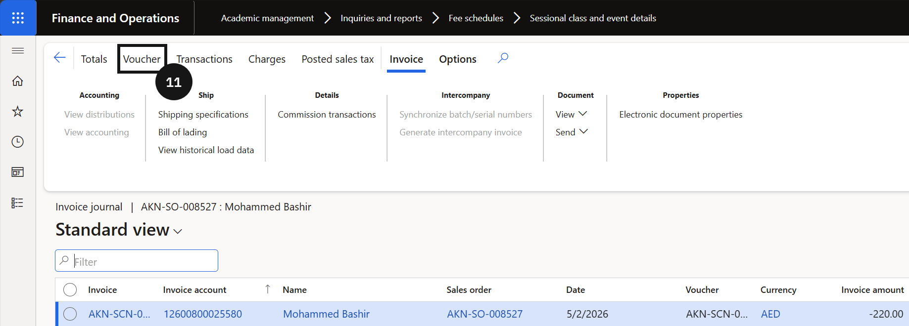

# Sessional Class and Event Enrolment Cancellation

When a student's enrolment in a sessional class or event needs to be cancelled after invoicing, the cancellation is performed from the Sessional class and event details form. The system automatically generates a credit note to reverse the original invoice. The credit note is recorded in the journal section with the same sales order details as the original invoice, and the quantity and total price on the reversed sales order appear as negative values.

1. Open the enrolment record

   From the **FNO dashboard**, open **Modules ▸ Academic Management**, expand **Inquiries and reports ▸ Fee schedules**, and click **Sessional class and event details**. Locate the enrolment record for the student and event to cancel (④).

2. Cancel and confirm

   Click **Cancel** in the toolbar (⑤). Click **Yes** to confirm. The system generates a credit note to reverse the original invoice.

   

3. View the credit note

   Open the **General** tab (⑧) and click the **Document number** link (⑨) to view the reversed sales order. Open the student record. Click **Invoice journal** (⑩) to view the posted credit note, then click **Voucher** (⑪) to review the posted accounting entry.

   

   

   
