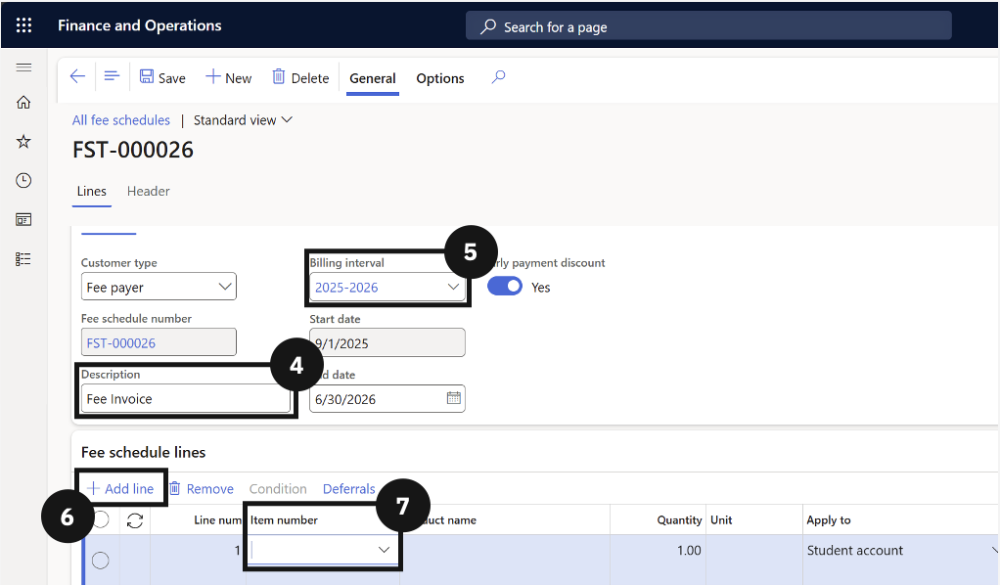

# Create an Event Fee Schedule Template

Before the fee generation batch can invoice students for sessional classes or events, a fee schedule template specific to the event must be in place. Event templates are set up the same way as standard fee schedule templates but are configured with the event-specific billing interval and fee item.

1. Open All fee schedules and create a new template

   From the **FNO dashboard**, open **Modules ▸ Academic Management**, expand **Fee schedules**, and click **All fee schedules**. Click **New** in the toolbar.

2. Complete the template header and fee lines

   Enter a **Description** (e.g., *Event template*) and choose the **Billing interval**. Click **+ Add line** and complete the required fields for each line. Add **conditions** to restrict the template to specific event codes or student groups if required.

3. Save

   Click **Save**.

