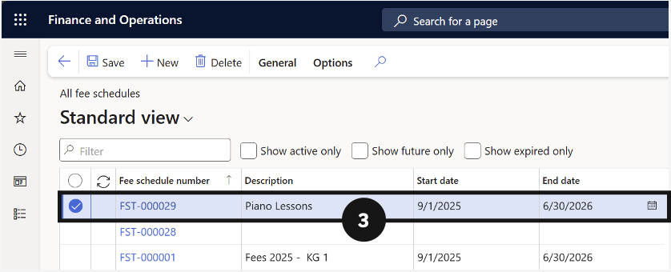
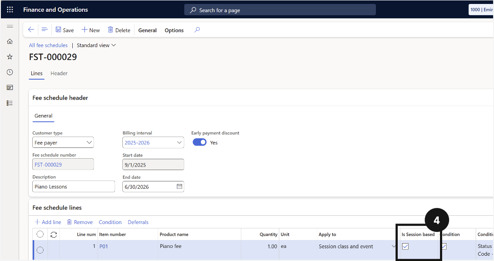

# Enable Session-Based Invoicing

If **Session Based** is not enabled, the system charges a flat fee (quantity = 1). Delete any previously generated sales order for this event and student before rerunning the fee generation batch.

1. Open the fee schedule template

   From the **FNO dashboard**, open **Modules ▸ Academic Management**, expand **Fee schedules**, and click **All fee schedules**. Find and open the relevant fee schedule template.

2. Enable and save

   Enable the **Session Based** option and click **Save**. Then run the fee schedule batch to generate the invoices.

