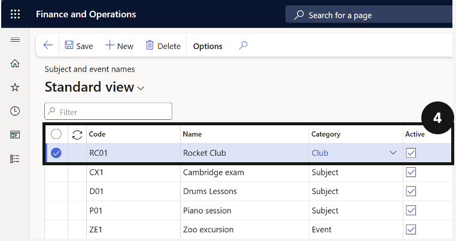

# Set Up Subject and Event Names

Before students can be enrolled in sessional classes or events and invoiced, the system needs the correct fee categories, subject codes, and event names configured. Each entry must be marked active before it can be used in fee processing. This setup is typically created through integration from the upstream activity module — manual entry is rarely required.

1. Open Subject and event names

   From the **FNO dashboard**, open **Modules ▸ Academic Management**, expand **Setup**, and click **Subject and event names**. Click **New** in the Action Pane.

2. Complete the record

   Fill in the following fields (④):

   - **Code** — enter or create a unique code.
   - **Name** — enter the subject or event name.
   - **Category** — select the correct category from the dropdown. The **Type** field auto-fills based on the selected category.
   - **Active** — check the box to activate the record.
   - **Item number** — select the item number from the dropdown.

   

3. Save

   Click **Save**.
