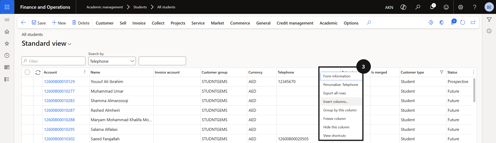
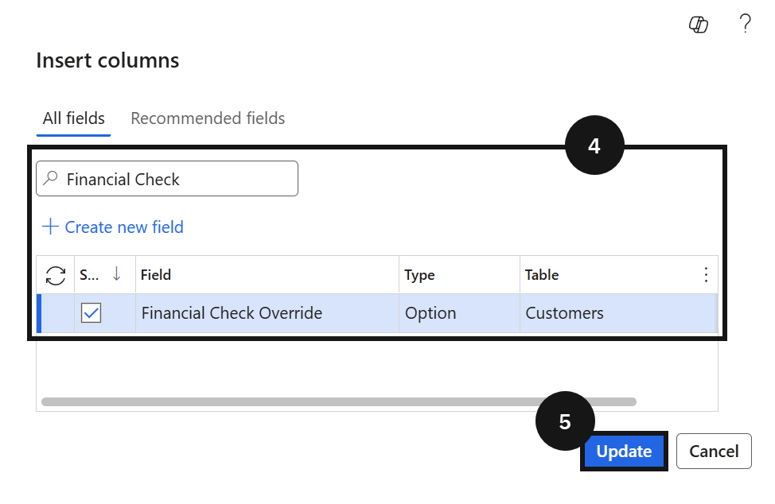
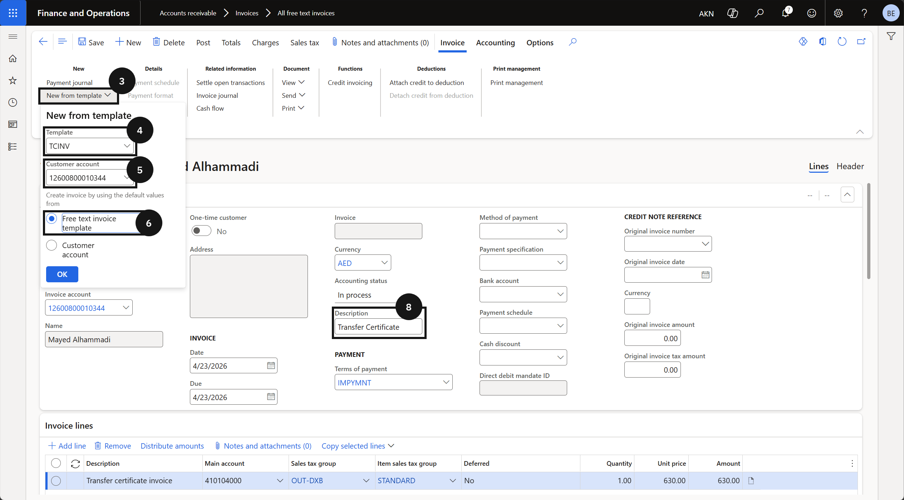
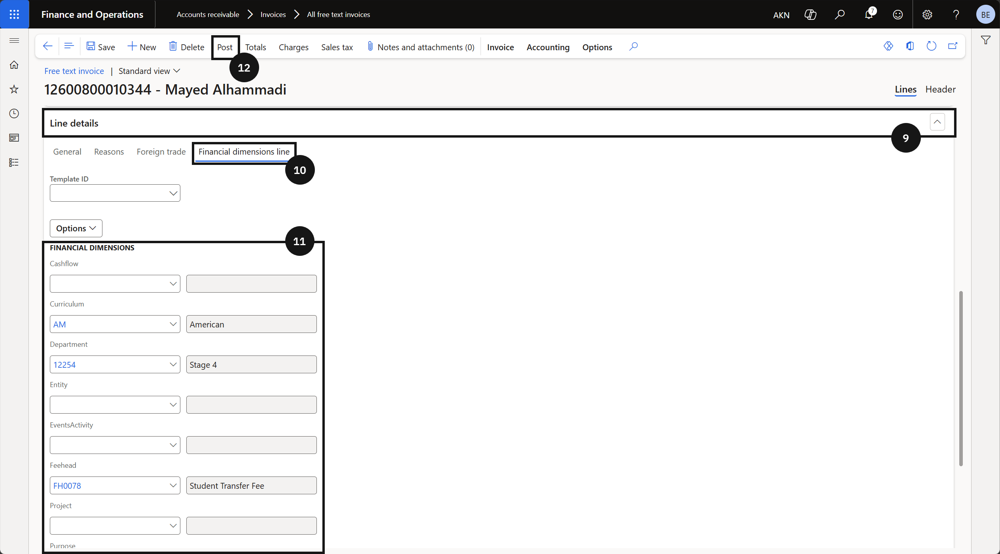

# Student Promotion

Student Promotion manages the financial checks and processes that occur when students move between academic years. It covers how the system automatically polls outstanding fee balances during reenrolment periods and blocks students from progressing if they exceed a configured threshold. Staff can review blocked students, arrange payment with families, and apply financial check overrides with an audit reason where a payment arrangement is in place. Financial obligations are reviewed and resolved before reenrolment invitations are issued.

---

## Update Student Enrolment Dates (WIP)

> **Note:** The next academic year record for a student is automatically received from the Student Management System after the eligibility and finance checks are completed.

1. From the **FNO dashboard**, open **Modules** ▸ **Academic Management**.
2. Expand **Students** and click **All students**.
3. Open the relevant student record.
4. Confirm the student's enrolment status shows as **Re-enrolment open**.
5. Click **Academic Enrolment** tab to review the academic year records.
6. Verify that the table shows the student's current grade/year and the next grade/year for promotion.
   > **Note:** *Do not edit the Academic Enrolments table directly in Dynamics 365; records are managed upstream by the Student Management System.*
---

## Release

---

#### Reenrolment & Promotion — Financial Blocking

During pre-promotion activities, the student management system polls Finance & Operations to check each student's outstanding fee balance before sending reenrolment invitations. This check runs automatically, typically in Term 2 and Term 3, and is driven by a threshold amount configured in the fee parameters. If a student's balance exceeds the threshold, the system blocks them from reenrolment and returns a status to the student management system indicating that the invitation should not be sent. A school staff member then contacts the family to arrange payment. Once the balance is cleared and the system polls again, the student's status updates to reenrolment open.

---

## Blocking Due to Fee Outstanding

> **Note:** *The fee balance threshold that triggers a block is configured in the fee schedule parameters. Ensure this has been set before the reenrolment polling period begins.*

1. From the **FNO dashboard**, open **Modules** ▸ **Academic Management**.
2. Expand **Students** and click **All students**.
3. Open the relevant **student** record.
4. Confirm the student's status shows as **Blocked**.

> **Note:** *Students with a balance exceeding the configured threshold are automatically assigned a status of Blocked. A notification is sent to the student management system to prevent reenrolment progression.*

5. Contact the family to arrange payment of the outstanding balance.
6. Once payment is received and the system polls again, confirm the student's status updates to **Reenrolment open**.

---

#### Overriding the Financial Check

Where a payment arrangement is in place and the school does not want to block a student's reenrolment, an authorised user can apply a financial check override directly on the student's record. When the override is active, the system bypasses the financial check for that student on the next poll and their status updates to reenrolment open. A reason code is required to create an audit record for the override.

---

## Overriding the Fee Check for Reenrolment

> **Note:** *This action requires appropriate user permissions. The override applies to the next system poll — it does not permanently exempt the student from the financial check.*

1. From the **FNO dashboard**, open **Modules** ▸ **Academic Management**.
2. Expand **Students** and click **All students**.
3. Open the relevant **student** record.
4. Set the **Financial check override** toggle to **Yes**.
5. Select a **Reason code** from the dropdown.

> **Note:** *Reason codes are configured by the school (e.g., Fee check — payment plan in place). The reason code creates an audit record for the override.*

6. Click **Save**.

> **Note:** *On the next system poll, the student will be excluded from the financial check and their status will update to Reenrolment open.*

---

#### Clearing Overrides in Bulk

At the start of a new year or after a promotion process, overrides set in the previous cycle need to be cleared. Staff can add the **Financial check override** column to the **All Students** list view to identify all students with an active override. From there, overrides can be cleared individually by unchecking the checkbox, or in bulk by exporting the list to Excel, clearing the values in the file, and importing it back into the system.

---

## Clearing Fee Check Overrides

1. From the **FNO dashboard**, open **Modules** ▸ **Academic Management**.
2. Expand **Students** and click **All students**.
3. Right-click any column header and select **Insert field**.
4. Search for and add the **Financial check override** field.
5. Click **Update**.

> **Note:** *The Financial check override column displays as a checkbox. Once added, the column persists in the view for future use.*

6. Filter or sort the list by the **Financial check override** column to display only students with an active override.
7. Clear overrides using one of the following methods:
   - *Individual* — uncheck the **Financial check override** checkbox directly in the list for each student.
   - *Bulk via Excel* — click **Export to Excel**, clear the override values in the exported file, then import the file back into the system.

---

#### Financial Check Setup
 
The financial check setup defines the outstanding fee balance threshold used when the student management system polls Finance & Operations to determine whether a student is cleared for reenrolment. Thresholds are configured by fee head (dimension value), meaning the system can apply different acceptable balance limits depending on the type of fee. When a reenrolment check is triggered, the student's outstanding balance for each fee head is compared against the configured threshold. If the balance exceeds the threshold for any configured fee head, the student does not receive financial clearance.
 
---
 
## Financial Check Setup
 
1. From the **FNO dashboard**, open **Modules** ▸ **Academic Management**.
2. Expand **Setup** and click **Fee schedule parameters**.
3. In the **General** tab.
4. Expand the **Financial dimension** section.
5. Click **+ New** in the threshold table.
6. Enter the **Threshold limit**.

> **Note:** *The threshold limit is a monetary amount. If a student's outstanding balance for a given fee head meets or exceeds this amount, the student will not receive financial clearance for reenrolment.*
 
7. Select the **Dimension value** from the dropdown.

> **Note:** *The dimension value represents the fee head (fee type) against which the outstanding balance will be evaluated. The Description field defaults from the selected fee head.*
 
8. Repeat steps 5–7 for each fee head that requires a threshold.
9. Click **Save**.

> **Note:** *When the student management system requests reenrolment clearance, it checks the student's outstanding balance by fee head against each configured threshold. A student is only financially cleared if their balance for every configured fee head is below the threshold.*
 

---

#### Transfer Certificate

When a student withdraws from the school and requests a transfer certificate, a free text invoice for the transfer certificate fee is raised in Finance & Operations. In a live environment, this is initiated by the customer experience team contacting the finance office, who then creates and posts the invoice. The process uses a pre-configured free text invoice template (TCINV) to ensure the correct fee head and line details are applied automatically.

---

## Transfer Certificate

1. From the **FNO dashboard**, open **Modules** ▸ **Accounts receivable**.
2. Expand **Invoices** and click **All free text invoices**.
3. Click **New from template** in the toolbar.
4. In the **Template** field, select **TCINV**.

> **Note:** *The TCINV template pre-populates the invoice line with the transfer certificate fee configuration. In a live environment, this step is triggered by a request from the customer experience team.*

5. In the **Customer account** field, enter or select the fee payer.
6. In the **Create invoice by using the default values from** field, select **Free text invoice template**.
7. Click **OK**.
8. In the **Description** field, enter a value.
9. Scroll down and expand the **Line details** tab.
10. Open **Financial dimension line**.
11. Set the **Financial dimension**.

> **Note:** *Select Curriculum, School Levels, and Year Group. The Fee Head field is auto-populated based on the free text invoice template setup.*

12. Click **Post**.
13. In the **Batch processing** field, select **No**.
14. Click **OK**.
15. Close the page.

---
